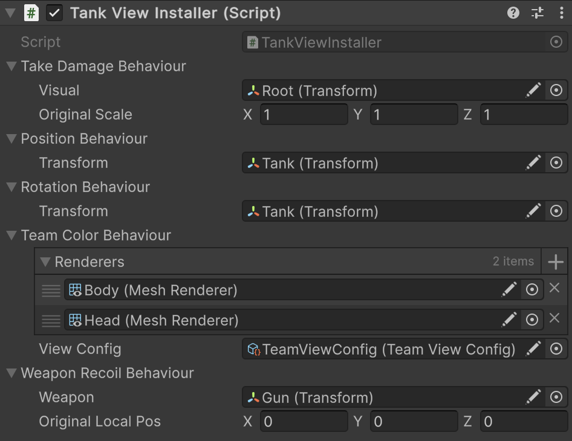

# 📌 Building Entity System with Model & View Separation

## 📑 Table of Contents

- [Overview](#-overview)
- [Base Entity Type](#-base-entity-type)
    - [Entity Interface](#-entity-interface)
    - [UnitEntity Implementation](#-unitentity-implementation)
- [Entity Factory](#-entity-factory)
    - [UnitFactory](#-unitfactory)
    - [Concrete Factory Examples](#-concrete-factory-examples)
    - [Creating Factory Assets in Unity](#-creating-factory-assets-in-unity)
- [Multi-Factory](#-multi-factory)
    - [Creating Multi-Factory Asset in Unity](#creating-multi-factory-asset-in-unity)
- [Entity System Setup](#-entity-system-setup)
- [Spawning and Despawning Entities](#-spawning-and-despawning-entities)
- [Entity Visualization](#-entity-visualization)
    - [Entity View](#-entity-view)
    - [Entity View Catalog](#-entity-view-catalog)
    - [Entity View Pool](#-entity-view-pool)
    - [View Collection](#-view-collection)
- [Binding the View Collection to the Entity World](#-binding-the-view-collection-to-the-entity-world)
- [Summary](#-summary)
- [Conclusion](#-conclusion)

---

## 📖 Overview

This section covers the creation of an **Entity System** where the **C# model is separated from the Unity
environment** and Unity is used solely for visualization.

With [Atomic.Entities](../Entities/Manual.md), this can be implemented efficiently and in a scalable way:

- Units are represented by a specific type, for example `UnitEntity`
- Units are created via [ScriptableEntityFactory\<E>](../Entities/Factories/ScriptableEntityFactory%601.md) and obtained
  from a
  pool using [EntityPool\<E>](../Entities/Pooling/EntityPool%601.md)
- Visualization is handled
  via [EntityView\<E>](../Entities/UI/EntityView%601.md), [EntityViewCollection\<E, V>](../Entities/UI/EntityCollectionView%601.md)
  and [EntityViewPool\<E, V>](../Entities/UI/EntityViewPool%601.md)

---

## 🗂 Base Entity Type

The base entity in **Atomic.Entities** serves as the foundation for the entire unit system.  
It combines **data**, **tags**, **values**, and **behaviors**, remaining fully abstract and independent of Unity.

### 1️⃣ Entity Interface

```csharp
public interface IUnitEntity : IEntity
{
}
```

**Explanation:**

- `IUnitEntity` inherits from [IEntity](../Entities/Entities/IEntity.md) — the core contract for all entities in the
  framework.
- The interface acts as an **extension point**: you can add unit-specific methods and properties without modifying the
  core architecture.

### 2️⃣ UnitEntity Implementation

```csharp
public sealed class UnitEntity : Entity, IUnitEntity
{
    public UnitEntity(
        string name = null,
        int tagCapacity = 0,
        int valueCapacity = 0,
        int behaviourCapacity = 0
    ) : base(name, tagCapacity, valueCapacity, behaviourCapacity)
    {
    }
}
```

**Explanation:**

- Inherits from [Entity](../Entities/Entities/Entity.md) — the base class supporting tags, values, and behaviors.
- The **capacity-based constructor** allows pre-allocating memory for tags, values, and behaviors, optimizing
  editor-time performance and mass unit creation.
- `name` is used for entity identification and lookup in pools and collections.

---

## 🗂 Entity Factory

[Factories](../Entities/Factories/Manual.md) are responsible for **creating and configuring entities**. They allow you
to centrally define base unit
parameters, set initial values, and attach behaviors and tags. Using factories makes the code **scalable, reusable, and
easy to test**.

### 1️⃣ UnitFactory

```csharp
public abstract class UnitFactory : ScriptableEntityFactory<IUnitEntity>
{
    public string Name => this.name;

    public sealed override IUnitEntity Create()
    {
        var entity = new UnitEntity(
            this.Name,
            this.initialTagCapacity,
            this.initialValueCapacity,
            this.initialBehaviourCapacity
        );
        this.Install(entity);
        return entity;
    }

    protected abstract void Install(IUnitEntity entity);
}
```

**Explanation:**

- Inherits from [ScriptableEntityFactory\<E>](../Entities/Factories/ScriptableEntityFactory%601.md) — a base
  ScriptableObject factory for creating entities.
- `Create()` instantiates a `UnitEntity` with the specified capacities and name.
- `Install()` is called for **additional entity configuration**: adding tags, values, and behaviors. It’s abstract so
  each concrete factory can implement its own logic.
- The `Name` property is useful for identification and lookup.

---

### 2️⃣ Concrete Factory Examples

#### `TankFactory`

```csharp
[CreateAssetMenu(
    fileName = "TankFactory",
    menuName = "Example/New TankFactory"
)]
public sealed class TankFactory : UnitFactory
{
[SerializeField] private TransformEntityInstaller _transformInstaller;
[SerializeField] private MoveEntityInstaller _moveInstaller;
[SerializeField] private LifeEntityInstaller _lifeInstaller;
[SerializeField] private RangeCombatEntityInstaller _combatInstaller;
[SerializeField] private AIEntityInstaller _aiInstaller;

    protected override void Install(IUnitEntity entity)
    {
        entity.AddUnitTag(); // add "Unit" tag
        entity.AddTeam(new ReactiveVariable<TeamType>()); // assign team

        // Install behaviors via EntityInstallers
        entity.Install(_transformInstaller);
        entity.Install(_moveInstaller);
        entity.Install(_lifeInstaller);
        entity.Install(_combatInstaller);
        entity.Install(_aiInstaller);
    }

}
```

**Explanation:**

- Creates a tank and immediately configures its behaviors: movement, health, combat, AI, and transform.
- Using **EntityInstallers** allows modular behavior attachment.

#### `SoldierFactory`

```csharp
[CreateAssetMenu(
    fileName = "SoliderFactory",
    menuName = "Example/New SoliderFactory"
)]
public sealed class SoliderFactory : UnitFactory
{
    [SerializeField] private TransformEntityInstaller _transformInstaller;
    [SerializeField] private MoveEntityInstaller _moveInstaller;
    [SerializeField] private LifeEntityInstaller _lifeInstaller;
    [SerializeField] private MeleeCombatEntityInstaller _meleeCombatInstaller;
    [SerializeField] private AIEntityInstaller _aiInstaller;

    protected override void Install(IUnitEntity entity)
    {
        entity.AddUnitTag();
        entity.AddTeam(new ReactiveVariable<TeamType>());

        entity.Install(_transformInstaller);
        entity.Install(_moveInstaller);
        entity.Install(_lifeInstaller);
        entity.Install(_meleeCombatInstaller);
        entity.Install(_aiInstaller);
    }

}
```

**Explanation:**

- Similar to the tank factory but attaches **melee combat** instead of ranged combat.
- Easily scalable for different unit types with minimal code duplication.

---

### 🔧 Creating Factory Assets in Unity

After creating the factories, you can create assets via `Create > Example > New TankFactory / New SoliderFactory`.
These assets will be used in the **multi-factory and entity pool**.


> 💡 This approach allows quickly creating and configuring new unit types without changing code, simply by adding new
> factories.

---

## 🗂 Multi-Factory

A **multi-factory** serves as a **catalog for all unit factories**, allowing you to quickly find the required factory by
a key (e.g., unit name). It combines multiple factories into a single interface for convenient access and management.

```csharp
[CreateAssetMenu(fileName = "UnitCatalog", menuName = "Example/New UnitCatalog")]
public sealed class UnitMultiFactory : ScriptableMultiEntityFactory<string, IUnitEntity, UnitFactory>
{
    protected override string GetKey(UnitFactory factory) => factory.Name;
}
```

**Explanation:**

- Inherits from [ScriptableMultiEntityFactory\<K, E, F>](../Entities/Factories/ScriptableMultiEntityFactory%601.md) —
  this allows storing **multiple factories in a
  single ScriptableObject**.
- `GetKey` returns a unique identifier for each factory (e.g., `Name`), which is used when retrieving entities from the
  pool.
- Using a multi-factory makes it easy to manage a large number of units in the game, adding new factories without
  changing code.

---

### 🔧 Creating Multi-Factory Asset in Unity

After creating the multi-factory, all your factories can be added to the catalog via the Inspector:


> 💡 The multi-factory catalog simplifies working with a large number of unit types, making the system **scalable and
designer-friendly**.

---

## 🗂 Entity System Setup

This section covers **initialization and configuration of the unit system** through the `GameContext`. Here we create an
entity pool, a world for managing entities, and hook the lifecycle into the game context.

```csharp
[Serializable]
public sealed class UnitSystemInstaller : IEntityInstaller<IGameContext>
{
    [SerializeField]
    private UnitMultiFactory factoryCatalog;

    public void Install(IGameContext context)
    {
        // 1. Create a multi-entity pool for units using our factory catalog
        var entityPool = new MultiEntityPool<string, IUnitEntity>(factoryCatalog);
        context.AddEntityPool(entityPool);

        // 2. Create the world for active entities
        var entityWorld = new EntityWorld<IUnitEntity>();
        context.AddEntityWorld(entityWorld);

        // 3. Connect the world lifecycle to the game context
        context.WhenInit(entityWorld.InitEntities);
        context.WhenEnable(entityWorld.Enable);
        context.WhenTick(entityWorld.Tick);
        context.WhenFixedTick(entityWorld.FixedTick);
        context.WhenLateTick(entityWorld.LateTick);
        context.WhenDisable(entityWorld.Disable);
        context.WhenDispose(entityWorld.DisposeEntities);
        context.WhenDispose(entityWorld.Dispose);
    }
}
```

**Explanation:**

- **MultiEntityPool** — a pool for managing unit instances created by factories. It allows **object reuse**, minimizing
  allocations.
- **EntityWorld** — manages the lifecycle of all active entities: initialization, updates, and disabling.
- **Game context (`IGameContext`)** — connects the world and pool to the game loop, subscribing `Init`, `Enable`,
  `Tick`, `FixedTick`, `LateTick`, `Disable`, and `Dispose` methods to the corresponding game events.
- This approach ensures **full separation of C# logic from Unity visualization**, enabling scalable systems and easy
  integration of new unit types.

---

## 🗂 Spawning and Despawning Entities

One of the core elements of the system is **spawning and despawning entities**. The main idea:  
take an entity from the pool, configure its properties, and add it to the `EntityWorld`. Key points:

- On first addition, `Entity.Init()` and `Entity.Enable()` are called.
- On removal from the world, `Entity.Disable()` is called.
- All active entities are managed via `Update`/`FixedUpdate` and other `EntityWorld` cycles.

Below is an example of implementation:

```csharp
public static class UnitsUseCase
{
    public static IUnitEntity Spawn(
        IGameContext context,
        string name,
        Vector3 position,
        Quaternion rotation,
        TeamType team
    )
    {
        // Take the entity from the pool by name
        MultiEntityPool<string, IUnitEntity> pool = context.GetEntityPool();
        IUnitEntity entity = pool.Rent(name);

        // Configure position, rotation, and team
        entity.GetPosition().Value = position;
        entity.GetRotation().Value = rotation;
        entity.GetTeam().Value = team;

        // Add to the world for updates
        IEntityWorld world = context.GetEntityWorld(); 
        world.Add(entity);
        return entity;
    }
    
    public static bool Despawn(IGameContext context, IUnitEntity entity)
    {
        // Remove from the world
        IEntityWorld world = context.GetEntityWorld(); 
        if (!world.Remove(entity))
            return false;

        // Return to the pool for reuse
        MultiEntityPool<string, IUnitEntity> pool = context.GetEntityPool();
        pool.Return(entity);
        return true;
    }
}
```

Example of Usage:

```csharp
// Spawn a unit for construction
UnitsUseCase.Spawn(context, "Builder", position, rotation, TeamType.Player);

// Despawn a unit when it is destroyed
UnitsUseCase.Despawn(context, unitEntity);
```

---

## 🎨 Entity Visualization

This section focuses on the **visual representation of units and other entities** in the system. We
use [EntityView\<E>](../Entities/UI/EntityView%601.md), [EntityViewCatalog\<E, V>](../Entities/UI/EntityViewCatalog%601.md),
[EntityViewPool\<E, V>](../Entities/UI/EntityViewPool%601.md),
and [EntityCollectionView\<E, V>](../Entities/UI/EntityCollectionView%601.md) to efficiently manage the visual
representation of objects.

---

### 🗂 Entity View

The base visualization class serves as a bridge between the **C# entity model** and its visual representation in
Unity. By inheriting from [EntityView\<E>](../Entities/UI/EntityView%601.md), it allows each unit entity to have a
corresponding GameObject in the scene, which can be automatically updated based on the entity's state.

```csharp
public class UnitView : EntityView<IUnitEntity>
{
}
```

To visualize the entity, create a prefab and attach the `UnitView` component:


> 💡 `UnitView` itself does not contain game logic. It links the entity (`IUnitEntity`) with Unity components such as
> transforms, animations, or particle systems. Updates are driven by the entity system, keeping visuals decoupled from
> logic.

---

#### 🛠 Example: Tank View Installer

To modularly attach visual behaviors to the tank entity, use
a [SceneEntityInstaller\<E>](../Entities/Installers/SceneEntityInstaller%601.md):

```csharp
public sealed class TankViewInstaller : SceneEntityInstaller
{
    [SerializeField] private TakeDamageViewBehaviour _takeDamageBehaviour;
    [SerializeField] private PositionViewBehaviour _positionBehaviour;
    [SerializeField] private RotationViewBehaviour _rotationBehaviour;
    [SerializeField] private TeamColorViewBehaviour _teamColorBehaviour;
    [SerializeField] private WeaponRecoilViewBehaviour _weaponRecoilBehaviour;

    public override void Install(IEntity entity)
    {
        entity.AddBehaviour(_takeDamageBehaviour);
        entity.AddBehaviour(_positionBehaviour);
        entity.AddBehaviour(_rotationBehaviour);
        entity.AddBehaviour(_teamColorViewBehaviour);
        entity.AddBehaviour(_weaponRecoilBehaviour);
    }

    public override void Uninstall(IEntity entity)
    {
        entity.DelBehaviour(_takeDamageBehaviour);
        entity.DelBehaviour(_positionBehaviour);
        entity.DelBehaviour(_rotationBehaviour);
        entity.DelBehaviour(_teamColorViewBehaviour);
        entity.DelBehaviour(_weaponRecoilBehaviour);
    }
}
```

Attach this installer to the same GameObject that has the `UnitView` component:



> 💡 This pattern allows you to **modularly add or remove visual behaviors** from any entity prefab without changing the
> underlying C# logic.

Drag and drop `TankViewInstaller` to the `installers` field of `UnitView`


---

### 🗂 Entity View Catalog

Для хранения всех визуальных представлений создаём каталог,
наследуя [EntityViewCatalog\<E>](../Entities/UI/EntityViewCatalog%601.md):

```csharp
[CreateAssetMenu(
    fileName = "UnitViewCatalog",
    menuName = "Example/New UnitViewCatalog"
)]
public sealed class UnitViewCatalog : EntityViewCatalog<IUnitEntity, UnitView>
{
}
```

> 💡 Каталог позволяет **по ключу находить соответствующий визуальный объект** для сущности.

Теперь создаем ассет каталога в проекте и добавляем туда префабы с `UnitView`


---

### 🗂 Entity View Pool

To efficiently manage visual GameObjects, create a view pool by inheriting from
[EntityViewPool<E, V>](../Entities/UI/EntityViewPool%601.md):

```csharp
public sealed class UnitViewPool : EntityViewPool<IUnitEntity, UnitView>
{
}
```

Attach the Pool in the Scene


**Setup:**

- Assign a **`Transform`** to the `container` field — this will hold all instantiated views as child objects.
- Add one or more **`UnitViewCatalog`** assets to the `catalogs` list — the pool will use them to preload and reuse
  prefabs.

> 💡 `EntityViewPool` enables **object reuse**, avoiding constant creation and destruction of GameObjects,  
> which is especially important for large-scale games like RTS, tower defense, or simulation projects.

> ⚙️ With pooling, you can spawn hundreds of units efficiently without performance drops.


---

### 🗂 View Collection

To manage and synchronize multiple unit views in the scene, use  
[EntityCollectionView<E, V>](../Entities/UI/EntityCollectionView%601.md) — a component that automatically tracks which
entities are currently
active and ensures each one has a corresponding visual representation.

```csharp
public sealed class UnitCollectionView : EntityCollectionView<IUnitEntity, UnitView>
{
}
```

#### 🧩 Create a Specific Collection for Units

```csharp
public sealed class UnitCollectionView : EntityCollectionView<IUnitEntity, UnitView>
{
}
```

This collection links your **`UnitViewPool`** (which manages reusable prefabs) with the **active entities** in your
`EntityWorld`.

#### ⚙️ Attach the Collection in the Scene


**Setup:**

- Assign a **`Transform`** to the `Viewport` field — all visualized units will be parented under this transform.
- Assign the **`UnitViewPool`** to the `ViewPool` field — this defines where to take and return visual objects.

> ⚡ The `EntityCollectionView` automatically keeps the scene in sync with your entity world —  
> when a unit is spawned, its view is created; when the unit is despawned, its view is returned to the pool.

> 💡 This separation ensures clean architecture: entities handle logic, while views reflect their current state visually.

---

## 🗂 Binding the View Collection to the Entity World

Once both your **EntityWorld** (the logical layer) and **UnitCollectionView** (the visual layer) are initialized,
you need to **bind them together**. This ensures that every time an entity is spawned or removed in the world,
its corresponding visual representation appears or disappears in the scene automatically.

```csharp
public class EntryPoint : MonoBehaviour
{
    [SerializeField]
    private UnitViewCollection _viewCollection; 
        
    void Start()
    {
        IEntityWorld<IUnitEntity> world = GameContext.Instance.GetEntityWorld();
        _viewCollection.Show(world);
    }
}
```

**Explanation:**

- `Show(EntityWorld<T>)` — connects the collection view to a specific world of entities.  
  After this call:
    - When an entity is **added** to the world → a corresponding view is **spawned** from the pool.
    - When an entity is **removed** → its view is **returned** to the pool.
- The collection internally subscribes to the entity world’s lifecycle events,  
  keeping your **scene visuals synchronized** with the logical model in real-time.

> 💡 With this binding, your **gameplay logic (entities)** and **visual representation (views)** are fully decoupled,
> yet synchronized in real time — a clean, scalable architecture ideal for RTS or simulation games.

---

## ✅ Summary

By combining the following key components:

- `EntityView<IUnitEntity>` — the link between entity logic and Unity GameObject.
- `EntityViewCatalog<IUnitEntity, UnitView>` — a centralized registry of available views.
- `EntityViewPool<IUnitEntity, UnitView>` — a reusable object pool for efficient memory use.
- `EntityCollectionView<IUnitEntity, UnitView>` — a dynamic collection syncing the world and visuals.

you create a **powerful and modular visualization system** that:

- 🔄 Automatically synchronizes the **C# model** and **Unity view** in real time.
- ♻️ Reuses GameObjects through pooling, minimizing allocations and improving performance.
- 🧩 Simplifies management of large numbers of units in complex scenes (e.g., RTS or simulation games).
- 🚀 Integrates seamlessly with `UnitFactory`, `UnitWorld`, and other Atomic.Entities systems.

---

## 🧠 Conclusion

Using **Atomic.Entities**, you gain a **clean separation** between data and visuals, resulting in:

- 💡 Scalable, testable unit systems independent of Unity’s scene lifecycle.
- ⚙️ A modular architecture built on **factories, pools, and entity collections**.
- 🧱 Minimal coupling between gameplay logic and Unity objects.
- 🌱 Easy extension — add new unit types, behaviors, or visual setups without changing core code.
- ⚡ High performance and maintainability for large, entity-driven projects.

> ✅ In short: Atomic.Entities provides a robust foundation for building **modern, decoupled, and highly performant
gameplay systems** in Unity.
