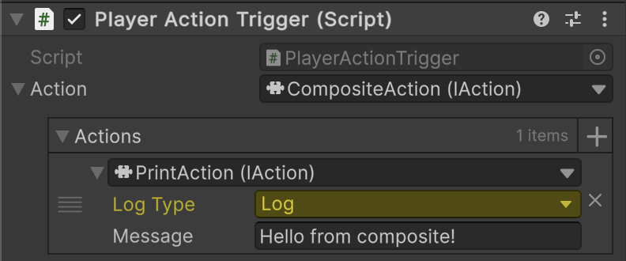

# 📌 Using SerializeReference for CompositeActions

For **narrative or scenario-driven games**, `[SerializeReference]` combined with [CompositeAction](../Elements/Actions/CompositeActions.md) allows designers to **configure multiple actions directly in the Inspector**.  
This approach is especially useful for **chaining actions visually** without extra code, enabling rapid iteration on game logic or events.

---

## 📑 Table of Contents

- [Example of Usage](#-examples-of-usage)
    - [Create an Action Trigger](#1-create-an-action-trigger)
    - [Add PlayerActionTrigger to a GameObject](#2-add-playeractiontrigger-to-a-gameobject)
    - [Assign Composite Action](#3-assign-composite-action)
- [Conclusion](#-conclusion)
- [Benefits](#-benefits)

---

## 🗂 Example of Usage

### 1. Create an Action Trigger

Create a component that executes an action **when triggered by the player**.  
The specific action can be assigned by the designer directly in the **Inspector**:

```csharp
using UnityEngine;
using Atomic.Elements;

public sealed class PlayerActionTrigger : MonoBehaviour
{
    private const string PlayerTag = "Player";
    
    [SerializeReference] private IAction _action;

    private void OnTriggerEnter(Collider collider)
    {
        if (collider.CompareTag(PlayerTag))
            _action.Invoke();
    }
}
```

---

### 2. Add PlayerActionTrigger to a GameObject

Attach the `PlayerActionTrigger` component to a GameObject in the scene.



---

### 3. Assign Composite Action

In the **Inspector**, assign a [CompositeAction](../Elements/Actions/CompositeAction.md) to the `action` field.  
For example, you can add a sequence of actions such as [PrintAction](../Elements/Actions/PrintAction.md) to the composite array.

This allows multiple actions to be executed **in order**, directly configured by designers without writing additional scripts.

---

## 🏁 Conclusion

- `[SerializeReference]` combined with `CompositeAction` enables **flexible, inspector-driven action sequences**.
- Designers can **compose complex behaviors visually**, chaining multiple actions per entity or trigger.
- Reduces the need for extra scripting and allows **rapid iteration** on gameplay logic.
- Integrates seamlessly with the [Atomic.Elements](../Elements/Manual.md) framework.
- Ideal for **narrative events, cutscenes, or scenario-based gameplay logic**.

---

## ✅ Benefits

- Supports **visual composition of actions** directly in the Inspector.
- Enables **modular, reusable action sequences**.
- Reduces **code duplication** for scenario-driven logic.
- Allows **rapid iteration and prototyping** without modifying scripts.
- Integrates with `CompositeAction` to handle **complex sequential or conditional behaviors**.