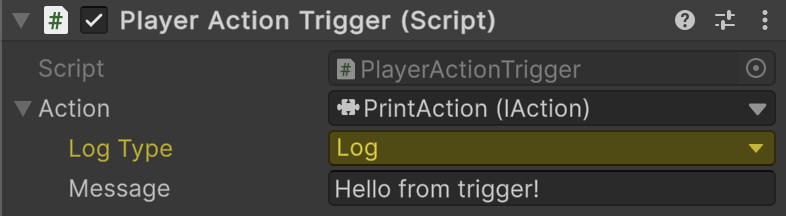

# 📌 Using SerializeReference for LogAction

In Unity, [LogAction](../Elements/Actions/PrintAction.md) is ideal for **visualizing when an action occurs**.
It can be used as a temporary placeholder for real actions, included inside a composite, or employed for **debugging and
testing action pipelines**. By combining `[SerializeReference]` with `LogAction`, designers can **configure it directly in the Inspector** for
immediate feedback.

---

## 📑 Table of Contents

- [Example of Usage](#-example-of-usage)
    - [Create a PlayerActionTrigger](#1-create-a-playeractiontrigger)
    - [Assign LogAction in Inspector](#2-assign-logaction-in-inspector)
- [Conclusion](#-conclusion)
- [Benefits](#-benefits)

---

## 🗂 Example of Usage

### 1. Create a PlayerActionTrigger

Create a component that executes an action **when triggered by the player**.  
The specific action can be assigned by the designer in the **Inspector**:

```csharp
public sealed class PlayerActionTrigger : MonoBehaviour
{
    private const string PlayerTag = "Player";
    
    [SerializeReference] 
    private IAction _action;

    private void OnTriggerEnter(Collider collider)
    {
        if (collider.CompareTag(PlayerTag))
            _action.Invoke();
    }
}
```

---

### 2. Assign LogAction in Inspector

In the **Inspector**, assign a [LogAction](../Elements/Actions/PrintAction.md) to the `action` field. 
This will print a message to the console whenever the trigger is activated, allowing designers and developers to 
**verify action execution** without additional code.



---

## 🏁 Conclusion

- `[SerializeReference]` allows `LogAction` to be **serialized and configured directly in the Inspector**.
- `LogAction` is useful for **debugging, testing, or temporarily replacing real actions**.
- Integrates with `CompositeAction` or standalone triggers for **visual feedback on action execution**.
- Supports **rapid iteration and validation** of action sequences in scenario-driven or reactive systems.
- Encourages **clean, modular, and maintainable action pipelines**.

---

## ✅ Benefits

- Provides **immediate visual feedback** when actions are executed.
- Supports **Inspector-driven configuration** without extra scripts.
- Useful for **debugging or testing complex action sequences**.
- Can be used as a **placeholder in CompositeActions** for iterative design.
- Promotes **modular and reusable action structures** in Unity projects.