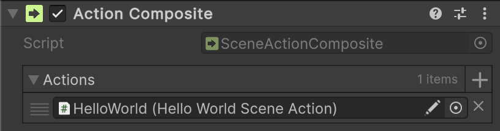

# 🧩 MonoActionComposite

Represents a <b>parameterless</b> composite scene action that can be invoked.

---

## 📑 Table of Contents

- [Example of Usage](#-example-of-usage)
- [API Reference](#-api-reference)
    - [Type](#-type)
    - [Inspector Settings](#-inspector-settings)
    - [Fields](#-fields)
        - [Actions](#actions)
    - [Methods](#-methods)
        - [Invoke()](#invoke)

---

## 🗂 Example of Usage

**MonoActionComposite** can be used similarly to [MonoActionConfigurable](MonoActionConfigurable.md) but is **strictly a
composite container for `MonoAction`**.

#### 1. Add the `Atomic/Elements/Action Composite` component to a `GameObject`.



#### 2. Assign `HelloWorldSceneAction` component to the **Actions** array in the Inspector.

```csharp
public sealed class HelloWorldSceneAction : MonoAction
{
    public override void Invoke() => Debug.Log("Hello world");
}
```

---

## 🔍 API Reference

### 🏛️ Type <div id="-type"></div>

```csharp
[AddComponentMenu("Atomic/Elements/Action Composite")]
public class MonoActionComposite : MonoAction
```

- **Description:** Represents a <b>parameterless</b> composite scene action that can be invoked.
- **Inheritance:** [MonoAction](MonoAction.md)
- **Notes:**
    - Supports Odin Inspector
    - Attach to a `GameObject`, assign a list of `MonoAction` implementations in the Inspector, and they
      will be invoked sequentially.

---

### 🛠 Inspector Settings

| Parameter | Description                                   |
|-----------|-----------------------------------------------|
| `actions` | The array of scene actions to invoke in order |

---

### 🧱 Fields

#### `Actions`

```csharp
public MonoAction[] actions;
```

- **Description:** The array of scene actions to invoke in order.
- **Access:** Read / Write

---

### 🏹 Methods

#### `Invoke()`

```csharp
public override void Invoke();
```

- **Description:** Executes each action in the `actions` array sequentially.
