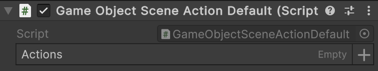
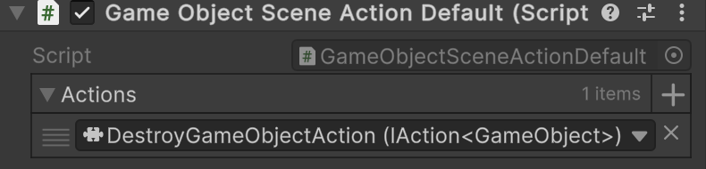

# 🧩 MonoActionConfigurable&lt;T&gt;

Represents a scene-based composite action with <b>one parameter</b>.
Attach to a `GameObject`, assign a list of [IAction\<T>](IAction%601.md) implementations in the Unity Inspector, 
and they will be invoked sequentially. Supports Odin Inspector.

---

## 📑 Table of Contents

- [Quick Start](#-quick-start)
- [Inspector Settings](#-inspector-settings)
- [API Reference](#-api-reference)
    - [Type](#-type)
    - [Fields](#-fields)
        - [Actions](#actions)
    - [Methods](#-methods)
        - [Invoke(T)](#invoket)

---

## 🚀 Quick Start

#### 1. Create a `GameObjectMonoActionConfigurable` component

```csharp
public sealed class GameObjectMonoActionConfigurable : MonoActionConfigurable<GameObject>
{
}
```

#### 2. Add the `GameObjectMonoActionConfigurable` component to a `GameObject`



#### 3. Create an action that destroys a `GameObject` (example)

```csharp
[Serializable]
public sealed class DestroyGameObjectAction : IAction<GameObject>
{
    public void Invoke(GameObject arg) => GameObject.Destroy(arg);
}
```

#### 4. Assign `DestroyGameObjectAction` to the **Actions** parameter of the `GameObjectMonoActionConfigurable` component



---

## 🛠 Inspector Settings

| Parameter | Description                              |
|-----------|------------------------------------------|
| `actions` | The array of actions to execute in order |

---

## 🔍 API Reference

### 🏛️ Type <div id="-type"></div>

```csharp
public abstract class MonoActionConfigurable<T> : MonoAction<T>
```

- **Description:** Represents a scene-based composite action with <b>one parameter</b>.
- **Inheritance:** [MonoAction&lt;T&gt;](MonoAction%601.md)
- **Type parameter:** `T` — the input argument type.


---

### 🧱 Fields

#### `Actions`

```csharp
public IAction<T>[] actions;
```

- **Description:** The array of actions to invoke in order.
- **Access:** Read / Write

---

### 🏹 Methods

#### `Invoke(T)`

```csharp
public override void Invoke(T arg);
```

- **Description:** Executes each action sequentially with the provided argument.
- **Parameter:** `arg` – The input argument.
