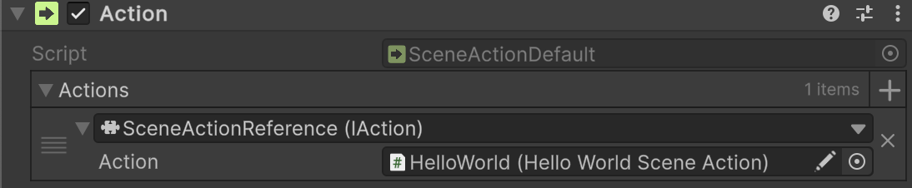
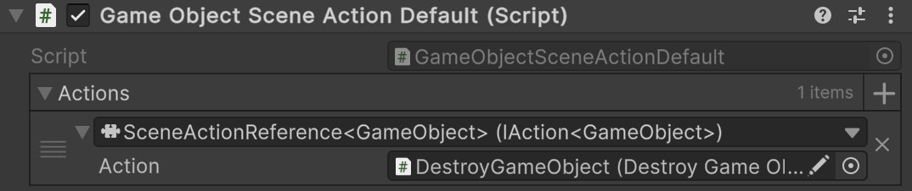

# 🧩 MonoActions Reference

**MonoActionReference** is a **pointer** for [MonoAction](MonoActions.md). It is primarily used when
a game designer works with [MonoActionConfigurable](MonoActionsConfigurable.md) and needs to reference or invoke another
`MonoAction` from a different context. This wrapper implement the corresponding [IAction](IActions.md) interface
and can be used in **Inspector-driven workflows**.

---

## 📑 Table of Contents

- [Examples of Usage](#-examples-of-usage)
    - [Non-generic action](#non-generic-action)
    - [Generic action](#generic-action)
- [API Reference](#-api-reference)
- [Notes](#-notes)

---

## 🗂 Examples of Usage

`MonoActionReference` is useful for creating a reference to another `MonoAction` via `[SerializeReference]`.

### 1️⃣ Non-generic action <div id="non-generic-action"></div>

Below is an example of referencing a `MonoActionConfigurable` with a `HelloWorldMonoAction`.



```csharp
public sealed class HelloWorldMonoAction : MonoAction
{
    public override void Invoke() => Debug.Log("Hello World!");
}
```

---

### 2️⃣ Generic action <div id="generic-action"></div>

Below is an example of referencing a `DestroyGameObjectMonoAction` from the `GameObjectMonoActionConfigurable`.



```csharp
public sealed class GameObjectMonoActionConfigurable : MonoActionConfigurable<GameObject>
{
}
```

```csharp
public sealed class DestroyGameObjectMonoAction : MonoAction<GameObject>
{
    public void Invoke(GameObject arg) => GameObject.Destroy(arg);
}
```

---

## 🔍 API Reference

There are several implementations of reference actions, depending on the number of arguments the actions take:

- [MonoActionReference](MonoActionReference.md) — Non-generic version; works without parameters.
- [MonoActionReference&lt;T&gt;](MonoActionReference%601.md) — Reference that takes one argument.
- [MonoActionReference&lt;T1, T2&gt;](MonoActionReference%602.md) — Reference that takes two arguments.
- [MonoActionReference&lt;T1, T2, T3&gt;](MonoActionReference%603.md) — Reference that takes three arguments.
- [MonoActionReference&lt;T1, T2, T3, T4&gt;](MonoActionReference%604.md) — Reference that takes four arguments.

---

## 📝 Notes

> [!NOTE]  
> The reference only stores a pointer to a `MonoAction`. If the reference is null, invoking it does nothing.

> [!WARNING]  
> Using `[SerializeReference]` should be considered a last resort. If possible, define actions through code for clarity
> and maintainability, as `[SerializeReference]` can be fragile during refactoring.
