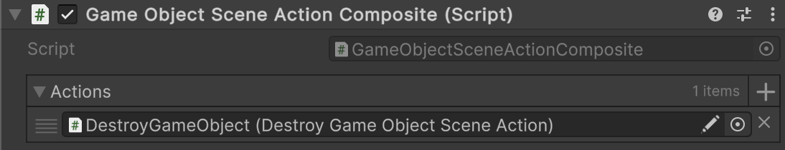

# 🧩 SceneActionComposite&lt;T&gt;

Represents a composite scene action with <b>one parameter</b> that can be invoked.

---

## 📑 Table of Contents

- [Example of Usage](#-example-of-usage)
- [API Reference](#-api-reference)
    - [Type](#-type)
    - [Inspector Settings](#-inspector-settings)
    - [Fields](#-fields)
        - [Actions](#actions)
    - [Methods](#-methods)
        - [Invoke(T)](#invoket)

---

## 🗂 Example of Usage

`SceneActionComposite<T>` can be used similarly to [SceneActionDefault&lt;T&gt;](SceneActionDefault%601.md) but is 
**strictly a composite container** for [SceneActionAbstract\<T>](SceneActionAbstract%601.md).

#### 1. Create a `GameObjectSceneActionComposite` component extending the base class.

```csharp
public sealed class GameObjectSceneActionComposite : SceneActionComposite<GameObject>
{
}
```

#### 2. Add the `GameObjectSceneActionComposite` component to a `GameObject`



#### 3. Create an action that destroys a `GameObject` (example)

```csharp
public sealed class DestroyGameObjectSceneAction : SceneActionAbstract<GameObject>
{
    public override void Invoke(GameObject arg) => Destroy(arg);
}
```

#### 4. Assign `DestroyGameObjectSceneAction` to the **Actions** parameter of the

`GameObjectSceneActionComposite` component

---

## 🔍 API Reference

### 🏛️ Type <div id="-type"></div>

```csharp
public class SceneActionComposite<T> : SceneActionAbstract<T>
```

- **Description:** Represents a composite scene action with <b>one parameter</b> that can be invoked.
- **Inheritance:** [SceneActionAbstract&lt;T&gt;](SceneActionAbstract%601.md)
- **Type parameter:** `T` — the argument type.
- **Notes:**
    - Supports Odin Inspector
    - Attach to a `GameObject`, assign a list of `SceneActionAbstract<T>` implementations in the Inspector, and they
      will be invoked sequentially.

---

### 🛠 Inspector Settings

| Parameter | Description                                                      |
|-----------|------------------------------------------------------------------|
| `actions` | The array of scene actions to invoke in order  with one argument |

---

### 🧱 Fields

#### `Actions`

```csharp
public SceneActionAbstract<T>[] actions;
```

- **Description:** The array of scene actions to invoke in order.
- **Access:** Read / Write

---

### 🏹 Methods

#### `Invoke(T)`

```csharp
public override void Invoke(T arg);
```

- **Description:** Executes each action sequentially with the provided argument.
- **Parameter:** `arg` – The input argument.