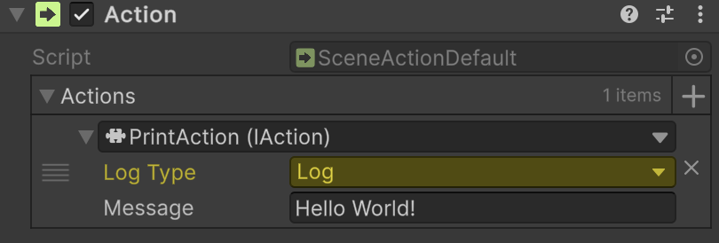

# 🧩 SceneActionDefault

Represents a <b>parameterless</b> composite scene action that can be invoked. Attach to a `GameObject`, assign a list of
[IAction](IAction.md) implementations in the Unity Inspector, and they will be invoked sequentially. Supports Odin Inspector.

---

## 📑 Table of Contents

- [Quick Start](#-quick-start)
- [Inspector Settings](#-inspector-settings)
- [API Reference](#-api-reference)
    - [Type](#-type)
    - [Fields](#-fields)
        - [Actions](#actions)
    - [Methods](#-methods)
        - [Invoke()](#invoke)

---

## 🚀 Quick Start

#### 1. Add the `Atomic/Elements/Action` component.



#### 2. In the **Inspector**, assign the `PrintAction` value to the `Action` parameter.

#### 3. Use `SceneActionDefault` as `SceneActionAbstract` in your components.

```csharp
// Example of usage "SceneActionDefault"
public sealed class GameStartup : MonoBehaviour
{
    [SerializeField] 
    private SceneActionAbstract _startup;

    private void Start() => _startup.Invoke();
}
```

---

## 🛠 Inspector Settings

| Parameter | Description                              |
|-----------|------------------------------------------|
| `actions` | The array of actions to execute in order |

---

## 🔍 API Reference

### 🏛️ Type <div id="-type"></div>

```csharp
[AddComponentMenu("Atomic/Elements/Action")]
public class SceneActionDefault : SceneActionAbstract
```

- **Description:** Represents a <b>parameterless</b> composite scene action that can be invoked.
- **Inheritance:** [SceneActionAbstract](SceneActionAbstract.md)

---

### 🧱 Fields

#### `Actions`

```csharp
public IAction[] actions;
```

- **Description:** The array of actions to invoke in order.
- **Access:** Read / Write

---

### 🏹 Methods

#### `Invoke()`

```csharp
public override void Invoke();
```

- **Description:** Executes each action in the `actions` array sequentially.