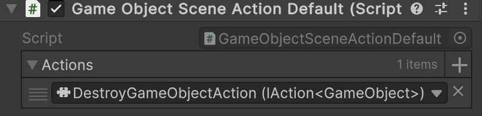

# 🧩 SceneActionDefault&lt;T&gt;

```csharp
public abstract class SceneActionDefault<T> : SceneActionAbstract<T>
```

- **Description:** Represents a scene-based composite action with <b>one parameter</b>.
- **Inheritance:** [SceneActionAbstract&lt;T&gt;](SceneActionAbstract%601.md)
- **Type parameter:** `T` — the input argument type.
- **Notes:**
    - Supports Odin Inspector
    - Attach to a `GameObject`, assign a list of `IAction<T>` implementations in the `Inspector`, and they will be
      invoked sequentially.

---

## 🛠 Inspector Settings

| Parameter | Description                              |
|-----------|------------------------------------------|
| `actions` | The array of actions to execute in order |

---

## 🧱Fields

#### `Actions`

```csharp
public IAction<T>[] actions;
```

- **Description:** The array of actions to invoke in order.
- **Access:** Read / Write

---

## 🏹 Methods

#### `Invoke(T)`

```csharp
public override void Invoke(T arg);
```

- **Description:** Executes each action sequentially with the provided argument.
- **Parameter:** `arg` – The input argument.

---

## 🗂 Example of Usage

#### 1. Create a `GameObjectSceneActionDefault` component

```csharp
public sealed class GameObjectSceneActionDefault : SceneActionDefault<GameObject>
{
}
```

#### 2. Add the `GameObjectSceneActionDefault` component to a `GameObject`


#### 3. Create an action that destroys a `GameObject` (example)

```csharp
[Serializable]
public sealed class DestroyGameObjectAction : IAction<GameObject>
{
    public void Invoke(GameObject arg) => GameObject.Destroy(arg);
}
```

#### 4. Assign `DestroyGameObjectAction` to the **Actions** parameter of the `GameObjectSceneActionDefault` component

