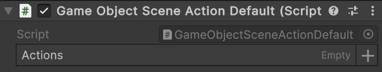

<details>
  <summary>
    <h2>🧩 SceneActionDefault&lt;T&gt;</h2>
    <br> Represents a scene-based composite action with <b>one parameter</b>.
  </summary>

<br>

```csharp
public abstract class SceneActionDefault<T> : SceneActionAbstract<T>
```

- **Type parameter:** `T` — the input argument type.

---

### 🛠 Inspector Settings

| Parameter | Description                              |
|-----------|------------------------------------------|
| `actions` | The array of actions to execute in order |

---

### 🧱Fields

#### `actions`

```csharp
public IAction<T>[] actions;
```

- **Description:** The array of actions to invoke in order.
- **Access:** Read / Write

---

### 🏹 Methods

#### `Invoke(T arg)`

```csharp
public override void Invoke(T arg);
```

- **Description:** Executes each action sequentially with the provided argument.
- **Parameter:** `arg` – The input argument.

</details>

---


## 🗂 Example of Usage

For **narrative or scenario-driven games**, where designers need to configure a lot of actions directly on the scene,
`SceneAction` combined with `[SerializeReference]` is very convenient.

---

### 🔹 Non-generic Usage

Below is an example of using `SceneActionDefault`

#### 1. Add the `Atomic/Elements/Action` component.


#### 2. In the **Inspector**, assign the `PrintAction` value to the `Action` parameter.

#### 3. Use `SceneActionDefault` as `SceneActionAbstract` in your components.

```csharp
// Example of usage "SceneActionDefault"
public sealed class GameStartup : MonoBehaviour
{
    [SerializeField] private SceneActionAbstract _startup;

    private void Start() => _startup.Invoke();
}
```

---

### 🔹 Generic Usage

Below is an example of using `SceneActionDefault<T>` with a `GameObject`.

#### 1. Create a `GameObjectSceneActionDefault` component

```csharp
using Atomic.Elements;
using UnityEngine;

public sealed class GameObjectSceneActionDefault : SceneActionDefault<GameObject>
{
}
```

#### 2. Add the `GameObjectSceneActionDefault` component to a `GameObject`



#### 3. Create an action that destroys a `GameObject` (example)

```csharp
[Serializable]
public sealed class DestroyGameObjectAction : IAction<GameObject>
{
    public void Invoke(GameObject arg) => GameObject.Destroy(arg);
}
```

#### 4. Assign `DestroyGameObjectAction` to the **Actions** parameter of the `GameObjectSceneActionDefault` component

