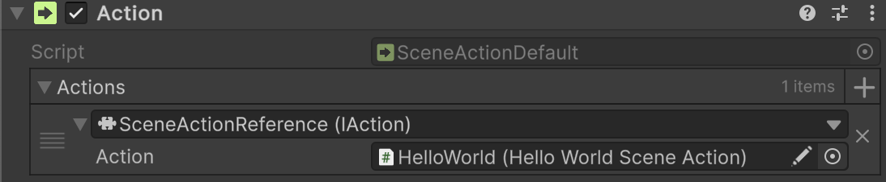

# 🧩 SceneActionReference

A parameterless reference wrapper for a [SceneActionAbstract](SceneActionAbstract.md).
Assign a `SceneActionAbstract` component in the Inspector and invoke it using `Invoke()`.

---

## 📑 Table of Contents

- [Example of Usage](#-example-of-usage)
- [Inspector Settings](#-inspector-settings)
- [API Reference](#-api-reference)
    - [Type](#-type)
    - [Constructors](#-constructors)
        - [Constructor()](#sceneactionreference)
        - [Constructor(SceneActionAbstract)](#sceneactionreferencesceneactionabstract)
    - [Fields](#-fields)
        - [Action](#action)
    - [Methods](#-methods)
        - [Invoke()](#invoke)

---

## 🗂 Example of Usage

Below is an example of referencing a [SceneActionDefault](SceneActionDefault.md) with a `HelloWorldSceneAction`.

#### 1. Assume we have a `SceneActionDefault` component on a scene



#### 2. Assume we have an another `HelloWorldSceneAction` on a scene

```csharp
public sealed class HelloWorldSceneAction : SceneActionAbstract
{
    public override void Invoke() => Debug.Log("Hello World!");
}
```

#### 3. So we can bind the `HelloWorldSceneAction` to the `SceneActionDefault` via

`SceneActionReference` in the Unity Inspector

---

## 🛠 Inspector Settings

| Parameter | Description                             |
|-----------|-----------------------------------------|
| `action`  | Reference to the scene action to invoke |

---

## 🔍 API Reference

### 🏛️ Type <div id="-type"></div>

```csharp
[Serializable]
public sealed class SceneActionReference : IAction
```

- **Description:** A parameterless reference wrapper for a [SceneActionAbstract](SceneActionAbstract.md).
- **Inheritance:** [IAction](IAction.md)
- **Notes:** Supports Unity serialization and Odin Inspector

---

### 🏗️ Constructors <div id="-constructors"></div>

#### `SceneActionReference()`

```csharp
public SceneActionReference();
```

- **Description:** Default constructor, intended **only for use by the Unity Inspector**.
- **Usage:** Required for Unity to serialize the reference in the Inspector.

#### `SceneActionReference(SceneActionAbstract)`

```csharp
public SceneActionReference(SceneActionAbstract action);
```

- **Description:** Creates a new reference wrapping the specified `SceneActionAbstract`.
- **Parameter:** `action` — The `SceneActionAbstract` to reference.

---

### 🧱 Fields

#### `Action`

```csharp
public SceneActionAbstract action;
```

- **Description:** Reference to the scene action to invoke.
- **Access:** Read / Write

---

### 🏹 Methods

#### `Invoke()`

```csharp
public void Invoke();
```

- **Description:** Invokes the referenced scene action if it exists.