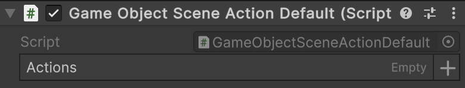
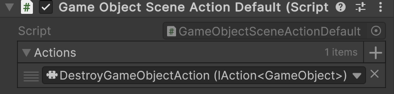

# 🧩 SceneActions Default

Implement the [IAction](IActions.md) interfaces and inherit
from [SceneActionAbstract](SceneActionsAbstract.md). It allows game designers to build **composite actions directly in
the Unity scene** — chaining multiple action instances, including generic variants, without writing
additional code.

---

## 📑 Table of Contents

- [Examples of Usage](#-examples-of-usage)
    - [Non-generic action](#non-generic-action)
    - [Generic action](#generic-action)
- [API Reference](#-api-reference)
- [Notes](#-notes)

---

## 🗂 Examples of Usage

For **narrative or scenario-driven games**, where designers need to configure a lot of actions directly on the scene,
`SceneAction` combined with `[SerializeReference]` is very convenient.

---

### 1️⃣ Non-generic action <div id="non-generic-action"></div>

Below is an example of using [SceneActionDefault](SceneActionDefault.md)

#### 1. Add the `Atomic/Elements/Action` component.


#### 2. In the **Inspector**, assign the [PrintAction](PrintAction.md) value to the `Action` parameter.

#### 3. Use [SceneActionDefault](SceneActionDefault.md) as [SceneActionAbstract](SceneActionAbstract.md) in your components.

```csharp
// Example of usage "SceneActionDefault"
public sealed class GameStartup : MonoBehaviour
{
    [SerializeField] 
    private SceneActionAbstract _startup;

    private void Start() => _startup.Invoke();
}
```

---

### 2️⃣ Generic action <div id="generic-action"></div>

Below is an example of using `SceneActionDefault<T>` with a `GameObject`.

#### 1. Create a `GameObjectSceneActionDefault` component

```csharp
using Atomic.Elements;
using UnityEngine;

public sealed class GameObjectSceneActionDefault : SceneActionDefault<GameObject>
{
}
```

#### 2. Add the `GameObjectSceneActionDefault` component to a `GameObject`



#### 3. Create an action that destroys a `GameObject` (example)

```csharp
[Serializable]
public sealed class DestroyGameObjectAction : IAction<GameObject>
{
    public void Invoke(GameObject arg) => GameObject.Destroy(arg);
}
```

#### 4. Assign `DestroyGameObjectAction` to the **Actions** parameter of the `GameObjectSceneActionDefault` component



---

## 🔍 API Reference

There are several implementations of default scene actions, depending on the number of arguments the actions take:

- [SceneActionDefault](SceneActionDefault.md) — Non-generic version; works without parameters.
- [SceneActionDefault&lt;T&gt;](SceneActionDefault%601.md) — Action that takes one argument.
- [SceneActionDefault&lt;T1, T2&gt;](SceneActionDefault%602.md) — Action that takes two arguments.
- [SceneActionDefault&lt;T1, T2, T3&gt;](SceneActionDefault%603.md) — Action that takes three arguments.
- [SceneActionDefault&lt;T1, T2, T3, T4&gt;](SceneActionDefault%604.md) — Action that takes four arguments.

---

## 📝 Notes

> [!NOTE]  
> Actions are executed in the order they appear in the array.  
> Null references are automatically skipped, making partially configured lists safe to use.

> [!TIP]
> In essence, **SceneActionDefault** acts as a **container of actions**, executing them sequentially as configured in
> the **Inspector** through `[SerializeReference]`.

> [!WARNING]
> Using `[SerializeReference]` should be considered a last resort. If possible, define actions through code instead for
> clarity and maintainability, because `[SerializeReference]` is very fragile during refactoring.
