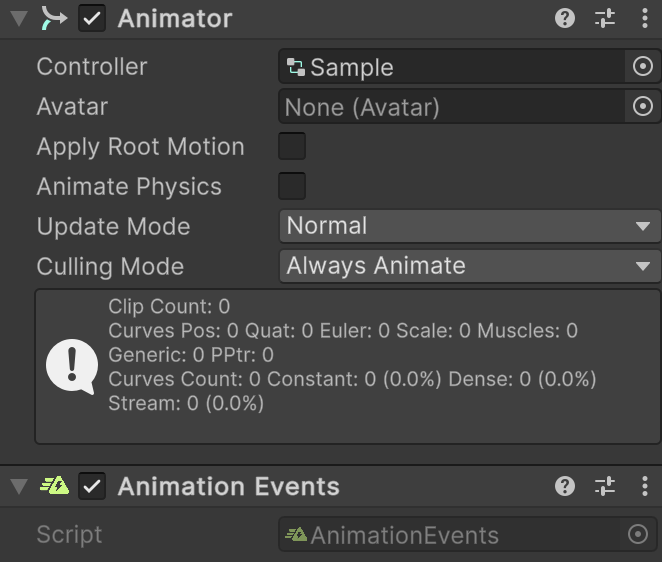
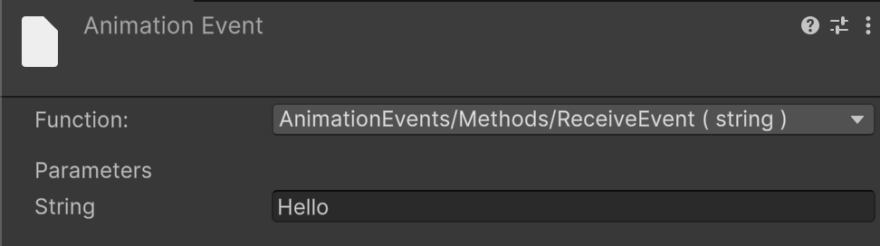
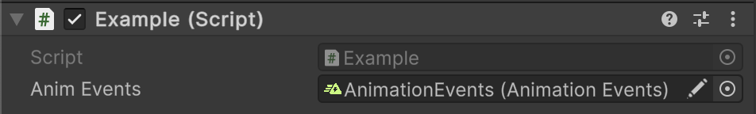

# 🧩 AnimationEvents

A **Unity MonoBehaviour** that bridges Unity animation events to C# event subscriptions. Allows
listening for animation events without hardcoding method names in the inspector. Attach this component to a GameObject
with an `Animator` or `Animation` to dispatch animation events through C# events.

---

## 📑 Table of Contents

- [Quick Start](#-quick-start)
- [API Reference](#-api-reference)
  - [Type](#-type)
  - [Events](#-events)
    - [OnEvent](#onevent)
  - [Methods](#-methods)
    - [Subscribe(string, Action)](#subscribestring-action)
    - [Unsubscribe(string, Action)](#unsubscribestring-action)
    - [ReceiveEvent(string)](#receiveeventstring)
- [Notes](#-notes)

---

## 🚀 Quick Start

#### Step 1. Add Components

Add both an `Animator` and `Atomic/Elements/AnimationEvents` component to your `GameObject`.

- 

#### Step 2. Set Up Animator

Configure your `AnimatorController` and animation clips, then assign it to the `Animator` on the scene.

#### Step 3. Create Animation Event

On the timeline of your `AnimationClip`, create an `AnimationEvent` and set its `Function` to:
`AnimationEvents/Methods/ReceiveEvent(string)`

- 

#### Step 4. Handle Animation Events in Script

Create a script to subscribe to animation events from `AnimationEvents`:

```csharp
public class Example : MonoBehaviour
{
    [SerializeField]
    private AnimationEvents _animEvents;

    private void OnEnable()
    {
        _animEvents.Subscribe("Hello", OnHello);
        _animEvents.OnEvent += OnAnimationEvent;
    }

    private void OnDisable()
    {
        _animEvents.Unsubscribe("Hello", OnHello);
        _animEvents.OnEvent -= OnAnimationEvent;
    }

    private void OnHello() => Debug.Log("Hello!");
    
    private void OnAnimationEvent(string evt) => Debug.Log($"Event triggered: {evt}");
}
```

#### Step 5. Attach Script

Attach the script to a GameObject and assign the `AnimationEvents` component to it.

- 

#### Step 6. Play and Test

Enter Play Mode in Unity and verify that the Console shows logs:

---

## 🔍 API Reference

### 🏛️ Type <div id="-type"></div>

```csharp
[AddComponentMenu("Atomic/Elements/Animation Events")]
[DisallowMultipleComponent]
public sealed class AnimationEvents : MonoBehaviour
```

- **Inheritance:** `MonoBehaviour`

---

### ⚡ Events

#### `OnEvent`

```csharp
public event Action<string> OnEvent;
```

- **Description:** Invoked whenever an animation event sends a string message.
- **Parameter:** `string` — the event key or name from the animation timeline.
- **Remarks:** Works for any animation event, providing a generic subscription mechanism.

---

### 🏹 Methods

#### `Subscribe(string, Action)`

```csharp
public void Subscribe(string evt, Action action);
```

- **Description:** Registers an action for a specific animation event key.
- **Parameters:**
    - `evt` — the animation event key to listen for.
    - `action` — the action to execute when the event is received.
- **Remarks:** Multiple actions can be subscribed to the same event.

#### `Unsubscribe(string, Action)`

```csharp
public void Unsubscribe(string evt, Action action);
```

- **Description:** Removes a previously registered action from a specific animation event key.
- **Parameters:**
    - `evt` — the animation event key to stop listening for.
    - `action` — the action to remove from the handler list.
- **Remarks:** If the action was not registered, nothing happens.

#### `ReceiveEvent(string)`

```csharp
public void ReceiveEvent(string message);
```

- **Description:** Method called by Unity’s Animation Event system.
- **Parameter:** `message` — the string key sent from the animation timeline.
- **Remarks:** Dispatches the event to both specific handlers registered via `Subscribe` and the generic `OnEvent`.

---

## 📝 Notes

- Handles animation events without requiring hardcoded method names in the Unity inspector.
- Supports multiple subscribers per event key.
- Provides both **generic** (`OnEvent`) and **strongly-typed** (`Subscribe`) notifications.
- Keeps animation logic **decoupled** and flexible for runtime changes.