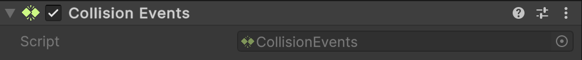

# 🧩 CollisionEvents

A **Unity MonoBehaviour** that exposes Unity’s collision callbacks as C# events. This makes it easier
to react to physics interactions without overriding `OnCollisionEnter`, `OnCollisionExit`, or `OnCollisionStay` in
custom scripts. Attach this component to a `GameObject` with a `Collider` (and optionally a `Rigidbody`) to receive
collision events as C# events.

---

## 📑 Table of Contents

- [Quick Start](#-quick-start)
- [API Reference](#-api-reference)
    - [Type](#-type)
    - [Events](#-events)
        - [OnEntered](#onentered)
        - [OnExited](#onexited)
        - [OnStay](#onstay)
    - [Methods](#-methods)
        - [OnCollisionEnter(Collision)](#oncollisionentercollision)
        - [OnCollisionExit(Collision)](#oncollisionexitcollision)
        - [OnCollisionStay(Collision)](#oncollisionstaycollision)
- [Notes](#-notes)

---

## 🚀 Quick Start

#### Step 1. Add Component

Add a `Atomic/Elements/CollisionEvents` component to a `GameObject` with a `Collider` (and optionally a `Rigidbody`).



#### Step 2. Create Script

Create a script that will handle collision events:

```csharp
public class Example : MonoBehaviour
{
    [SerializeField]
    private CollisionEvents _collisionEvents;

    private void OnEnable()
    {
        _collisionEvents.OnEntered += HandleEnter;
        _collisionEvents.OnExited  += HandleExit;
        _collisionEvents.OnStay    += HandleStay;
    }

    private void OnDisable()
    {
        _collisionEvents.OnEntered -= HandleEnter;
        _collisionEvents.OnExited  -= HandleExit;
        _collisionEvents.OnStay    -= HandleStay;
    }

    private void HandleEnter(Collision collision)
        => Debug.Log($"Collision started with {collision.gameObject.name}");

    private void HandleExit(Collision collision)
        => Debug.Log($"Collision ended with {collision.gameObject.name}");

    private void HandleStay(Collision collision)
        => Debug.Log($"Still colliding with {collision.gameObject.name}");
}
```

#### Step 3. Attach Script

Attach the `Example` script to the **same GameObject**.

#### Step 4. Run and Test

Enter **Play Mode** in Unity. When colliding with other objects, you’ll see logs in the **Console**.

---

## 🔍 API Reference

### 🏛️ Type <div id="-type"></div>

```csharp
[AddComponentMenu("Atomic/Elements/Collision Events")]
[DisallowMultipleComponent]
public sealed class CollisionEvents : MonoBehaviour
```

- **Inheritance:** `MonoBehaviour`

---

### ⚡ Events

#### `OnEntered`

```csharp
public event Action<Collision> OnEntered;
```

- **Description:** Invoked when a collision **starts**.
- **Parameter:** `Collision` — detailed information about the collision.
- **Unity Equivalent:** `MonoBehaviour.OnCollisionEnter(Collision)`

#### `OnExited`

```csharp
public event Action<Collision> OnExited;
```

- **Description:** Invoked when a collision **ends**.
- **Parameter:** `Collision` — detailed information about the collision.
- **Unity Equivalent:** `MonoBehaviour.OnCollisionExit(Collision)`

#### `OnStay`

```csharp
public event Action<Collision> OnStay;
```

- **Description:** Invoked **every frame** while a collision persists.
- **Parameter:** `Collision` — detailed information about the collision.
- **Unity Equivalent:** `MonoBehaviour.OnCollisionStay(Collision)`

---

### 🏹 Methods

These methods are automatically called by Unity’s physics engine and forward events to C# subscribers.

#### `OnCollisionEnter(Collision)`

```csharp
public void OnCollisionEnter(Collision collision);
```

- **Description:** Called by Unity when a collider / rigidbody **starts colliding**.
- **Parameter:** `Collision` — detailed information about the collision.
- **Dispatches:** `OnEntered`

#### `OnCollisionExit(Collision)`

```csharp
public void OnCollisionExit(Collision collision);
```

- **Description:** Called by Unity when a collider / rigidbody **stops colliding**.
- **Parameter:** `Collision` — detailed information about the collision.
- **Dispatches:** `OnExited`

#### `OnCollisionStay(Collision)`

```csharp
public void OnCollisionStay(Collision collision);
```

- **Description:** Called by Unity **each frame** while colliders remain in contact.
- **Parameter:** `Collision` — detailed information about the collision.
- **Dispatches:** `OnStay`

---

## 📝 Notes

- Requires a `Collider` and (for dynamic collisions) a `Rigidbody`.
- Works with both **3D physics** (`Collision`) and is not compatible with **2D physics** (`Collision2D`).
- Decouples collision handling logic from `MonoBehaviour` lifecycle methods.
- Supports multiple subscribers per event.