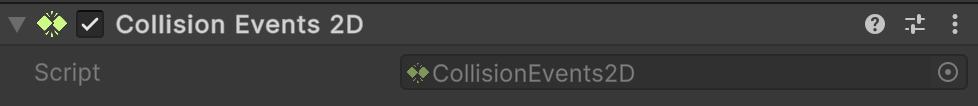

# 🧩 CollisionEvents2D

A **Unity MonoBehaviour** that exposes Unity’s **2D collision callbacks** as C# events. This makes it
easier to react to 2D physics interactions without overriding `OnCollisionEnter2D`, `OnCollisionExit2D` or
`OnCollisionStay2D` in custom scripts. Attach this component to a `GameObject` with a `Collider2D` (and optionally a
`Rigidbody2D`) to receive 2D collision events as C# events.

---

## 📑 Table of Contents

- [Quick Start](#-quick-start)
- [API Reference](#-api-reference)
    - [Type](#-type)
    - [Events](#-events)
        - [OnEntered](#onentered)
        - [OnExited](#onexited)
        - [OnStay](#onstay)
    - [Methods](#-methods)
        - [OnCollisionEnter2D(Collision2D)](#oncollisionenter2dcollision2d)
        - [OnCollisionExit2D(Collision2D)](#oncollisionexit2dcollision2d)
        - [OnCollisionStay2D(Collision2D)](#oncollisionstay2dcollision2d)
- [Notes](#-notes)
---

## 🚀 Quick Start

#### Step 1. Add Component

Add a `Atomic/Elements/CollisionEvents2D` component to a `GameObject` with a `Collider2D` (and optionally a `Rigidbody2D`).



#### Step 2. Create Script

Create a script that will handle collision events:

```csharp
public class Example : MonoBehaviour
{
    [SerializeField]
    private CollisionEvents2D _collisionEvents;

    private void OnEnable()
    {
        _collisionEvents.OnEntered += HandleEnter;
        _collisionEvents.OnExited  += HandleExit;
        _collisionEvents.OnStay    += HandleStay;
    }

    private void OnDisable()
    {
        _collisionEvents.OnEntered -= HandleEnter;
        _collisionEvents.OnExited  -= HandleExit;
        _collisionEvents.OnStay    -= HandleStay;
    }

    private void HandleEnter(Collision2D collision)
        => Debug.Log($"2D Collision started with {collision.gameObject.name}");

    private void HandleExit(Collision2D collision)
        => Debug.Log($"2D Collision ended with {collision.gameObject.name}");

    private void HandleStay(Collision2D collision)
        => Debug.Log($"Still colliding with {collision.gameObject.name}");
}
```

#### Step 3. Attach Script

Attach the `Example` script to the **same GameObject**.

#### Step 4. Run and Test

Enter **Play Mode** in Unity. When colliding with other 2D objects, you’ll see logs in the **Console**.

---

## 🔍 API Reference

### 🏛️ Type <div id="-type"></div>

```csharp
[AddComponentMenu("Atomic/Elements/Collision Events 2D")]
[DisallowMultipleComponent]
public sealed class CollisionEvents2D : MonoBehaviour
```

- **Inheritance:** `MonoBehaviour`

---

### ⚡ Events

#### `OnEntered`

```csharp
public event Action<Collision2D> OnEntered;
```

- **Description:** Invoked when a 2D collision **starts**.
- **Parameter:** `Collision2D` — detailed information about the collision.
- **Unity Equivalent:** `MonoBehaviour.OnCollisionEnter2D(Collision2D)`

#### `OnExited`

```csharp
public event Action<Collision2D> OnExited;
```

- **Description:** Invoked when a 2D collision **ends**.
- **Parameter:** `Collision2D` — detailed information about the collision.
- **Unity Equivalent:** `MonoBehaviour.OnCollisionExit2D(Collision2D)`

#### `OnStay`

```csharp
public event Action<Collision2D> OnStay;
```

- **Description:** Invoked **every physics step** while a 2D collision persists.
- **Parameter:** `Collision2D` — detailed information about the collision.
- **Unity Equivalent:** `MonoBehaviour.OnCollisionStay2D(Collision2D)`

---

### 🏹 Methods

These methods are automatically called by Unity’s 2D physics engine and forward events to C# subscribers.

#### `OnCollisionEnter2D(Collision2D)`

```csharp
public void OnCollisionEnter2D(Collision2D collision);
```

- **Description:** Called by Unity when a 2D collider/rigidbody **starts colliding**.
- **Parameter:** `Collision2D` — detailed information about the collision.
- **Dispatches:** `OnEntered`

#### `OnCollisionExit2D(Collision2D)`

```csharp
public void OnCollisionExit2D(Collision2D collision);
```

- **Description:** Called by Unity when a 2D collider/rigidbody **stops colliding**.
- **Parameter:** `Collision2D` — detailed information about the collision.
- **Dispatches:** `OnExited`

#### `OnCollisionStay2D(Collision2D)`

```csharp
public void OnCollisionStay2D(Collision2D collision);
```

- **Description:** Called by Unity **every physics frame** while colliders remain in contact.
- **Parameter:** `Collision2D` — detailed information about the collision.
- **Dispatches:** `OnStay`

---

## 📝 Notes

- Requires a `Collider2D` and (for dynamic collisions) a `Rigidbody2D`.
- Works with **2D physics** (`Collision2D`) and is not compatible with 3D collisions (`Collision`).
- Decouples collision handling logic from `MonoBehaviour` lifecycle methods.
- Supports multiple subscribers per event.