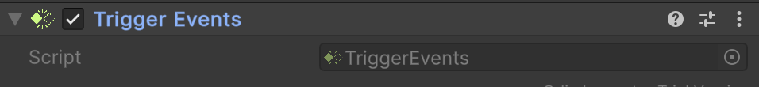

# 🧩 TriggerEvents

A **Unity MonoBehaviour** that exposes Unity’s 3D trigger callbacks as C# events. This allows
external scripts to react
to trigger interactions without overriding Unity callbacks. Attach
this component to a `GameObject` with a **Collider** set as a **Trigger** to receive events.

---

## 📑 Table of Contents

- [Quick Start](#-quick-start)
- [API Reference](#-api-reference)
    - [Type](#-type)
    - [Events](#-events)
        - [OnEntered](#onentered)
        - [OnExited](#onexited)
        - [OnStay](#onstay)
    - [Methods](#-methods)
        - [OnTriggerEnter(Collider)](#ontriggerentercollider)
        - [OnTriggerExit(Collider)](#ontriggerexitcollider)
        - [OnTriggerStay(Collider)](#ontriggerstaycollider)
- [Notes](#-notes)

---

## 🚀 Quick Start

#### Step 1. Add Component

Add a **`Atomic/Elements/TriggerEvents`** component to a `GameObject` with a **Collider** set as a trigger.



#### Step 2. Create Script

Create a script that will handle trigger events:

```csharp
public class Example : MonoBehaviour
{
    [SerializeField]
    private TriggerEvents _triggerEvents;

    private void OnEnable()
    {
        _triggerEvents.OnEntered += HandleEnter;
        _triggerEvents.OnExited  += HandleExit;
        _triggerEvents.OnStay    += HandleStay;
    }

    private void OnDisable()
    {
        _triggerEvents.OnEntered -= HandleEnter;
        _triggerEvents.OnExited  -= HandleExit;
        _triggerEvents.OnStay    -= HandleStay;
    }

    private void HandleEnter(Collider other)
        => Debug.Log($"Trigger entered by {other.gameObject.name}");

    private void HandleExit(Collider other)
        => Debug.Log($"Trigger exited by {other.gameObject.name}");

    private void HandleStay(Collider other)
        => Debug.Log($"Still inside trigger: {other.gameObject.name}");
}
```

#### Step 3. Attach Script

Attach the `Example` script to the **same GameObject**.

#### Step 4. Run and Test

Enter **Play Mode** in Unity. When other colliders interact with the trigger, you’ll see logs in the **Console**.

---

## 🔍 API Reference

### 🏛️ Type <div id="-type"></div>

```csharp
[AddComponentMenu("Atomic/Elements/Trigger Events")]
[DisallowMultipleComponent]
public sealed class TriggerEvents : MonoBehaviour
```

- **Inheritance:** `MonoBehaviour`

---

### ⚡ Events

#### `OnEntered`

```csharp
public event Action<Collider> OnEntered;
```

- **Description:** Invoked when a collider **enters** the trigger zone.
- **Parameter:** `Collider` — the collider that entered.
- **Unity Equivalent:** `MonoBehaviour.OnTriggerEnter(Collider)`

#### `OnExited`

```csharp
public event Action<Collider> OnExited;
```

- **Description:** Invoked when a collider **exits** the trigger zone.
- **Parameter:** `Collider` — the collider that exited.
- **Unity Equivalent:** `MonoBehaviour.OnTriggerExit(Collider)`

#### `OnStay`

```csharp
public event Action<Collider> OnStay;
```

- **Description:** Invoked every frame while a collider **remains** inside the trigger.
- **Parameter:** `Collider` — the collider that is staying.
- **Unity Equivalent:** `MonoBehaviour.OnTriggerStay(Collider)`

---

### 🏹 Methods

These methods are automatically called by Unity and forward events to C# subscribers.

#### `OnTriggerEnter(Collider)`

```csharp
public void OnTriggerEnter(Collider other);
```

- **Description:** Called when a collider enters the trigger.
- **Parameter:** `Collider` — the collider that entered.
- **Dispatches:** `OnEntered`

#### `OnTriggerExit(Collider)`

```csharp
public void OnTriggerExit(Collider other);
```

- **Description:** Called when a collider exits the trigger.
- **Parameter:** `Collider` — the collider that exited.
- **Dispatches:** `OnExited`

#### `OnTriggerStay(Collider)`

```csharp
public void OnTriggerStay(Collider other);
```

- **Description:** Called every frame while a collider remains in the trigger.
- **Parameter:** `Collider` — the collider that is staying.
- **Dispatches:** `OnStay`

---

## 📝 Notes

- Requires a **Collider** set as a **Trigger**.
- Works with **3D physics** (`Collider`) and is not compatible with 2D triggers (`Collider2D`).
- Decouples trigger handling from MonoBehaviour lifecycle methods.
- Supports multiple subscribers per event.