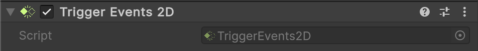

# 🧩 TriggerEvents2D

A **Unity MonoBehaviour** that exposes Unity’s 2D trigger callbacks (`OnTriggerEnter2D`,
`OnTriggerExit2D`,`OnTriggerStay2D`) as C# events. This allows external scripts to react to 2D trigger interactions
without overriding Unity callbacks. Attach this component to a `GameObject` with a **2D Collider** set as a **Trigger**
to receive events.

---


## 📑 Table of Contents

- [Quick Start](#-quick-start)
- [API Reference](#-api-reference)
    - [Type](#-type)
    - [Events](#-events)
        - [OnEntered](#onentered)
        - [OnExited](#onexited)
        - [OnStay](#onstay)
    - [Methods](#-methods)
        - [OnTriggerEnter2D(Collider2D)](#ontriggerenter2dcollider2d)
        - [OnTriggerExit2D(Collider2D)](#ontriggerexit2dcollider2d)
        - [OnTriggerStay2D(Collider2D)](#ontriggerstay2dcollider2d)
- [Notes](#-notes)

---

## 🚀 Quick Start

#### Step 1. Add Component

Add a **`Atomic/Elements/TriggerEvents2D`** component to a `GameObject` with a **2D Collider** set as a trigger.



#### Step 2. Create Script

Create a script that will handle trigger events:

```csharp
public class Trigger2DExample : MonoBehaviour
{
    [SerializeField]
    private TriggerEvents2D _triggerEvents;

    private void OnEnable()
    {
        _triggerEvents.OnEntered += HandleEnter;
        _triggerEvents.OnExited  += HandleExit;
        _triggerEvents.OnStay    += HandleStay;
    }

    private void OnDisable()
    {
        _triggerEvents.OnEntered -= HandleEnter;
        _triggerEvents.OnExited  -= HandleExit;
        _triggerEvents.OnStay    -= HandleStay;
    }

    private void HandleEnter(Collider2D other)
        => Debug.Log($"2D Trigger entered by {other.gameObject.name}");

    private void HandleExit(Collider2D other)
        => Debug.Log($"2D Trigger exited by {other.gameObject.name}");

    private void HandleStay(Collider2D other)
        => Debug.Log($"Still inside 2D trigger: {other.gameObject.name}");
}
```

#### Step 3. Attach Script

Attach the `Trigger2DExample` script to the **same GameObject**.

#### Step 4. Run and Test

Enter **Play Mode** in Unity. When other 2D colliders interact with the trigger, logs will appear in the **Console**.

---

## 🔍 API Reference

### 🏛️ Type <div id="-type"></div>

```csharp
[AddComponentMenu("Atomic/Elements/Trigger Events 2D")]
[DisallowMultipleComponent]
public sealed class TriggerEvents2D : MonoBehaviour
```

- **Inheritance:** `MonoBehaviour`

---

### ⚡ Events

#### `OnEntered`

```csharp
public event Action<Collider2D> OnEntered;
```

- **Description:** Invoked when a 2D collider **enters** the trigger zone.
- **Parameter:** `Collider2D` — the collider that entered.
- **Unity Equivalent:** `MonoBehaviour.OnTriggerEnter2D(Collider2D)`

#### `OnExited`

```csharp
public event Action<Collider2D> OnExited;
```

- **Description:** Invoked when a 2D collider **exits** the trigger zone.
- **Parameter:** `Collider2D` — the collider that exited.
- **Unity Equivalent:** `MonoBehaviour.OnTriggerExit2D(Collider2D)`

#### `OnStay`

```csharp
public event Action<Collider2D> OnStay;
```

- **Description:** Invoked every frame while a 2D collider **remains** inside the trigger.
- **Parameter:** `Collider2D` — the collider that is staying.
- **Unity Equivalent:** `MonoBehaviour.OnTriggerStay2D(Collider2D)`

---

### 🏹 Methods

These methods are automatically called by Unity and forward events to C# subscribers.

#### `OnTriggerEnter2D(Collider2D)`

```csharp
public void OnTriggerEnter2D(Collider2D other);
```

- **Description:** Called when a 2D collider enters the trigger.
- **Dispatches:** `OnEntered`

#### `OnTriggerExit2D(Collider2D)`

```csharp
public void OnTriggerExit2D(Collider2D other);
```

- **Description:** Called when a 2D collider exits the trigger.
- **Dispatches:** `OnExited`

#### `OnTriggerStay2D(Collider2D)`

```csharp
public void OnTriggerStay2D(Collider2D other);
```

- **Description:** Called every frame while a 2D collider remains in the trigger.
- **Dispatches:** `OnStay`

---

## 📝 Notes

- Requires a **2D Collider** set as a **Trigger**.
- Works with **2D physics** (`Collider2D`) and is not compatible with 3D triggers (`Collider`).
- Decouples trigger handling from MonoBehaviour lifecycle methods.
- Supports multiple subscribers per event.
