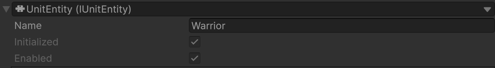
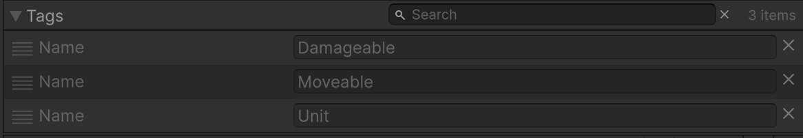
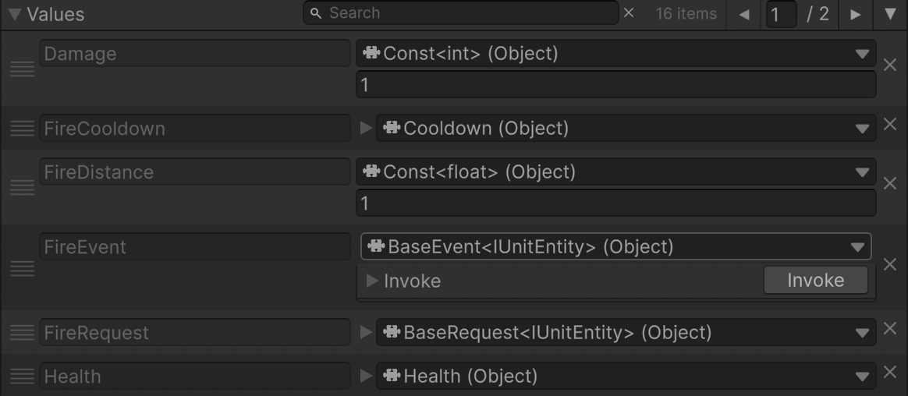
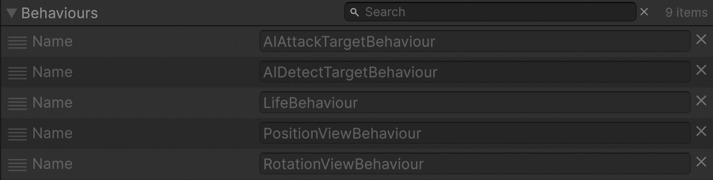

# 🧩 Entity Debug

Represents debug properties are available only in <b>Unity Editor</b> when using <b>Odin Inspector</b>

---

## 📑 Table of Contents

- [Examples of Usage](#-examples-of-usage)
  - [Core](#ex1)
  - [Tags](#ex2)
  - [Values](#ex3)
  - [Behaviours](#ex4)
- [Debug Parameters](#-debug-parameters)

---

## 🗂 Examples of Usage

Below are debug inspector examples for the [Entity](Entity.md):

### 1️⃣ Core Debug

- **Options:**
    - Change name of an entity

---

### 2️⃣ Tag Debug

- **Options:**
    - Search Tag by name
    - Delete Tag by the cross button

---

### 3️⃣ Value Debug

- **Options:**
    - Search Value by name
    - Change Value by reference
    - Delete Value by the cross button

---

### 4️⃣ Behaviour Debug

- **Options:**
    - Search Behaviour by name
    - Delete Behaviour

---

## 🛠 Debug Parameters

| Parameter     | Description                                           |
|---------------|-------------------------------------------------------|
| `Name`        | Displays entity name in the Unity Editor.             |
| `Initialized` | Displays if the entity is initialized.                |
| `Enabled`     | Displays if the entity is enabled.                    |
| `Tags`        | Sorted list of tags for debug display.                |
| `Values`      | Sorted list of values for debug display.              |
| `Behaviours`  | Sorted list of attached behaviours for debug display. |