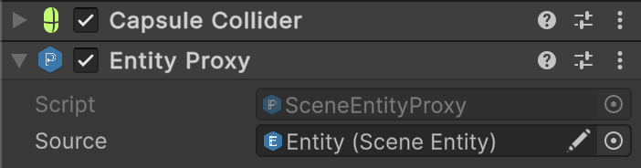

# 🧩 Entities

An **Entity** is the fundamental element in the framework. Each entity is a container that holds **tags**,
**properties**, **behaviors**, and own **lifecycle**. This container is **dynamic** and strictly separates **data** from
**logic**, which allows for rapid development of game mechanics and their reuse. Thus, every game object, entity, and
system is a **composition**.

---

## 📑 Table of Contents

- [Examples of Usage](#-examples-of-usage)
    - [Entity](#ex1)
    - [SceneEntity](#ex2)
    - [SceneEntityProxy](#ex3)
    - [SceneEntitySingleton](#ex4)
- [API Reference](#-api-reference)
- [Performance](#-performance)
    - [Tags](#-tags)
    - [Values](#-values)
    - [Behaviours](#-behaviours)
- [Best Practices](#-best-practices)

---

## 🗂 Examples of Usage

<div id="ex1"></div>

### 1️⃣ Entity

Below is the process for quickly creating an entity in plain C#

#### 1. Create a new instance of the entity

```csharp
//Create a new entity
IEntity entity = new Entity("Character");

//Add tags
entity.AddTag("Moveable");

//Add properties
entity.AddValue("Position", new ReactiveVariable<Vector3>());
entity.AddValue("MoveSpeed", new Const<float>(3.5f));
entity.AddValue("MoveDirection", new ReactiveVariable<Vector3>());
```

#### 2. Create a movement mechanics for the entity

```csharp
//Controller that moves entity by its direction
public sealed class MoveBehaviour : IEntityInit, IEntityTick
{
    private IVariable<Vector3> _position;
    private IValue<float> _moveSpeed;
    private IValue<Vector3> _moveDirection;

    //Called when Entity.Init()
    public void Init(IEntity entity)
    {
        _position = entity.GetValue<IVariable<Vector3>>("Position");
        _moveSpeed = entity.GetValue<IValue<float>>("MoveSpeed");
        _moveDirection = entity.GetValue<IValue<Vector3>>("MoveDirection");
    }

    //Called when Entity.OnUpdate()
    public void Tick(IEntity entity, float deltaTime)
    {
        Vector3 direction = _moveDirection.Value;
        if (direction != Vector3.zero) 
            _position.Value += _moveSpeed.Value * deltaTime * direction;
    }
}
```

#### 3. Attach `MoveBehaviour` instance to the entity

```csharp
entity.AddBehaviour<MoveBehaviour>();
```

#### 4. Control lifecycle of your entity

```csharp
// Initialize the entity -> Calls IEntityInit
entity.Init();

// Enable the entity for updates -> Calls IEntityEnable 
entity.Enable(); 

// Update your entity while game is running
const float deltaTime = 0.016f; // 60 FPS
while(isGameRunning)
{
   entity.Tick(deltaTime); // Calls IEntityTick
   System.Threading.Thread.Sleep(16); // deltaTime * 1000 
}

// Disable entity for updates -> Calls IEntityDisable
entity.Disable();

// Dispose entity resources -> Calls IEntityDispose
entity.Dispose();
```

<div id="ex2"></div>

---

### 2️⃣ SceneEntity

Below is the process for quickly creating a character entity in Unity

#### 1. Create a new `GameObject` on a scene


#### 2. Add `Entity` Component to the GameObject


#### 3. Create a movement mechanics for the entity

```csharp
// Controller that moves entity by its direction
public sealed class MoveBehaviour : IEntityInit, IEntityFixedTick
{
    private Transform _transform;
    private IValue<float> _moveSpeed;
    private IValue<Vector3> _moveDirection;

    // Called when MonoBehaviour.Start() is invoked
    public void Init(IEntity entity)
    {
        _transform = entity.GetValue<Transform>("Transform");
        _moveSpeed = entity.GetValue<IValue<float>>("MoveSpeed");
        _moveDirection = entity.GetValue<IValue<Vector3>>("MoveDirection");
    }

    // Called when MonoBehaviour.FixedUpdate() is invoked
    public void FixedTick(IEntity entity, float deltaTime)
    {
        Vector3 direction = _moveDirection.Value;
        if (direction != Vector3.zero) 
            _transform.position += _moveSpeed.Value * deltaTime * direction;
    }
}
```

#### 4. Create a script that populates the entity with tags, values and behaviours

 ```csharp
//Populates entity with tags, values and behaviours
public sealed class CharacterInstaller : SceneEntityInstaller
{
    [SerializeField] private Transform _transform;
    [SerializeField] private Const<float> _moveSpeed = 5.0f; //Immutable variable
    [SerializeField] private ReactiveVariable<Vector3> _moveDirection; //Mutable variable with subscription

    public override void Install(IEntity entity)
    {
        //Add tags to a character
        entity.AddTag("Character");
        entity.AddTag("Moveable");

        //Add properties to a character
        entity.AddValue("Transform", _transform);
        entity.AddValue("MoveSpeed", _moveSpeed);
        entity.AddValue("MoveDirection", _moveDirection);
        
        //Add behaviours to a character
        entity.AddBehaviour<MoveBehaviour>();
    }
}
```

#### 5. Attach `CharacterInstaller` script to the GameObject


#### 6. Drag & drop `CharacterInstaller` into `installers` field of the entity


#### 7. Enter `PlayMode` and check your character movement!

<div id="ex3"></div>

---

### 3️⃣ SceneEntityProxy

1. Add a **Collider** component to the **child GameObject**.  
   


2. Attach a **SceneEntityProxy** component to the same GameObject.  
   


3. In the `SceneEntityProxy`, assign the parent entity reference to the **Source** field.


4. Now, whenever another collider interacts with this child collider, you can easily retrieve the parent entity.

---

<div id="ex4"></div>

### 4️⃣ SceneEntitySingleton

```csharp
public class GameContext : SceneEntitySingleton<GameContext>
{
}
```

```csharp
// Access globally
var context = GameContext.Instance;
context.AddValue("Score", 42);

int score = context.GetValue<int>("Score");
Debug.Log(score); // 42
```

---

## 🔍 API Reference

Below are the interfaces and classes for working with entities.

<ul>
<li>

<details>
<summary><a href="IEntity.md"><strong>IEntity</strong></a></summary>

<ul>
  <li><a href="IEntityCore.md">Core</a></li>
  <li><a href="IEntityTags.md">Tags</a></li>
  <li><a href="IEntityValues.md">Values</a></li>
  <li><a href="IEntityBehaviours.md">Behaviours</a></li>
  <li><a href="IEntityLifecycle.md">Lifecycle</a></li>
</ul>

</details>
</li>

<li>

<details>
<summary><a href="Entity.md"><strong>Entity</strong></a></summary>

<ul>
  <li><a href="EntityCore.md">Core</a></li>
  <li><a href="EntityTags.md">Tags</a></li>
  <li><a href="EntityValues.md">Values</a></li>
  <li><a href="EntityBehaviours.md">Behaviours</a></li>
  <li><a href="EntityLifecycle.md">Lifecycle</a></li>
  <li><a href="EntityDebug.md">Debug</a></li>
</ul>

</details>
</li>

<li>

<details>
<summary><a href="SceneEntity.md"><strong>SceneEntity</strong></a></summary>

<ul>
  <li><a href="SceneEntityCore.md">Core</a></li>
  <li><a href="SceneEntityTags.md">Tags</a></li>
  <li><a href="SceneEntityValues.md">Values</a></li>
  <li><a href="SceneEntityBehaviours.md">Behaviours</a></li>
  <li><a href="SceneEntityLifecycle.md">Lifecycle</a></li>
  <li><a href="SceneEntityInstalling.md">Installing</a></li>
  <li><a href="SceneEntityGizmos.md">Gizmos</a></li>
  <li><a href="SceneEntityDebug.md">Debug</a></li>
  <li><a href="SceneEntityEditor.md">Editor</a></li>
  <li><details><summary><a href="SceneEntityCreation.md">Creation</a></summary>
    <ul>
        <li><a href="SceneEntityCreateArgs.md">CreateArgs</a></li>
    </ul></details>
  </li>
  <li><a href="SceneEntityDestruction.md">Destruction</a></li>
  <li><a href="SceneEntityCasting.md">Casting</a></li>
</ul>

</details>

</li>


<li>

<details>
<summary><a href="SceneEntityProxies.md"><strong>SceneEntityProxies</strong></a></summary>
    <ul>
      <li><a href="SceneEntityProxy.md">SceneEntityProxy</a></li>
      <li><a href="SceneEntityProxy.md">SceneEntityProxy&lt;E&gt;</a></li>
    </ul>
</details>

</li>

<li>


<details>
<summary><strong>Singletons</strong></summary>
    <ul>
      <li><a href="EntitySingleton.md">EntitySingleton&lt;E&gt;</a></li>
      <li><a href="SceneEntitySingleton.md">SceneEntitySingleton&lt;E&gt;</a></li>
    </ul>
</details>

</li>

<details>
<summary><strong>Extensions</strong></summary>
    <ul>
      <li><a href="ExtensionsCore.md">Core</a></li>
      <li><a href="ExtensionsTags.md">Tags</a></li>
      <li><a href="ExtensionsValues.md">Values</a></li>
      <li><a href="ExtensionsBehaviours.md">Behaviours</a></li>
      <li><a href="ExtensionsInstalling.md">Installing</a></li>
      <li><a href="ExtensionsRetrieval.md">Retrieval</a></li>
    </ul>
</details>

</ul>


---

## 🔥 Performance

The performance measurements below were conducted on a <b>MacBook with Apple M1</b>,
using <b>1,000 elements</b> for each container type. All times are <b>median execution times</b>,
in microseconds (μs).

---

<div id="-tags"></div>

### 🏷️ Tags

Tags are implemented as a **HashSet of integers**, optimized for fast lookups, additions, and removals.

| Operation  | HashSet (Median μs) | Tags (Median μs) |
|------------|---------------------|------------------|
| Contains   | 47.85               | 3.80             |
| Add        | 57.40               | 8.30             |
| Remove     | 50.45               | 5.40             |
| Clear      | 1.10                | 2.80             |
| Enumerator | 29.75               | 2.30             |

> Tags are extremely lightweight and provide **O(1) average time complexity** for key operations.

---

<div id="-values"></div>

### 🔑 Values

Values act as a **Dictionary-like storage** mapping integer keys to objects or structs, supporting generic access and
unsafe references for high performance.

| Operation            | Dictionary (Median μs) | Values (Median μs)                 |
|----------------------|------------------------|------------------------------------|
| Get                  | 7.40                   | 4.10 (object)                      |
| Get + Cast           | 8.25                   | 12.00 (reference) / 4.70 (value)   |
| Get + Unsafe Cast    | 7.80                   | 4.20 (reference) / 4.50 (value)    |
| TryGet               | 34.20                  | 31.20 (object)                     |
| TryGet + Cast        | -                      | 50.75 (reference) / 4.90  (value)  |
| TryGet + Unsafe Cast | -                      | 30.50 (reference) / 6.90  (value)  |
| Add                  | 34.10                  | 62.15 (reference) / 178.45 (value) |
| Remove               | 6.70                   | 5.20 (reference) / 5.50 (value)    |
| Clear                | 1.30                   | 2.60                               |
| Contains             | 6.90                   | 4.00                               |
| Set                  | 37.50                  | 62.50 (reference) / 187.35 (value) |
| Enumerator           | 56.60                  | 56.80 (reference) / 171.75 (value) |

> Values provide flexible access patterns with **minimal overhead**, especially for primitives and unsafe references.

---

<div id="-behaviours"></div>

### ⚙️ Behaviours

Behaviours are stored in a **list-like container**, supporting multiple references to the same instance. Operations
include addition, removal, and indexed access.

| Operation  | List (Median μs) | Behaviours (Median μs) |
|------------|------------------|------------------------|
| Add        | 29.30            | 34.30                  |
| Clear      | 0.40             | 1.20                   |
| Contains   | 1825.95          | 650.60                 |
| Remove     | 312.63           | 243.91                 |
| Get At     | 1.60             | 2.30                   |
| Enumerator | 29.95            | 28.80                  |

> Behaviours combine fast index access with flexibility to store duplicate references, though some operations are
> **O(n)** in the worst case.

---

## 📌 Best Practices

- [Iterating over Entity Tags, Values and Behaviours](../../BestPractices/IteratingOverEntity.md) <!-- + -->
- [Building Entity System with Model & View Separation](../../BestPractices/EntitySystem.md)  <!-- + -->
- [Modular EntityInstallers](../BestPractices/ModularEntityInstallers.md)  <!-- + -->
