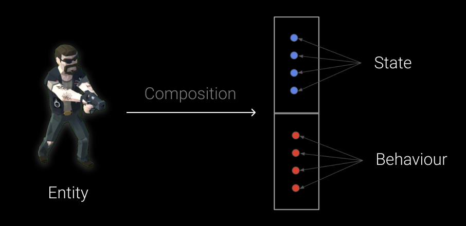

# 🧩 Entities

An **Entity** is the fundamental element in the framework. Each entity is a container that holds **tags**,
**properties**, **behaviors**, and own **lifecycle**. This container is **dynamic** and strictly separates **data** from
**logic**, which allows for rapid development of game mechanics and their reuse. Thus, every game object, entity, and
system is a **composition**.

---

## 📑 Table of Contents

- [API Reference](#-api-reference)
- [Core Concept](#-core-concept)
- [Unity Quick Start](#-unity-quick-start)
- [CSharp Quick Start](#-csharp-quick-start)
- [Examples of Usage](#-examples-of-usage)
- [Performance](#-performance)

---

## 🔍 API Reference

Below are the interfaces and classes for working with entities.

- [IEntity](IEntity.md)
- [Entity](Entity.md)
- [EntitySingleton](EntitySingleton.md)
- [SceneEntity](SceneEntity.md)
- [SceneEntityProxy](SceneEntityProxy.md)
- [SceneEntitySingleton](SceneEntitySingleton.md)
- [Extensions](Extensions.md)

---

## 💡 Core Concept

At the core of all entities lies the **Entity-State-Behaviour (ESB)** pattern.
The idea of the **ESB** pattern is that any object, system, or AI can be represented as an **Entity** with a
**composition** of data (**State**) and logic (**Behaviour**), but with a strict separation between them.

Since State and Behaviour are strictly separated, this makes it possible to **reuse components** and **modify the
structure of a game object at runtime**. This approach provides great flexibility and allows for the rapid development
of gameplay interactions.

- **Entity** — a container that holds collections of data and logic.
- **State** — a data map that defines the parameters of an entity.
- **Behaviour** — a set of controllers that operate on the entity’s *State* they are attached to.



---

## 🚀 Unity Quick Start

Below is the process for quickly creating a character entity in Unity:

#### 1. Create a new `GameObject`


#### 2. Add `Entity` Component to the GameObject


#### 3. Create `MoveBehaviour` for your entity

```csharp
// Controller that moves entity by its direction
public sealed class MoveBehaviour : IEntityInit, IEntityFixedTick
{
    private Transform _transform;
    private IValue<float> _moveSpeed;
    private IValue<Vector3> _moveDirection;

    // Called when MonoBehaviour.Start() is invoked
    public void Init(IEntity entity)
    {
        _transform = entity.GetValue<Transform>("Transform");
        _moveSpeed = entity.GetValue<IValue<float>>("MoveSpeed");
        _moveDirection = entity.GetValue<IValue<Vector3>>("MoveDirection");
    }

    // Called when MonoBehaviour.FixedUpdate() is invoked
    public void FixedTick(IEntity entity, float deltaTime)
    {
        Vector3 direction = _moveDirection.Value;
        if (direction != Vector3.zero) 
            _transform.position += _moveSpeed.Value * deltaTime * direction;
    }
}
```

#### 4. Create `CharacterInstaller` script

 ```csharp
//Populates entity with tags, values and behaviours
public sealed class CharacterInstaller : SceneEntityInstaller
{
    [SerializeField] private Transform _transform;
    [SerializeField] private Const<float> _moveSpeed = 5.0f; //Immutable variable
    [SerializeField] private ReactiveVariable<Vector3> _moveDirection; //Mutable variable with subscription

    public override void Install(IEntity entity)
    {
        //Add tags to a character
        entity.AddTag("Character");
        entity.AddTag("Moveable");

        //Add properties to a character
        entity.AddValue("Transform", _transform);
        entity.AddValue("MoveSpeed", _moveSpeed);
        entity.AddValue("MoveDirection", _moveDirection);
        
        //Add behaviours to a character
        entity.AddBehaviour<MoveBehaviour>();
    }
}
```

#### 5. Attach `CharacterInstaller` script to the GameObject


#### 6. Drag & drop `CharacterInstaller` into `installers` field of the entity


#### 7. Enter `PlayMode` and check your character movement!

---

## ⚡ CSharp Quick Start

Below is the process for quickly creating an entity in plain C#

#### 1. Create a new entity

```csharp
//Create a new entity
IEntity entity = new Entity("Character");

//Add tags
entity.AddTag("Moveable");

//Add properties
entity.AddValue("Position", new ReactiveVariable<Vector3>());
entity.AddValue("MoveSpeed", new Const<float>(3.5f));
entity.AddValue("MoveDirection", new ReactiveVariable<Vector3>());
```

#### 2. Create `MoveBehaviour` for the entity

```csharp
//Controller that moves entity by its direction
public sealed class MoveBehaviour : IEntityInit, IEntityTick
{
    private IVariable<Vector3> _position;
    private IValue<float> _moveSpeed;
    private IValue<Vector3> _moveDirection;

    //Called when Entity.Init()
    public void Init(IEntity entity)
    {
        _position = entity.GetValue<IVariable<Vector3>>("Position");
        _moveSpeed = entity.GetValue<IValue<float>>("MoveSpeed");
        _moveDirection = entity.GetValue<IValue<Vector3>>("MoveDirection");
    }

    //Called when Entity.OnUpdate()
    public void Tick(IEntity entity, float deltaTime)
    {
        Vector3 direction = _moveDirection.Value;
        if (direction != Vector3.zero) 
            _position.Value += _moveSpeed.Value * deltaTime * direction;
    }
}
```

#### 3. Add `MoveBehaviour` to the entity

```csharp
entity.AddBehaviour<MoveBehaviour>();
```

#### 4. Initialize the entity when game is loading

```csharp
//Calls IEntityInit
entity.Init();
```

#### 5. Enable the entity when game is started

```csharp
//Enable entity for updates
//Calls IEntityEnable
entity.Enable(); 
```

#### 6. Update the entity while a game is running

```csharp
const float deltaTime = 0.02f;

while(_isGameRunning)
{ 
   //Calls IEntityTick
   entity.Tick(deltaTime); 
}
```

#### 7. When game is finished disable the entity

```csharp
//Disable entity for updates
//Calls IEntityDisable
character.Disable();
```

#### 8. Dispose the entity when unloading game resources

```csharp
//Dispose entity resources
//Calls IEntityDispose
entity.Dispose();
```

---

## 🗂 Examples of Usage

Below are examples of working with an entity, which include **Core**, **Tags**, **Values**, **Behaviours**, and *
*Lifecycle**.

---

### 💠 Core Usage

This example demonstrates the basic operations you can perform with an entity:

```csharp
// Assume we have instance of entity
IEntity entity = ...

// Subscribe to the OnStateChanged event
entity.OnStateChanged += (IEntity e) =>
{
    Console.WriteLine($"Entity {e.Name} (ID: {e.InstanceID}) changed state!");
};

// Change name
entity.Name = "Hero"; //Triggers state changed

// Read the unique runtime identifier
int id = entity.InstanceID;
Console.WriteLine($"Created entity '{entity.Name}' with ID: {id}");
```

### 🏷️ Tag Usage

This example demonstrates how to use tags with entity, including adding, removing, and checking tags. Three
approaches are shown:

1. Using **numeric keys** for performance
2. Using **string names** for readability
3. Using **code generation** for real projects.

---

#### 1️⃣ Using Numeric Keys

By default, all tags use `int` keys because this avoids computing hash codes and is very fast; therefore, the example
below uses numeric keys as the default approach.

```csharp
// Assume we have instance of entity
IEntity entity = ...

// Subscribe to tag events
entity.OnTagAdded += (e, tagId) => 
    Console.WriteLine($"Tag added: {tagId}");
entity.OnTagDeleted += (e, tagId) => 
    Console.WriteLine($"Tag removed: {tagId}");

// Add tags by numeric ID
entity.AddTag(1);         // Player tag = 1
entity.AddTag(2);         // NPC tag = 2

// Check tags
if (entity.HasTag(1)) //Check if  Player tag exists
    Console.WriteLine("Entity has tag ID 1 (Player)");

// Remove a NPC tag
entity.DelTag(2);

// Add multiple tags
entity.AddTags(new int[] { 3, 4 }); // Ally, Merchant

// Enumerate all tags
foreach (int id in entity.GetTags())
    Console.WriteLine($"Entity tag ID: {id}");
```

---

#### 2️⃣ Using String Names

In this example, for convenience, there are [extension methods](ExtensionsTags.md) for the entity. This format is more
user-friendly but slightly slower than using numeric keys.

```csharp
// Assume we have instance of entity
IEntity entity = ...

// Add tags by string name
entity.AddTag("Player");
entity.AddTag("NPC");

// Check tags
if (entity.HasTag("Player"))
    Console.WriteLine("Entity is a Player");

// Remove a tag
entity.DelTag("NPC");

// Add multiple tags at once
entity.AddTags(new string[] { "Ally", "Merchant" });

// Enumerate all tags (numeric IDs)
foreach (int id in entity.GetTags())
    Console.WriteLine($"Entity tag ID: {id}");
```

---

#### 3️⃣ Using Entity API

Sometimes managing tags by raw `int` keys or `string` names can get messy and error-prone, especially in big projects.
To make this process easier and **type-safe**, the Atomic Framework supports **code generation**.
This means you describe all your tags (and values) once in a small config file, and the framework will automatically
generate C# helpers. You can learn more about this in the Manual under
the [Entity API](../EntityAPI/Manual.md) feature.

```csharp
// Assume we have instance of entity
IEntity entity = ...

// Add tags
entity.AddPlayerTag();
entity.AddNPCTag();

// Check tag
if (entity.HasPlayerTag())
    Console.WriteLine("Entity is a Player");

// Remove a tag
entity.DelNPCTag();
```

---

### 🔑 Value Usage

This example demonstrates how to use **values** with entity, including adding, retrieving, updating, and removing
values. Three approaches are shown:

1. Using **numeric keys** for performance
2. Using **string names** for readability
3. Using **code generation** for real projects.

---

#### 1️⃣ Using Numeric Keys

By default, all values use `int` keys because this avoids computing hash codes and is very fast; therefore, the example
below uses numeric keys as the default approach.

```csharp
// Create a new entity
IEntity entity = new Entity();

// Subscribe to value events
entity.OnValueChanged += (e, key) => Console.WriteLine($"Value {key} changed");

//Add health property
entity.AddValue(1, 100); //Health = 1

//Add speed property
entity.AddValue(2, 12.5f); //Speed = 2

//Add inventory property
entity.AddValue(3, new Inventory()); //Inventory = 3

// Get a value
int health = entity.GetValue<int>(1);
Console.WriteLine($"Health: {health}");

// Update a Health
entity.SetValue(1, 150);

// Remove a Speed value
entity.DelValue(2);
```

---

#### 2️⃣ Using String Names

In this example, for convenience, there are [extension methods](ExtensionsValues.md) for the entity. This format is
more user-friendly but slightly slower than using numeric keys.

```csharp
// Create a new entity
IEntity entity = new Entity();

// Add values by string key
entity.AddValue("Health", 100);
entity.AddValue("Speed", 12.5f);
entity.AddValue("Inventory", new Inventory());

// Get a value
int health = entity.GetValue<int>("Health");
Console.WriteLine($"Health: {health}");

// Update a value
entity.SetValue("Health", 150);

// Remove a value
entity.DelValue("Inventory");
```

---

#### 3️⃣ Using Entity API

Managing values by raw `int` keys or `string` names can be error-prone, especially in larger projects. To make the
process easier and **type-safe**, the Atomic Framework supports **code generation**. You describe all your tags and
values once in a small config file, and the framework automatically generates
strongly-typed C# helpers. More details are in the Manual under
the [Entity API](../EntityAPI/Manual.md) section.

```csharp
// Create a new entity
IEntity entity = new Entity();

// Add values
entity.AddHealth(100);
entity.AddSpeed(12.5f);
entity.AddInventory(new GridInventory());

// Get a value
int health = entity.GetHealth();
Console.WriteLine($"Health: {health}");

// Update a value
entity.SetHealth(150);

// Remove a value
entity.DelInventory();
```

---


### ⚙️ Behaviours Usage

Below is an example of working with behaviours in `IEntity`.

#### 1️⃣ Basic Usage

```csharp
// Assume we have a player entity:
IEntity player = ...

// Subscribe to events
player.OnBehaviourAdded += (e, b) => 
    Console.WriteLine($"Behaviour {b.GetType().Name} added to {e.Id}");

player.OnBehaviourDeleted += (e, b) => 
    Console.WriteLine($"Behaviour {b.GetType().Name} removed from {e.Id}");

// Add behaviours
player.AddBehaviour(new MovementBehaviour());
player.AddBehaviour(new RotationBehaviour());

// Check count
Console.WriteLine($"Total behaviours: {player.BehaviourCount}");

// Retrieve behaviour by type
MovementBehaviour movementBehaviour = player.GetBehaviour<MovementBehaviour>();

// Try to retrieve behaviour by type
if (player.TryGetBehaviour<RotationBehaviour>(out var rotation))
    Console.WriteLine("Found RotationBehaviour");

// Remove behaviour
player.DelBehaviour<MovementBehaviour>();

// Clear all behaviours
player.ClearBehaviours();

// Enumerate all behaviours
foreach (IEntityBehaviour behaviour in player.GetBehaviourEnumerator())
    Console.WriteLine($"Behaviour: {behaviour.GetType().Name}");

// Get array of behaviours
IEntityBehaviour[] behaviours = player.GetBehaviours();

// Copy to array
IEntityBehaviour[] buffer = new IEntityBehaviour[10];
int copied = player.CopyBehaviours(buffer);

Console.WriteLine($"Copied {copied} behaviours into buffer");
```

#### 2️⃣ Using Extension Methods

The framework also provides [extension methods](Extensions.md#-behaviours) for convenient handling of behaviours.

```csharp
// Create a new entity
IEntity enemy = new Entity();

// Add behaviour by type (using new T())
enemy.AddBehaviour<MoveBehaviour>();

// Add multiple behaviours at once
var attackBehaviour = new AttackBehaviour();
var defenseBehaviour = new DefenseBehaviour();

enemy.AddBehaviours(new IEntityBehaviour[] {
    attackBehaviour, defenseBehaviour
});

// Remove multiple behaviours at once
enemy.DelBehaviours(new IEntityBehaviour[] {
    attackBehaviour, defenseBehaviour
});
```

## 🔥 Performance

The performance measurements below were conducted on a **MacBook with Apple M1**, using **1,000 elements** for each
container type. All times are **median execution times** in microseconds (μs).

### 🏷️ Tags

Tags are implemented as a **HashSet of integers**, optimized for fast lookups, additions, and removals.

| Operation  | HashSet (Median μs) | Tags (Median μs) |
|------------|---------------------|------------------|
| Contains   | 47.85               | 3.80             |
| Add        | 57.40               | 8.30             |
| Remove     | 50.45               | 5.40             |
| Clear      | 1.10                | 2.80             |
| Enumerator | 29.75               | 2.30             |

> Tags are extremely lightweight and provide **O(1) average time complexity** for key operations.

---

### 🔑 Values

Values act as a **Dictionary-like storage** mapping integer keys to objects or structs, supporting generic access and
unsafe references for high performance.

| Operation            | Dictionary (Median μs) | Values (Median μs)                 |
|----------------------|------------------------|------------------------------------|
| Get                  | 7.40                   | 4.10 (object)                      |
| Get + Cast           | 8.25                   | 12.00 (reference) / 4.70 (value)   |
| Get + Unsafe Cast    | 7.80                   | 4.20 (reference) / 4.50 (value)    |
| TryGet               | 34.20                  | 31.20 (object)                     |
| TryGet + Cast        | -                      | 50.75 (reference) / 4.90  (value)  |
| TryGet + Unsafe Cast | -                      | 30.50 (reference) / 6.90  (value)  |
| Add                  | 34.10                  | 62.15 (reference) / 178.45 (value) |
| Remove               | 6.70                   | 5.20 (reference) / 5.50 (value)    |
| Clear                | 1.30                   | 2.60                               |
| Contains             | 6.90                   | 4.00                               |
| Set                  | 37.50                  | 62.50 (reference) / 187.35 (value) |
| Enumerator           | 56.60                  | 56.80 (reference) / 171.75 (value) |

> Values provide flexible access patterns with **minimal overhead**, especially for primitives and unsafe references.

---

### ⚙️ Behaviours

Behaviours are stored in a **list-like container**, supporting multiple references to the same instance. Operations
include addition, removal, and indexed access.

| Operation  | List (Median μs) | Behaviours (Median μs) |
|------------|------------------|------------------------|
| Add        | 29.30            | 34.30                  |
| Clear      | 0.40             | 1.20                   |
| Contains   | 1825.95          | 650.60                 |
| Remove     | 312.63           | 243.91                 |
| Get At     | 1.60             | 2.30                   |
| Enumerator | 29.95            | 28.80                  |

> Behaviours combine fast index access with flexibility to store duplicate references, though some operations are
> **O(n)** in the worst case.

---
