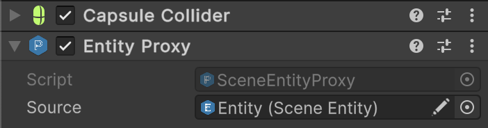

# 🧩 MonoEntityProxies

**Scene Entity Proxies** represent a family of Unity components that act as a **proxy** or **reference** to an
existing [MonoEntity](MonoEntity.md). They allow multiple `GameObjects` to share and reference the same entity
instance, enabling flexible entity
architectures and simplifying component-based setups in Unity scenes.

---

## 📑 Table of Contents

- [Theory](#-theory)
- [Examples of Usage](#-examples-of-usage)
  - [Unity Setup](#ex1)
  - [Interacting through the Proxy](#ex2)
- [API Reference](#-api-reference)
- [Notes](#-notes)

---

## 📖 Theory

### Handling Child Colliders

In some cases, a GameObject hierarchy may include **child colliders** that interact with other colliders. However, you
often cannot directly access the **parent entity** from the child collider.

To solve this, attach a [MonoEntityProxy](MonoEntityProxy.md) component next to the child collider. The
`MonoEntityProxy` serves as a bridge, allowing you to reference the **parent entity**
(or any other relevant [IEntity](IEntity.md) source) directly.

---

## 🗂 Examples of Usage

<div id="ex1"></div>

### 1️⃣ Unity Setup

1. Add a **Collider** component to the **child GameObject**.  
   


2. Attach a **MonoEntityProxy** component to the same GameObject.  
   


3. In the `MonoEntityProxy`, assign the parent entity reference to the **Source** field.


4. Now, whenever another collider interacts with this child collider, you can easily retrieve the parent entity.

---

<div id="ex2"></div>

### 2️⃣ Interacting through the Proxy

```csharp
public class SomeTrigger : MonoBehaviour 
{
    private void OnTriggerEnter(Collider collider)
    {
        // Access the parent entity through the proxy
        if (collider.TryGetComponent(out IEntity entity))
        {
            // Example: entity.DoSomething();
        }
    }
}
```

---

## 🔍 API Reference

There are both generic and non-generic versions of proxies.

- [MonoEntityProxy](MonoEntityProxy.md)
- [MonoEntityProxy&lt;E&gt;](MonoEntityProxy%601.md)

---

## 📝 Notes

- **Entity Reference** – Points to an existing [MonoEntity](MonoEntity.md)
- **Delegation** – Forwards [IEntity](IEntity.md) interface calls to target
- **Proxy Pattern** – Multiple proxies can reference one entity
- **Inspector Configuration** – Set entity reference in Unity Editor
  Generic Version – Use [MonoEntityProxy\<E>](MonoEntityProxy%601.md) for type-safe entity references and compile-time
  validation.

<!-- 

# 🧩 MonoEntity Proxies

Represent family of Unity components those act as a proxy or reference to an existing [MonoEntity](MonoEntity.md).
It allows multiple `GameObjects` to share and reference the same entity instance, enabling flexible entity
architectures.

---


## 📖 Handling child colliders with MonoEntityProxy

In some cases, a GameObject hierarchy may include **child colliders** that interact with other colliders. However, a
common problem arises — you often cannot directly access the **parent entity** from the child collider.


To solve this, you can attach a `MonoEntityProxy` component next to the child collider. The `MonoEntityProxy` serves
as a bridge, allowing you to reference the **parent entity** (or any other relevant
[IEntity](IEntity.md) source) directly.

## 🗂 Example of Usage

1. Assume we have a **Collider** component to the child GameObject.


2. Attach a **MonoEntityProxy** component to the same GameObject.


3. In the `MonoEntityProxy`, assign the parent entity reference to the `Source` field.

4. This way, whenever another collider interacts with the child collider, you can easily retrieve the parent entity from it.

```csharp
public class SomeTrigger : MonoBehaviour 
{
    private void OnTriggerEnter(Collider collider)
    {
         // Access the parent entity through the proxy
        if (collider.TryGetComponent(out IEntity)) // Proxy
        {
            // Do something
        }
    }
}
```


---


-->