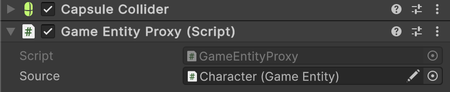

# 🧩 SceneEntityProxy&lt;E&gt;

Represents a generic proxy components that forwards calls to an underlying <code>E</code> source
entity.  Supports Odin Inspector

---


## 📑 Table of Contents

- [Example of Usage](#-example-of-usage)
- [Inspector Settings](#-inspector-settings)
- [API Reference](#-api-reference)
    - [Type](#-type)
    - [Properties](#-properties)
        - [Source](#source)

---

## 🗂 Example of Usage

1. Assume we have a **Collider** component to the child GameObject.


2. Assume we have a specific interface and implementation of the entity

```csharp
public interface IGameEntity : IEntity
{
}
```

```csharp
public class GameEntity : SceneEntity, IGameEntity
{
}
```

3. Create a special proxy type for `GameEntity`

```csharp
public sealed class GameEntityProxy : SceneEntityProxy<GameEntity>, IGameEntity
{
}
```

4. Attach a `GameEntityProxy` component to the same GameObject.



5. In the `GameEntityProxy`, assign the parent entity reference to the `Source` field.

4. This way, whenever another collider interacts with the child collider, you can easily retrieve the parent entity from it.

```csharp
public class SomeTrigger : MonoBehaviour 
{
    private void OnTriggerEnter(Collider collider)
    {
         // Access the parent entity through the proxy
        if (collider.TryGetComponent(out IGameEntity)) // Proxy
        {
            // Do something
        }
    }
}
```

---

## 🛠 Inspector Settings

| Parameter | Description                                              |
|-----------|----------------------------------------------------------|
| `source`  | Reference to the actual `E` object that this proxy wraps |

---

## 🔍 API Reference

### 🏛️ Type <div id="-type"></div>

```csharp
public abstract class SceneEntityProxy<E> : MonoBehaviour, IEntity
    where E : SceneEntity
```

- **Type Parameter:** `E` — The type of the source entity, must inherit from [SceneEntity](SceneEntity.md)
- **Inheritance:** `MonoBehaviour`, [IEntity](IEntity.md)

---

### 🔑 Properties

#### `Source`

```csharp
public E Source { get; }
```

- **Description:** The source entity that this proxy forwards calls to.