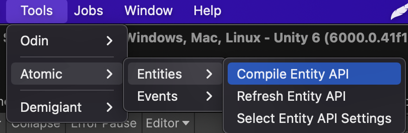
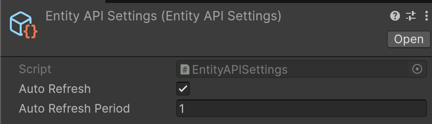
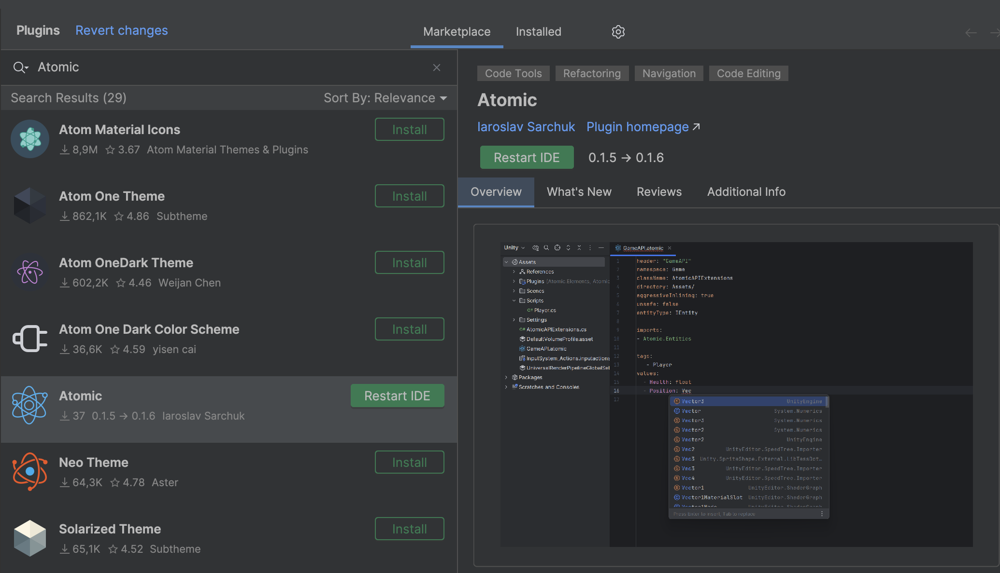

# 🧩 Entity API

The **Entity API** module introduces an extension-based approach for working with **tags** and **values** in entities.
It eliminates the use of **magic constants** and **hardcoded keys** by automatically generating **extension methods**,
improving **readability**, **type safety**, **refactoring safety**, and **IDE autocompletion**.

---

## 📑 Table of Contents

- [The Problem](#the-problem)
- [Entity API Generation](#entity-api-generation)
- [Generating via Unity Editor](#generating-api-via-unity-editor)
    - [Configuration Options](#-configuration-options)
    - [Using the Generated Extensions](#-using-the-generated-extensions)
    - [Refreshing and Configuring API Generation](#-refreshing-and-configuring-api-generation)
- [Generating via Rider Plugin](#generating-api-via-rider-plugin)
  - [Installation](#-installation)
  - [Plugin Usage](#-plugin-usage)
  - [Configuration Options](#-configuration-options-1)
  - [Generating Code](#-generating-code)
  - [Using the Generated Extensions](#-using-the-generated-extensions-1)
  - [Plugin Settings](#-plugin-settings)

---

## The Problem

When working with [entities](../Entities/Manual.md), developers often reference tags and values using **integer IDs** or
**string keys**:

```csharp
// Define tag keys
const int PlayerTag = 1;
const int NPCTag = 2;

// Define value keys
const int Health = 1;
const int Speed = 2;

Entity entity = new Entity();

entity.AddTag(PlayerTag);
entity.AddTag(NPCTag);
entity.AddValue(Health, 100);

int health = entity.GetValue<int>(Health);
```

Or using strings:

```csharp
Entity entity = new Entity();

entity.AddTag("Player");
entity.AddTag("NPC");
entity.AddValue("Health", 100);

int health = entity.GetValue<int>("Health");
```

This approach leads to **hardcoded strings** and **magic constants** tightly coupled with your codebase. It makes
**maintenance**, **refactoring**, and **type validation** difficult. The **Entity API** solves this problem through
**code generation**, providing **type-safe** accessors and eliminating hardcoded constants.

---

## Entity API Generation

The solution is a code generation that creates **extension methods** for your entities.  
These methods provide:

- Strong typing
- IDE autocomplete support
- No hardcoded constants
- Better maintainability

Example usage:

```csharp
Entity entity = new Entity();

entity.AddPlayerTag();  // Extension method
entity.AddNPCTag();     // Extension method
entity.AddHealth(100);  // Extension method

int health = entity.GetHealth(); // Extension method
```

The generated class looks like this:

```csharp
/**
 * Code generation. Don't modify! 
 **/
public static class EntityAPI
{
    ///Tags
    public static readonly int Player;
    public static readonly int NPC;
    
    ///Values
    public static readonly int Health; //int
    public static readonly int Speed; //float

    static EntityAPI()
    {
        // Values
        Health = NameToId(nameof(Health));
        Speed = NameToId(nameof(Speed));
    }

    ///Tag Extensions

    #region Player

    [MethodImpl(MethodImplOptions.AggressiveInlining)]
    public static bool HasPlayerTag(this IEntity entity) => entity.HasTag(Player);
    
    [MethodImpl(MethodImplOptions.AggressiveInlining)]
    public static bool AddPlayerTag(this IEntity entity) => entity.AddTag(Player);
    
    [MethodImpl(MethodImplOptions.AggressiveInlining)]
    public static bool DelPlayerTag(this IEntity entity) => entity.DelTag(Player);

    #endregion
    
    #region NPC

    [MethodImpl(MethodImplOptions.AggressiveInlining)]
    public static bool HasNPCTag(this IEntity entity) => entity.HasTag(NPC);
    
    [MethodImpl(MethodImplOptions.AggressiveInlining)]
    public static bool AddNPCTag(this IEntity entity) => entity.AddTag(NPC);
    
    [MethodImpl(MethodImplOptions.AggressiveInlining)]
    public static bool DelNPCTag(this IEntity entity) => entity.DelTag(NPC);

    #endregion
    
    ///Value Extensions
    
    #region Health
    
    [MethodImpl(MethodImplOptions.AggressiveInlining)]
    public static int GetHealth(this IEntity entity) => entity.GetValue<int>(Health);
    
    [MethodImpl(MethodImplOptions.AggressiveInlining)]
    public static bool TryGetHealth(this IEntity entity, out int value) => entity.TryGetValue(Health, out value);
    
    [MethodImpl(MethodImplOptions.AggressiveInlining)]
    public static void AddHealth(this IEntity entity, int value) => entity.AddValue(Health, value);
    
    [MethodImpl(MethodImplOptions.AggressiveInlining)]
    public static bool HasHealth(this IEntity entity) => entity.HasValue(Health);
    
    [MethodImpl(MethodImplOptions.AggressiveInlining)]
    public static bool DelHealth(this IEntity entity) => entity.DelValue(Health);
    
    [MethodImpl(MethodImplOptions.AggressiveInlining)]
    public static void SetHealth(this IEntity entity, int value) => entity.SetValue(Health, value);
    
    #endregion
    
    #region Speed
    
    [MethodImpl(MethodImplOptions.AggressiveInlining)]
    public static float GetSpeed(this IEntity entity) => entity.GetValue<float>(Speed);

    [MethodImpl(MethodImplOptions.AggressiveInlining)]
    public static bool TryGetSpeed(this IEntity entity, out float value) => entity.TryGetValue(Speed, out value);

    [MethodImpl(MethodImplOptions.AggressiveInlining)]
    public static void AddSpeed(this IEntity entity, float value) => entity.AddValue(Speed, value);

    [MethodImpl(MethodImplOptions.AggressiveInlining)]
    public static bool HasSpeed(this IEntity entity) => entity.HasValue(Speed);

    [MethodImpl(MethodImplOptions.AggressiveInlining)]
    public static bool DelSpeed(this IEntity entity) => entity.DelValue(Speed);

    [MethodImpl(MethodImplOptions.AggressiveInlining)]
    public static void SetSpeed(this IEntity entity, float value) => entity.SetValue(Speed, value);
    
    #endregion
}
```

This generated code allows:

- **Aggressively inlined methods** (no stack overhead)
- **IDE autocompletion**
- **Type safety**
- **No magic constants**

---

## Generating API via Unity Editor

To generate the **Entity API** within **Unity**, create a `.yaml` configuration file from the menu:  
`Assets → Create → Atomic → Entities → EntityAPI`


Example configuration file:

```yaml
directory: Assets/Scripts/
className: EntityAPI
namespace: SampleGame
entityType: IEntity
aggressiveInlining: true
unsafe: false

imports:
  - Atomic.Entities
  - Atomic.Elements
  - SampleGame
  - UnityEngine

tags:
  - Player
  - NPC

values:
  - Health: int
  - Speed: float
```

---

<div id="-configuration-options"></div>

### ⚙️ Configuration Options

| Option                 | Description                                               | Default   |
|------------------------|-----------------------------------------------------------|-----------|
| **directory**          | Output path for the generated file                        | –         |
| **className**          | Name of the generated class/file                          | –         |
| **namespace**          | Namespace for the generated class                         | –         |
| **entityType**         | Entity interface or derived type                          | `IEntity` |
| **aggressiveInlining** | Adds `[MethodImpl(MethodImplOptions.AggressiveInlining)]` | `false`   |
| **unsafe**             | Uses `GetValueUnsafe` for faster but unsafe access        | `false`   |
| **imports**            | Additional namespaces                                     | –         |
| **tags**               | List of tag names                                         | –         |
| **values**             | List of key-value pairs (`Name: Type`)                    | –         |

> 💡 You can create multiple `.yaml` files for different modules or features.

Once ready, run  
`Tools → Atomic → Entities → Compile Entity API` to generate the extension class automatically.



<div id="-using-the-generated-extensions"></div>

---

### 🧩 Using the Generated Extensions

After generation, you can use your strongly typed extensions like this:

```csharp
// Assume we have an instance of IEntity
IEntity entity = ...;

// Tag Extensions
entity.AddPlayerTag();
if (entity.HasPlayerTag())
entity.DelPlayerTag();

// Value Extensions
entity.AddHealth(55);
int health = entity.GetHealth();

if (entity.HasHealth())
entity.DelHealth();

if (entity.TryGetHealth(out int currentHealth))
entity.SetHealth(30);
```

---

### 🔁 Refreshing and Configuring API Generation

If you modify your `.yaml` configuration file, refresh the generated API via:  
`Tools → Atomic → Entities → Refresh Entity API`


To adjust code generation behavior, open:  
`Tools → Atomic → Entities → Select EntityAPI Settings`

  


From the settings window, you can:

- Enable or disable **AutoRefresh**
- Adjust the **AutoRefreshPeriod** (interval for regeneration)

This gives you full control over **when** and **how often** your Entity API regenerates.

---

## Generating API via Rider Plugin

This section explains how to generate **Entity extension methods** using the **Atomic Rider Plugin**.

### 📦 Installation

You can install the plugin either from **JetBrains Marketplace** or **GitHub**.

#### 🛒 From JetBrains Marketplace

- **Option 1:** In **Rider IDE**, go to `Preferences → Plugins → Marketplace` and search for **Atomic**
- **Option 2:** Install directly via [Rider Plugin on JetBrains Marketplace](https://plugins.jetbrains.com/plugin/28321-atomic)



> 💡 **Tip:** Restart Rider after installation to activate the plugin.

#### 💾 From GitHub Repository

1. Visit the [official repository](https://github.com/Prylor/atomic-rider-plugin)
2. Download the latest `.zip` version from the **Releases** page
3. In **Rider**, open `Preferences → Plugins → Settings`
4. Choose **Install Plugin from Disk**, then select the downloaded `.zip` archive


---

### 🧩 Plugin Usage

1. Right-click on your **project folder** in Rider
2. Select `New → Atomic File`


This creates an `.atomic` configuration file for **Entity API generation**:

```yaml
entityType: IEntity
namespace: MyGame.Components
className: EntityExtensions
directory: Assets/Scripts
aggressiveInlining: true
unsafe: false

imports:
  System
  UnityEngine
  Atomic.Entities

tags:
  Player
  Enemy
  Projectile

values:
  Health: int
  Position: Vector3
  Damage: float
```

3. Configure your entity API by editing parameters as needed.

---

<div id="-configuration-options-1"></div>

### ⚙️ Configuration Options

| Option                 | Description                                                                                   | Default   |
|------------------------|-----------------------------------------------------------------------------------------------|-----------|
| **directory**          | Output path for the generated file                                                            | –         |
| **className**          | Name of the generated class and file                                                          | –         |
| **namespace**          | Namespace of the generated class                                                              | –         |
| **entityType**         | Entity type (can be `IEntity` or a custom type inheriting from it)                            | `IEntity` |
| **aggressiveInlining** | Adds `[MethodImpl(MethodImplOptions.AggressiveInlining)]` to extension methods (true/false)   | `false`   |
| **unsafe**             | Uses `GetValueUnsafe` instead of `GetValue` (faster but may be unsafe)                        | `false`   |
| **imports**            | List of namespaces (`using`) required for code generation                                     | –         |
| **tags**               | List of tags to generate                                                                      | –         |
| **values**             | List of values to generate, in the format `Name: Type`                                        | –         |

---

### 🧠 Generating Code

- **Manual Generation:**  
  Press `Ctrl + Shift + G` while in the `.atomic` file
  - Required for **first-time generation**
  - Can be used anytime to **force regeneration**

- **Automatic Regeneration:**  
  Automatically updates existing C# files when saving `.atomic` changes
  - Only works for **existing files**
  - Can be enabled/disabled in plugin settings

---

<div id="-using-the-generated-extensions-1"></div>

### 🧩 Using the Generated Extensions

After generation, you can use your strongly typed extensions like this:

```csharp
// Assume we have an instance of IEntity
IEntity entity = ...;

// Tag Extensions
entity.AddPlayerTag();
if (entity.HasPlayerTag())
entity.DelPlayerTag();

// Value Extensions
entity.AddHealth(55);
int health = entity.GetHealth();

if (entity.HasHealth())
entity.DelHealth();

if (entity.TryGetHealth(out int currentHealth))
entity.SetHealth(30);
```

---

### ⚙️ Plugin Settings

Access plugin settings via:  
`File → Settings → Tools → Atomic Plugin`


- **Auto-generate:** Enable/disable automatic regeneration
- **Debounce delay:** Set delay before auto-generation (ms)
- **Show notifications:** Toggle generation notifications


<!--

## Generating API via Rider Plugin

The **Rider plugin** provides the same functionality directly inside JetBrains Rider.

### Installation

**Option 1 – JetBrains Marketplace**

1. Go to `Preferences → Plugins → Marketplace`
2. Search for **Atomic**
3. Click **Install**
4. Restart Rider

**Option 2 – GitHub Release**

1. Download the latest `.zip` from [GitHub](https://github.com/Prylor/atomic-rider-plugin)
2. In Rider, go to `Preferences → Plugins → Settings`
3. Choose **Install Plugin from Disk** and select the `.zip` file
4. Restart Rider

---

### Usage

1. Right-click your project folder
2. Select `New → Atomic File`

This creates a new `.atomic` configuration file:

```yaml
entityType: IEntity
namespace: MyGame.Components
className: EntityExtensions
directory: Assets/Scripts
aggressiveInlining: true
unsafe: false

imports:
  - System
  - UnityEngine
  - Atomic.Entities

tags:
  - Player
  - Enemy
  - Projectile

values:
  - Health: int
  - Position: Vector3
  - Damage: float
  ```

### Configuration Options

Same as in the Unity Editor section.

---

### Code Generation

- **Manual Generation:**  
  Press `Ctrl+Shift+G` in an `.atomic` file to generate or refresh the API class.  
  (Required for first-time generation.)

- **Automatic Regeneration:**  
  Changes in the `.atomic` file trigger regeneration automatically  
  (if **Auto-generate** is enabled in settings).

---

### Plugin Settings

Access via  
`File → Settings → Tools → Atomic Plugin`

| Option                 | Description                             |
|------------------------|-----------------------------------------|
| **Auto-generate**      | Enables/disables automatic regeneration |
| **Debounce delay**     | Delay before regeneration (in ms)       |
| **Show notifications** | Toggles generation messages             |

---

✅ The Entity API gives your game a **clean**, **type-safe**, and **automated** workflow for managing entity data —  
no more magic constants, no more string-based errors, just clean generated code.

-->