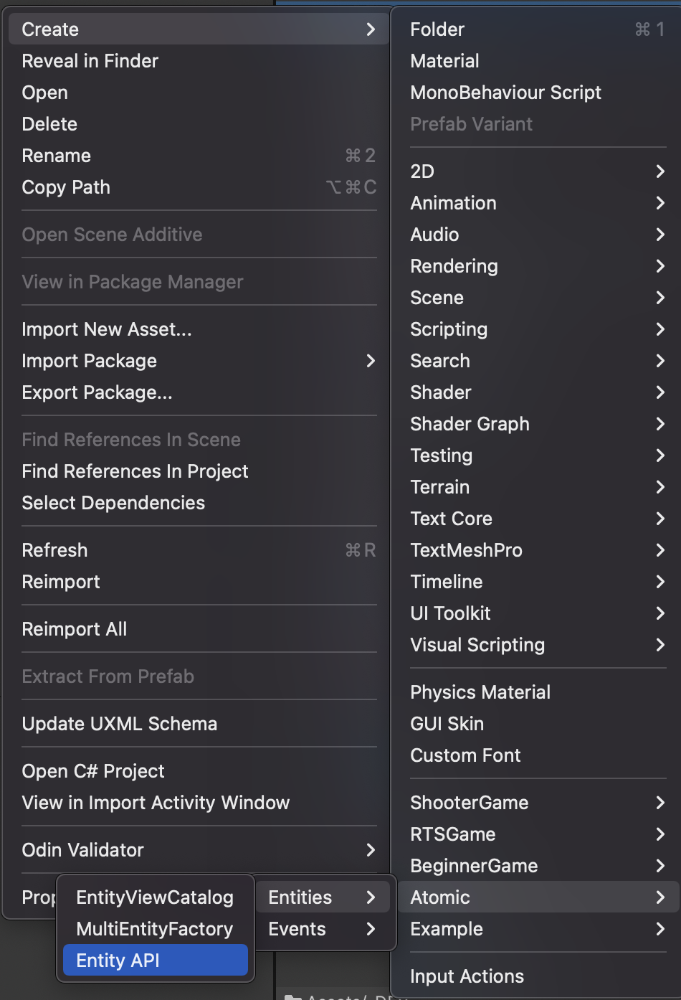
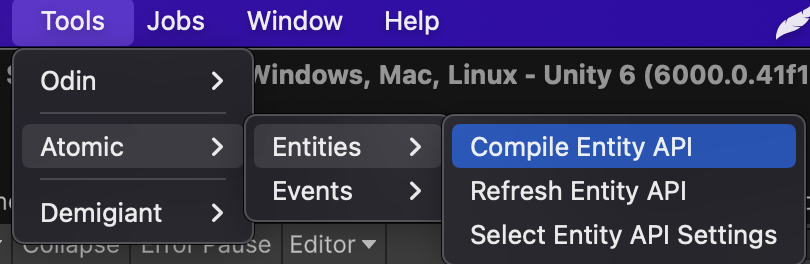
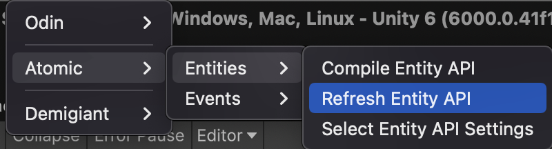
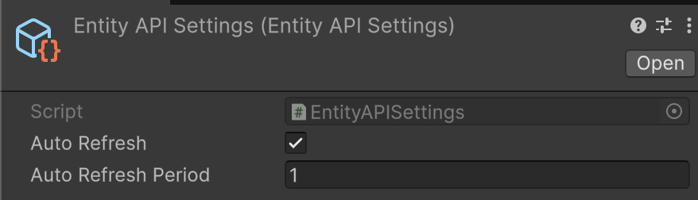
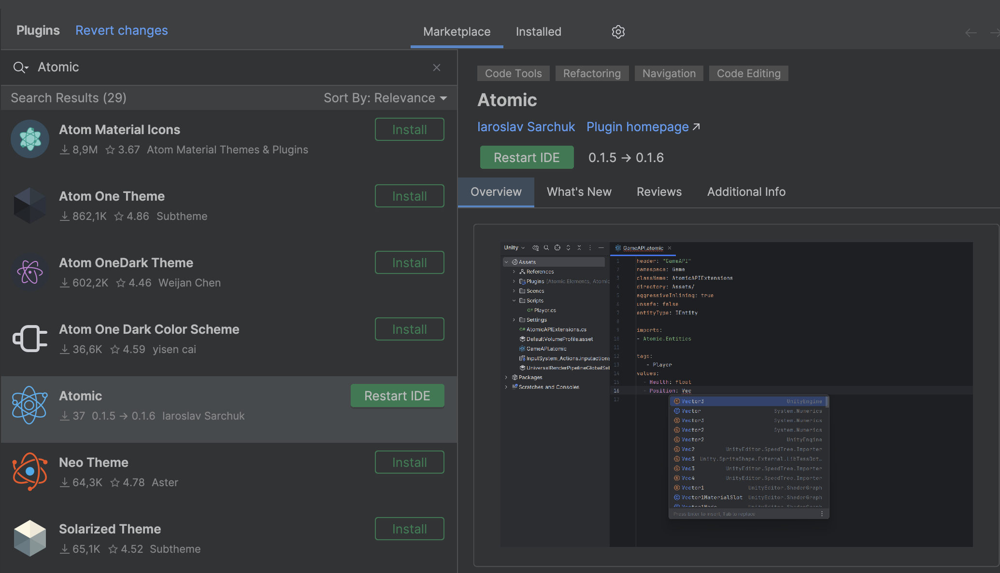

# 🧩 Entity API

This module provides an extension-based approach for working with tags and values for entities. It solves the problem of
**magic constants** and **hardcoded keys** by generating extension methods. This improves **readability, refactoring
safety, and IDE autocompletion**.

## 📑 Table of Contents

- [The Problem](#the-problem) <!-- + -->
- [Entity API Generation](#api-generation) <!-- + -->
- [Unity Editor API Generation](#generating-api-through-the-unity-editor) <!-- + -->
- [Rider Plugin API Generation](#generating-api-through-rider-plugin) <!-- + -->

---

## The Problem

When a developer use [entities](../Entities/Manual.md) and works with tags and values, they typically need to reference
them via `int` keys or `string` names.

For example:

```csharp
// Define tag keys
const int PlayerTag = 1;
const int NPCTag = 2;

// Define value keys
const int Health = 1;
const int Speed = 2;

Entity entity = new Entity();

entity.AddTag(PlayerTag);
entity.AddTag(NPCTag);

// Add health property
entity.AddValue(Health, 100);

// Get a value
int health = entity.GetValue<int>(Health);
```

or something like this:

```csharp
Entity entity = new Entity();

entity.AddTag("Player");
entity.AddTag("NPCTag");

// Add health property
entity.AddValue("Health", 100);

// Get a value
int health = entity.GetValue<int>("Health");
```

This approach results in **hardcoded strings** and **magic constants** tightly coupled with the code. Maintaining and
refactoring such code becomes difficult. Additionally, the developer must know the type of each value in advance, which
can lead to runtime errors. Entity API solves this problem with **code generation**, ensuring type safety and removing
hardcoded constants.

---

### Entity API Generation

To solve the problem of hardcode and magic constants, code generation is introduced. It creates **extension methods**
that provide IDE hints, remove magic constants, and ensure strong typing.

Here’s an example using entity tags and values with **extension methods**:

```csharp
Entity entity = new Entity();

entity.AddPlayerTag(); // Extension method
entity.AddNPCTag(); // Extension method

// Add health property
entity.AddHealth(100); //Extension method

// Get a value
int health = entity.GetHealth(); //Extension method
```

So, the generated file with extension methods for entity looks like this:

```csharp
/**
 * Code generation. Don't modify! 
 **/
public static class EntityAPI
{
    ///Tags
    public static readonly int Player;
    public static readonly int NPC;
    
    ///Values
    public static readonly int Health; //int
    public static readonly int Speed; //float

    static EntityAPI()
    {
        // Values
        Health = NameToId(nameof(Health));
        Speed = NameToId(nameof(Speed));
    }

    ///Tag Extensions

    #region Player

    [MethodImpl(MethodImplOptions.AggressiveInlining)]
    public static bool HasPlayerTag(this IEntity entity) => entity.HasTag(Player);
    
    [MethodImpl(MethodImplOptions.AggressiveInlining)]
    public static bool AddPlayerTag(this IEntity entity) => entity.AddTag(Player);
    
    [MethodImpl(MethodImplOptions.AggressiveInlining)]
    public static bool DelPlayerTag(this IEntity entity) => entity.DelTag(Player);

    #endregion
    
    #region NPC

    [MethodImpl(MethodImplOptions.AggressiveInlining)]
    public static bool HasNPCTag(this IEntity entity) => entity.HasTag(NPC);
    
    [MethodImpl(MethodImplOptions.AggressiveInlining)]
    public static bool AddNPCTag(this IEntity entity) => entity.AddTag(NPC);
    
    [MethodImpl(MethodImplOptions.AggressiveInlining)]
    public static bool DelNPCTag(this IEntity entity) => entity.DelTag(NPC);

    #endregion
    
    ///Value Extensions
    
    #region Health
    
    [MethodImpl(MethodImplOptions.AggressiveInlining)]
    public static IVariable<int> GetHealth(this IEntity entity) => entity.GetValue<IVariable<int>>(Health);
    
    [MethodImpl(MethodImplOptions.AggressiveInlining)]
    public static bool TryGetHealth(this IEntity entity, out IVariable<int> value) => entity.TryGetValue(Health, out value);
    
    [MethodImpl(MethodImplOptions.AggressiveInlining)]
    public static void AddHealth(this IEntity entity, IVariable<int> value) => entity.AddValue(Health, value);
    
    [MethodImpl(MethodImplOptions.AggressiveInlining)]
    public static bool HasHealth(this IEntity entity) => entity.HasValue(Health);
    
    [MethodImpl(MethodImplOptions.AggressiveInlining)]
    public static bool DelHealth(this IEntity entity) => entity.DelValue(Health);
    
    [MethodImpl(MethodImplOptions.AggressiveInlining)]
    public static void SetHealth(this IEntity entity, IVariable<int> value) => entity.SetValue(Health, value);
    
    #endregion
    
    #region Speed
    
    [MethodImpl(MethodImplOptions.AggressiveInlining)]
    public static IVariable<float> GetSpeed(this IEntity entity) => entity.GetValue<IVariable<float>>(Speed);

    [MethodImpl(MethodImplOptions.AggressiveInlining)]
    public static bool TryGetSpeed(this IEntity entity, out IVariable<float> value) => entity.TryGetValue(Speed, out value);

    [MethodImpl(MethodImplOptions.AggressiveInlining)]
    public static void AddSpeed(this IEntity entity, IVariable<float> value) => entity.AddValue(Speed, value);

    [MethodImpl(MethodImplOptions.AggressiveInlining)]
    public static bool HasSpeed(this IEntity entity) => entity.HasValue(Speed);

    [MethodImpl(MethodImplOptions.AggressiveInlining)]
    public static bool DelSpeed(this IEntity entity) => entity.DelValue(Speed);

    [MethodImpl(MethodImplOptions.AggressiveInlining)]
    public static void SetSpeed(this IEntity entity, IVariable<float> value) => entity.SetValue(Speed, value);
    
    #endregion
}
```

Such generation allows developers to use **extension methods** that are **aggressively inlined** by the compiler. This
avoids additional stack calls, provides IDE auto-completion, ensures type safety, and removes hardcoded constants.

---

## Generating API through the Unity Editor

To generate the Entity API through the **Unity Editor**, you first need to create a `.yaml` configuration file using the
menu: `Assets/Create/Atomic/Entities/EntityAPI`



You will get a .yaml file that will represent config for the entity api generation:

```yaml
directory: Assets/Scripts/
className: EntityAPI
namespace: SampleGame
entityType: IEntity
aggressiveInlining: true
unsafe: false

imports:

  - Atomic.Entities
  - Atomic.Elements
  - SampleGame
  - UnityEngine

tags:

  - Player
  - NPC

values:

  - Health: int
  - Speed: float
```

Below are configuration options that you can set up:

### 📑 Configuration options

| Option                 | Description                                                                                   | Default   |
|------------------------|-----------------------------------------------------------------------------------------------|-----------|
| **directory**          | Output path for the generated file                                                            | –         |
| **className**          | Name of the generated class and file                                                          | –         |
| **namespace**          | Namespace of the generated class                                                              | –         |
| **entityType**         | Entity type (can be `IEntity` or a custom type inheriting from `IEntity`)                     | `IEntity` |
| **aggressiveInlining** | Adds `[MethodImpl(MethodImplOptions.AggressiveInlining)]` to extension methods (true/false)   | `false`   |
| **unsafe**             | Optimization flag. Uses `GetValueUnsafe` instead of `GetValue` (faster but can cause crashes) | `false`   |
| **imports**            | List of namespaces (`using`) required for code generation                                     | –         |
| **tags**               | List of tags to generate (names only)                                                         | –         |
| **values**             | List of values to generate, in the format `Name: Type`                                        | –         |

> [!NOTE]  
> You can create multiple `.yaml` files if your project is large, and you want to split tags and values by feature.

After creating the config file, run: `Tools/Atomic/Entities/Compile Entity API`. This will generate an extension class
based on your `.yaml` configuration.



You will get a new .cs file with concrete keys and extensions methods:

```csharp
/**
* Code generation. Don't modify!
**/
public static class EntityAPI
{
    /// Tags
    public static readonly int Player;
    public static readonly int NPC;
  
    /// Values
    public static readonly int Health; // int
    public static readonly int Speed; // float
  
    static EntityAPI()
    {
        // Values
        Health = NameToId(nameof(Health));
        Speed = NameToId(nameof(Speed));
    }
  
    /// Tag Extensions
  
    #region Player
  
    [MethodImpl(MethodImplOptions.AggressiveInlining)]
    public static bool HasPlayerTag(this IEntity entity) => entity.HasTag(Player);
  
    [MethodImpl(MethodImplOptions.AggressiveInlining)]
    public static bool AddPlayerTag(this IEntity entity) => entity.AddTag(Player);
  
    [MethodImpl(MethodImplOptions.AggressiveInlining)]
    public static bool DelPlayerTag(this IEntity entity) => entity.DelTag(Player);
  
    #endregion
  
    #region NPC
  
    [MethodImpl(MethodImplOptions.AggressiveInlining)]
    public static bool HasNPCTag(this IEntity entity) => entity.HasTag(NPC);
  
    [MethodImpl(MethodImplOptions.AggressiveInlining)]
    public static bool AddNPCTag(this IEntity entity) => entity.AddTag(NPC);
  
    [MethodImpl(MethodImplOptions.AggressiveInlining)]
    public static bool DelNPCTag(this IEntity entity) => entity.DelTag(NPC);
  
    #endregion
  
    /// Value Extensions
  
    #region Health
  
    [MethodImpl(MethodImplOptions.AggressiveInlining)]
    public static IVariable<int> GetHealth(this IEntity entity) => entity.GetValue<IVariable<int>>(Health);
  
    [MethodImpl(MethodImplOptions.AggressiveInlining)]
    public static bool TryGetHealth(this IEntity entity, out IVariable<int> value) => entity.TryGetValue(Health, out
    value);
  
    [MethodImpl(MethodImplOptions.AggressiveInlining)]
    public static void AddHealth(this IEntity entity, IVariable<int> value) => entity.AddValue(Health, value);
  
    [MethodImpl(MethodImplOptions.AggressiveInlining)]
    public static bool HasHealth(this IEntity entity) => entity.HasValue(Health);
  
    [MethodImpl(MethodImplOptions.AggressiveInlining)]
    public static bool DelHealth(this IEntity entity) => entity.DelValue(Health);
  
    [MethodImpl(MethodImplOptions.AggressiveInlining)]
    public static void SetHealth(this IEntity entity, IVariable<int> value) => entity.SetValue(Health, value);
  
    #endregion
  
    #region Speed
  
    [MethodImpl(MethodImplOptions.AggressiveInlining)]
    public static IVariable<float> GetSpeed(this IEntity entity) => entity.GetValue<IVariable<float>>(Speed);
  
    [MethodImpl(MethodImplOptions.AggressiveInlining)]
    public static bool TryGetSpeed(this IEntity entity, out IVariable<float> value) => entity.TryGetValue(Speed, out
    value);
  
    [MethodImpl(MethodImplOptions.AggressiveInlining)]
    public static void AddSpeed(this IEntity entity, IVariable<float> value) => entity.AddValue(Speed, value);
  
    [MethodImpl(MethodImplOptions.AggressiveInlining)]
    public static bool HasSpeed(this IEntity entity) => entity.HasValue(Speed);
  
    [MethodImpl(MethodImplOptions.AggressiveInlining)]
    public static bool DelSpeed(this IEntity entity) => entity.DelValue(Speed);
  
    [MethodImpl(MethodImplOptions.AggressiveInlining)]
    public static void SetSpeed(this IEntity entity, IVariable<float> value) => entity.SetValue(Speed, value);
  
    #endregion
}
```

> [!NOTE]  
> Do not modify this class manually, as it will be overwritten automatically during regeneration.

After that you can use extensions for the entity, for example

```csharp
// Assume we have an instance of IEntity
IEntity entity = ...;

// Tag Extensions
entity.AddPlayerTag();
if (entity.HasPlayerTag()) // Do something
entity.DelPlayerTag();
    
// Value Extensions
entity.AddHealth(new BaseVariable<int>(55));
IVariable<int> health = entity.GetHealth();
if (entity.HasHealth()) // Do something
entity.DelHealth();
if (entity.TryGetHealth(out IVariable<int> health)) // Do something
entity.SetHealth(new BaseVariable<int>(30));
```

So, if you want to change your `.yaml` configuration file, you can refresh the API by selecting:
`Tools/Atomic/Entities/Refresh Entity API`



And you can also configure code generation through:  
`Tools/Atomic/Entities/Select EntityAPI Settings`




From there, you may disable automatic updates via `AutoRefresh` or adjust the `AutoRefreshPeriod` interval.

---

## Generating API through Rider Plugin

This section describes how to use code generation of extension methods for entities through
the Rider Plugin.

### 📦 Installation

There are two ways: from JetBrains Marketplace or GitHub repository:

#### From JetBrains Marketplace

- Option #1: In Rider IDE go to menu `Preferences/Plugins/Marketplace` and search the plugin by `Atomic` keyword
- Option #2: Install from this link [Rider Plugin](https://plugins.jetbrains.com/plugin/28321-atomic)



Restart IDE after installation.

#### From GitHub Repository

1. Go to [repository](https://github.com/Prylor/atomic-rider-plugin) where plugin is stored
2. Download the lastest version from releases as .zip archive
3. In Rider IDE go to menu `Preferences/Plugins/Settings`
4. Select `Install Plugin from Disk` and select the downloaded .zip archive


---


### Plugin Usage

1. Right-click on your project folder in Rider IDE
2. Select `New` → `Atomic File`

You will get an .atomic file that will represent config for the entity api generation:

```yaml
entityType: IEntity
namespace: MyGame.Components
className: EntityExtensions
directory: Assets/Scripts
aggressiveInlining: true
unsafe: false

imports:
  System
  UnityEngine
  Atomic.Entities

tags:
  Player
  Enemy
  Projectile

values:
  Health: int
  Position: Vector3
  Damage: float
```

3. Configure your entity API

Below are configuration options that you can set up:

###  Configuration options

| Option                 | Description                                                                                   | Default   |
|------------------------|-----------------------------------------------------------------------------------------------|-----------|
| **directory**          | Output path for the generated file                                                            | –         |
| **className**          | Name of the generated class and file                                                          | –         |
| **namespace**          | Namespace of the generated class                                                              | –         |
| **entityType**         | Entity type (can be `IEntity` or a custom type inheriting from `IEntity`)                     | `IEntity` |
| **aggressiveInlining** | Adds `[MethodImpl(MethodImplOptions.AggressiveInlining)]` to extension methods (true/false)   | `false`   |
| **unsafe**             | Optimization flag. Uses `GetValueUnsafe` instead of `GetValue` (faster but can cause crashes) | `false`   |
| **imports**            | List of namespaces (`using`) required for code generation                                     | –         |
| **tags**               | List of tags to generate (names only)                                                         | –         |
| **values**             | List of values to generate, in the format `Name: Type`                                        | –         |


4. **Press `Ctrl+Shift+G` to generate the C# file for the first time**
5. After initial generation, changes will auto-update the file (if enabled)

### Generating Code

- **Manual Generation**: Press `Ctrl+Shift+G` while in an `.atomic` file
    - **Required for first-time generation** - Creates the initial C# file
    - Can be used anytime to force regeneration
- **Automatic Regeneration**: Updates existing C# files automatically when you save changes
    - **Only works for existing files** - Won't create new files
    - Enable/disable in plugin settings

### Plugin Settings

Access settings via `File` → `Settings` → `Tools` → `Atomic Plugin`

- **Auto-generate**: Enable/disable automatic regeneration
- **Debounce delay**: Set delay before auto-generation (ms)
- **Show notifications**: Toggle generation notifications