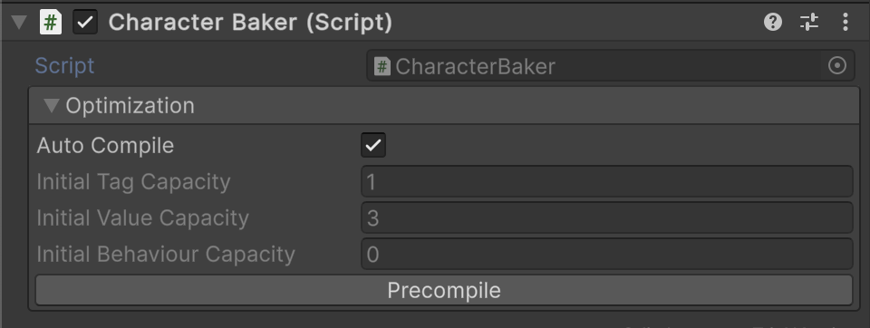

# 🧩️ SceneEntityBaker

Represents an abstract Unity component that converts **GameObjects** into **entities**. It supports batch baking for
entire scenes, GameObjects, or all objects in the scene.

---

## 🗂 Example of Usage

#### 1. Create a baker for a character entity

```csharp
public class CharacterBaker : SceneEntityBaker
{
    protected override void Install(IEntity entity)
    {
        entity.AddTag("Character");
        entity.AddValue<int>("Health", 200);
        entity.AddValue<int>("Damage", 10);
    }
}
```

#### 2. Attach this script to a GameObject



#### 3. Usage in a project

```csharp
// Create all entities associated with SceneEntityBaker including character
IEntity[] entities = SceneEntityBaker.BakeAll();

//Assume we have the entity world
EntityWorld world = new EntityWorld();

//Add enemies to entity world
world.AddRange(enemies);
```

---

## 🛠 Inspector Settings

<div id="-parameters"></div>

### 🎛️ Parameters

| Parameter                  | Description                                           | 
|----------------------------|-------------------------------------------------------|
| `autoCompile`              | Should precompute capacities when OnValidate happens? |
| `initialTagCapacity`       | Initial number of tags to assign to the entity        |
| `initialValueCapacity`     | Initial number of values to assign to the entity      |
| `initialBehaviourCapacity` | Initial number of behaviours to assign to the entity  |

- **Note:** These parameters are primarily used for **Editor optimization** and asset baking workflows.

---

<div id="-context-menu"></div>

### ⚙️ Context Menu

| Option       | Description                                                                                                                                                                                                                                                                   | 
|--------------|-------------------------------------------------------------------------------------------------------------------------------------------------------------------------------------------------------------------------------------------------------------------------------|
| `Precompile` | Creates a temporary entity using [Create()](#create) and **precompiles capacities** such as tag count, value count, and behavior count. Useful for editor previews, asset baking, and optimization. Only executed in the Editor. Logs a warning if `Create()` returns `null`. |
| `Reset`      | Resets factory fields to default values.                                                                                                                                                                                                                                      |

---

## 🔍 API Reference

### 🏛️ Type <div id="-type"></div>

```csharp
public abstract class SceneEntityBaker : SceneEntityBaker<IEntity>, IEntityFactory
```

- **Inheritance:** [SceneEntityBaker\<E>](SceneEntityBaker%601.md), [IEntityFactory](IEntityFactory.md)
- **Notes:** Provides the `Install(IEntity)` method to inject custom configuration logic after entity creation.

---

### 🧱 Fields

#### `InitialTagCapacity`

```csharp
[SerializeField] 
protected int initialTagCount;
```

- **Description:** Initial number of tags to assign to the entity. Mainly used for **editor optimization** and scene
  baking.

#### `InitialValueCapacity`

```csharp
[SerializeField]
protected int initialValueCount;
```

- **Description:** Initial number of values to assign to the entity.

#### `InitialBehaviourCapacity`

```csharp
[SerializeField] 
protected int initialBehaviourCount;
```

- **Description:** Initial number of behaviours to assign to the entity.

---

### 🏹 Methods

#### `Create()`

```csharp
public sealed override IEntity Create();
```

- **Description:** Creates a new [Entity](../Entities/Entity.md) using predefined initialization values and then applies
  custom logic via the `Install` method.
- **Returns:** A new instance of [IEntity](../Entities/IEntity.md).
- **Note:** This method is `sealed`; override `Install(IEntity)` for custom configuration.

#### `Install(IEntity)`

```csharp
protected abstract void Install(IEntity entity);
```

- **Description:** Called after entity creation to add tags, values, or behaviours.
- **Parameter:** `entity` — The [IEntity](../Entities/IEntity.md) instance to configure.
- **Note:** Must be implemented by derived classes to provide custom setup logic.

#### `OnValidate()`

```csharp
protected virtual void OnValidate();
```

- **Description:** Unity callback invoked when script values change in the Inspector. Updates cached metadata by calling
  `Precompile()` by default.
- **Remarks:** Only executed in the Editor outside of Play mode.

#### `Reset()`

```csharp
protected virtual void Reset();
```

- **Description:** Unity callback that resets factory fields to default values.
- **Remarks:** Only affects editor workflows.


<!--

# 🧩️ SceneEntityBaker


---

---

## Classes

### Class SceneEntityBaker&lt;E&gt;

```csharp
public abstract class SceneEntityBaker<E> : MonoBehaviour where E : IEntity {...}
```

### Class SceneEntityBaker
A shortcut version bound to the base `IEntity` type.

```csharp
public abstract class SceneEntityBaker : SceneEntityBaker<IEntity> {...}
```

---

### Inspector Settings

| Field              | Type                         | Description                                                         |
|--------------------|------------------------------|---------------------------------------------------------------------|
| `destroyAfterBake` | `bool` (serialized)          | Whether to destroy the GameObject after baking. Defaults to `true`. |
| `factory`          | `ScriptableEntityFactory<E>` | The entity factory used to create entities.                         |

---

### Methods

| Method                                      | Description                                                                                                                          |
|---------------------------------------------|--------------------------------------------------------------------------------------------------------------------------------------|
| `E Bake()`                                  | Creates an entity using the assigned factory, installs it via `Install(E entity)`, and optionally destroys the GameObject.           |
| `protected abstract void Install(E entity)` | Must be implemented by subclasses to configure the baked entity with scene-specific or overridden properties.                        |
| `E IEntityFactory<E>.Create()`              | Implements the `IEntityFactory<E>` interface. Calls `Bake()` to produce a new entity, allowing the Baker itself to act as a factory. |

---
## Static Methods

| Method                                                                                         | Description                                                                                     |
|------------------------------------------------------------------------------------------------|-------------------------------------------------------------------------------------------------|
| `static E[] BakeAll(bool includeInactive = true)`                                              | Finds and bakes **all bakers** in the scene. Returns an array of baked entities.                |
| `static void BakeAll(ICollection<E> destination, bool includeInactive)`                        | Finds and bakes **all bakers** in the scene, appending results to the provided collection.      |
| `static List<E> Bake(Scene scene, bool includeInactive = true)`                                | Bakes all bakers only in the specified scene. Returns a list of baked entities.                 |
| `static void Bake(Scene scene, ICollection<E> results, bool includeInactive = true)`           | Bakes all bakers in the specified scene, adding results to the provided collection.             |
| `static E[] Bake(GameObject gameObject, bool includeInactive = true)`                          | Bakes all bakers attached to or under the given GameObject. Returns an array of baked entities. |
| `static void Bake(GameObject gameObject, ICollection<E> results, bool includeInactive = true)` | Bakes all bakers under the given GameObject, adding results to the provided collection.         |

## Usage Example

Suppose you have a `UnitEntity` and want to bake it from a prefab or scene object:

```csharp
public sealed class UnitEntity : Entity
{
}
```

Create a factory asset for it:
```csharp
[CreateAssetMenu(menuName = "Factories/Unit Factory")]
public sealed class UnitFactory : ScriptableEntityFactory<UnitEntity>
{
    [SerializeField] private int _health = 100;
    [SerializeField] private int _damage = 25;
    
    public override UnitEntity Create() => new UnitEntity(
        this.name,
        new string[] { "Unit" }, 
        new Dictionary<string, object>
        {
            {"Health", _health},
            {"Damage", _damage}
        });
    } 
}
```

Now implement a baker:
```csharp
public class UnitBaker : SceneEntityBaker<UnitEntity>
{
    [SerializeField] private Optional<int> _health = 100;
    [SerializeField] private Optional<int> _damage = 25;

    protected override void Install(UnitEntity entity)
    {
        //Override params in the scene
        if (_health) entity.SetHealth("Health", _health);
        if (_damage) entity.SetHealth("Health", _damage);
    }
}
```

### Baking in code

Bake everything in the current scene:
```csharp
UnitEntity[] units = SceneEntityBaker<UnitEntity>.BakeAll();
```

Bake only under a given parent GameObject:
```csharp
UnitEntity[] squad = SceneEntityBaker<UnitEntity>.Bake(mySquadGameObject);
```

Bake into an existing collection:
```csharp
List<UnitEntity> buffer = new List<UnitEntity>();
SceneEntityBaker<UnitEntity>.BakeAll(buffer);
```

-->