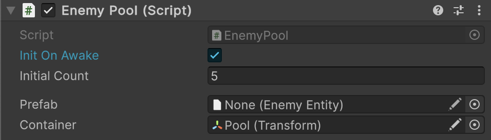

# 🧩 ExpandMode

**ExpandMode** is an enum that determines how an entity pool behaves when it runs out of pre-instantiated
entities and a new entity is requested via `Rent()`. It allows you to control pool growth strategy — from
fixed-size pools to exponential expansion.

---

## 📑 Table of Contents

- [Overview](#-overview)
- [Enum Values](#-enum-values)
  - [ExpandByOne](#expandbyone)
  - [ExpandByDoubling](#expandbydoubling)
  - [NoExpand](#noexpand)
- [Examples of Usage](#-examples-of-usage)
  - [Code Example](#code-example)
  - [Inspector Example](#inspector-example)
- [Expansion Behavior](#-expansion-behavior)
- [Best Practices](#-best-practices)

---

## 🧩 Overview

By default, pools create one entity when `Rent()` is called on an empty pool. `ExpandMode` lets you change
this behavior to suit your needs — whether you want predictable fixed-size pools, aggressive pre-warming,
or simple one-at-a-time growth.

`ExpandMode` is used by all pool implementations:

- [EntityPool\<E>](EntityPool%601.md)
- [MonoEntityPool\<E>](MonoEntityPool%601.md)
- [PrefabEntityPool\<E>](PrefabEntityPool%601.md)
- [MultiEntityPool\<K, E>](MultiEntityPool%601.md)

---

## 🔍 Enum Values

### ExpandByOne

```csharp
ExpandMode.ExpandByOne
```

Creates **one** new entity each time the pool is empty. This is the **default** behavior.

- **Growth:** Linear (+1 per expansion)
- **Use case:** General-purpose pooling where you want predictable, minimal allocations

### ExpandByDoubling

```csharp
ExpandMode.ExpandByDoubling
```

When the pool is empty, creates new entities equal to the **number of currently rented entities**,
effectively doubling the active inventory. If no entities are currently rented, creates **1 entity** as a seed.

- **Growth:** Exponential, scaling with demand (1 → 2 → 4 → 8 → 16 → ...)
- **Use case:** Scenarios where entity demand may spike and you want to reduce frequent small allocations

### NoExpand

```csharp
ExpandMode.NoExpand
```

Throws an `InvalidOperationException` when the pool is empty and a new entity is requested.

- **Growth:** None (fixed size)
- **Use case:** Enforcing a fixed pool size, catching unexpected empty-pool scenarios during development

---

## 🗂 Examples of Usage

### Code Example

#### 1. Using ExpandMode in a code-based pool

```csharp
IEntityFactory<GameEntity> factory = ...;

// Pool that doubles when empty
var pool = new EntityPool<GameEntity>(factory, new Args(), ExpandMode.ExpandByDoubling);
pool.Init(10);

// First 10 rents come from the pool
var e1 = pool.Rent(); // pool has 9 left

// ... rent all 10 ...

// Pool is empty — next rent creates 10 new entities (doubling)
var e11 = pool.Rent(); // 9 new entities added to pool
```

#### 2. Using NoExpand to enforce fixed size

```csharp
var pool = new EntityPool<GameEntity>(factory, new Args(), ExpandMode.NoExpand);
pool.Init(5);

// Rent all 5
var e1 = pool.Rent();
var e2 = pool.Rent();
var e3 = pool.Rent();
var e4 = pool.Rent();
var e5 = pool.Rent();

// This throws InvalidOperationException — pool is fixed at 5
var e6 = pool.Rent(); // 💥
```

### Inspector Example

For Unity-based pools (`MonoEntityPool`, `PrefabEntityPool`), `ExpandMode` is exposed as a serialized
field in the Inspector:

| Field        | Description                                                   |
|--------------|---------------------------------------------------------------|
| `expandMode` | Determines expansion behavior when the pool runs out of entities. |



---

## 📈 Expansion Behavior

Assume a pool initialized with 10 entities and all of them currently rented:

| Rented Count | ExpandByOne | ExpandByDoubling |
|--------------|-------------|------------------|
| 10           | 10 → 11     | 10 → 20          |
| 20           | 20 → 21     | 20 → 40          |
| 0 (empty)    | 0 → 1       | 0 → 1 (seed)     |

**Note:** `ExpandByDoubling` uses the count of currently **rented** entities to determine the expansion
amount. This ensures growth scales with actual demand.

---

## 📌 Best Practices

- Use **ExpandByOne** (default) for most scenarios — predictable and memory-efficient
- Use **ExpandByDoubling** when you expect burst demand and want to minimize expansion frequency
- Use **NoExpand** during development to catch pool exhaustion bugs early
- Pre-warm pools with `Init()` to avoid runtime expansion entirely
- Consider pool size limits when using `ExpandByDoubling` in long-running scenes
