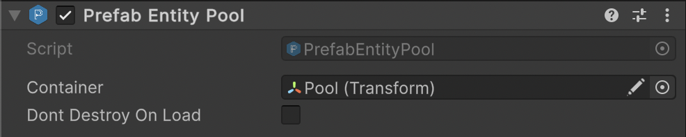

# 🧩 PrefabEntityPool

Default implementation of [PrefabEntityPool\<E>](PrefabEntityPool%601.md) for
base [MonoEntity](../Entities/MonoEntity.md) types. Provides a convenient non-generic entry point for working with
pooled [MonoEntity](../Entities/MonoEntity.md) instances across multiple Unity scenes. Use this when generic type
inference is not needed.

---

## 📑 Table of Contents

- [Example of Usage](#-example-of-usage)
- [Inspector Settings](#-inspector-settings)
- [API Reference](#-api-reference)
    - [Type](#-type)
    - [Methods](#-methods)
        - [Awake()](#awake)
        - [Init(MonoEntity, int)](#initMonoEntity-int)
        - [Rent(MonoEntity)](#rentMonoEntity)
        - [Rent(MonoEntity, Transform)](#rentMonoEntity-transform)
        - [Rent(MonoEntity, Vector3, Quaternion, Transform)](#rentMonoEntity-vector3-quaternion-transform)
        - [Return(MonoEntity)](#returnMonoEntity)
        - [Dispose(MonoEntity)](#disposeMonoEntity)
        - [Dispose()](#dispose)
        - [OnCreate(MonoEntity)](#oncreateMonoEntity)
        - [OnRent(MonoEntity)](#onrentMonoEntity)
        - [OnReturn(MonoEntity)](#onreturnMonoEntity)
        - [OnDispose(MonoEntity)](#ondisposeMonoEntity)
        - [GetEntityName(MonoEntity)](#getentitynameMonoEntity)
- [Notes](#-notes)

---

## 🗂 Example of Usage

#### 1. Add `Atomic/Entities/PrefabEntityPool` component to a GameObject



#### 2. Use this pool in your code

```csharp
// Reference the pool from the scene
PrefabEntityPool pool = ...;

// Pre-initialize pools
pool.Init(orcPrefab, 5);
pool.Init(goblinPrefab, 3);

// Rent entities
MonoEntity orc = pool.Rent(orcPrefab);
MonoEntity goblin = pool.Rent(goblinPrefab, parentTransform);
MonoEntity troll = pool.Rent(trollPrefab, new Vector3(0,0,0), Quaternion.identity, parentTransform);

// Return entities to the pool
pool.Return(orc);
pool.Return(goblin);
pool.Return(troll);

// Clear a specific prefab pool
pool.Dispose(orcPrefab);

// Clear all pools
pool.Dispose();
```

---

## 🛠 Inspector Settings

| Parameter           | Description                                                                                          |
|---------------------|------------------------------------------------------------------------------------------------------|
| `container`         | Root container transform for pooled entities. Defaults to the GameObject this script is attached to. |
| `dontDestroyOnLoad` | If true, the pool GameObject persists across scene loads.                                            |
| `expandMode`        | Determines how each prefab pool expands when empty. See [ExpandMode](ExpandMode.md).                |

---

## 🔍 API Reference

### 🏛️ Type <div id="-type"></div>

```csharp
[AddComponentMenu("Atomic/Entities/Prefab Entity Pool")]
[DisallowMultipleComponent]
public class PrefabEntityPool : PrefabEntityPool<MonoEntity>, IPrefabEntityPool
```

- **Inheritance:** [PrefabEntityPool\<E>](PrefabEntityPool%601.md), [IPrefabEntityPool](IPrefabEntityPool.md)

---

### 🏹 Methods

#### `Awake()`

```csharp
protected virtual void Awake();
```

- **Description:** Called by Unity when the GameObject is initialized.
- **Behavior:**
    - Assigns `_container` to `this.transform` if it is `null`.
    - Calls `DontDestroyOnLoad` on the GameObject if `_dontDestroyOnLoad` is `true`.
- **Usage:** Ensures that the pool is properly initialized before any entities are rented.

#### `Init(MonoEntity, int)`

```csharp
public void Init(MonoEntity prefab, int count);
```

- **Description:** Pre-initializes a pool for a specific prefab.
- **Parameters:**
    - `prefab` — The prefab to pre-instantiate and track in the pool.
    - `count` — The number of inactive instances to create.
- **Behavior:** Creates the internal pool if it does not exist and populates it with `count` entities.
- **Note:** Each instance is deactivated and stored under a container specific to the prefab.

#### `Rent(MonoEntity)`

```csharp
public MonoEntity Rent(MonoEntity prefab);
```

- **Description:** Rents an entity from the pool associated with the given prefab.
- **Behavior:** Uses default position `(0,0,0)` and rotation `Quaternion.identity`.
- **Returns:** A `MonoEntity` instance from the pool or a newly created one if the pool is empty.
- **Note:** Calls `OnRent` to activate the entity before returning.

#### `Rent(MonoEntity, Transform)`

```csharp
public MonoEntity Rent(MonoEntity prefab, Transform parent);
```

- **Description:** Rents an entity and parents it to the specified transform.
- **Parameters:**
    - `prefab` — The prefab to rent.
    - `parent` — The transform under which the entity should be parented.
- **Behavior:** Uses the parent's position and rotation for the entity.
- **Returns:** A rented `MonoEntity` instance.

#### `Rent(MonoEntity, Vector3, Quaternion, Transform)`

```csharp
public MonoEntity Rent(MonoEntity prefab, Vector3 position, Quaternion rotation, Transform parent = null);
```

- **Description:** Rents an entity instance with a specific position, rotation, and optional parent.
- **Parameters:**
    - `prefab` — The prefab to rent.
    - `position` — The world position for the rented entity.
    - `rotation` — The rotation for the entity.
    - `parent` — Optional transform to parent the entity under.
- **Returns:** A rented `MonoEntity` instance, positioned and rotated as specified.
- **Behavior:** Creates the pool if it does not exist and instantiates a new entity if the pool is empty.

#### `Return(MonoEntity)`

```csharp
public void Return(MonoEntity entity);
```

- **Description:** Returns a rented entity to its pool.
- **Parameter:** `entity` — The entity instance being returned.
- **Behavior:**
    - Calls `OnReturn` to deactivate the entity.
    - Reparents the entity under its prefab-specific container.
    - Ignores the entity if it is already in the pool.

#### `Dispose(MonoEntity)`

```csharp
public void Dispose(MonoEntity prefab);
```

- **Description:** Clears the pool for a specific prefab and destroys all associated entities and container.
- **Parameter:** `prefab` — The prefab whose pool should be cleared.
- **Behavior:** Calls `OnDispose` on each entity before destroying it and destroys the prefab container.

#### `Dispose()`

```csharp
public void Dispose();
```

- **Description:** Clears all prefab pools and destroys all pooled entities and containers.
- **Behavior:** Iterates over all internal pools and calls `OnDispose` on each entity before destroying it.

#### `OnCreate(MonoEntity)`

```csharp
protected virtual void OnCreate(MonoEntity entity);
```

- **Description:** Called whenever a new entity instance is created for pooling.
- **Default Behavior:** Deactivates the entity GameObject.
- **Override Use:** Set default state, initialize components, or perform setup on newly created entities.

#### `OnRent(MonoEntity)`

```csharp
protected virtual void OnRent(MonoEntity entity);
```

- **Description:** Called when an entity is rented from the pool.
- **Default Behavior:** Activates the entity GameObject.

#### `OnReturn(MonoEntity)`

```csharp
protected virtual void OnReturn(MonoEntity entity);
```

- **Description:** Called when an entity is returned to the pool.
- **Default Behavior:** Deactivates the entity GameObject.

#### `OnDispose(MonoEntity)`

```csharp
protected virtual void OnDispose(MonoEntity entity);
```

- **Description:** Called when a pooled entity is destroyed (e.g., during pool cleanup).
- **Default Behavior:** Empty. Override to release resources, unregister events, or perform additional cleanup.

#### `GetEntityName(MonoEntity)`

```csharp
protected virtual string GetEntityName(MonoEntity entity);
```

- **Description:** Extracts a clean base name from a prefab or entity instance.
- **Behavior:** Removes Unity-generated numeric suffixes like `(1)`, `(2)` etc.
- **Returns:** A string used as a key for pooling.

---

### 📝 Notes

- Pools are **created lazily** on first rent or init.
- Returned entities are **reparented** to their internal container to keep hierarchy clean.
- `dontDestroyOnLoad` allows pools to persist across scene changes.
- Override **protected hooks** to customize entity behavior on create, rent, return, or dispose.