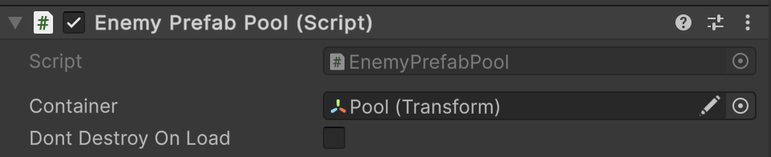

# 🧩 PrefabEntityPool\<E>

A **multi-prefab object pool** for scene-based entities of type `E`. Allows renting and returning multiple different
entity prefabs, each tracked by its own internal pool. Pools are created lazily and managed by prefab name. Supports
pre-warming via `Init`.

---

## 📑 Table of Contents

- [Example of Usage](#-example-of-usage)
- [Inspector Settings](#-inspector-settings)
- [API Reference](#-api-reference)
  - [Type](#-type)
  - [Methods](#-methods)
    - [Awake()](#awake)
    - [Init(E, int)](#inite-int)
    - [Rent(E)](#rente)
    - [Rent(E, Transform)](#rente-transform)
    - [Rent(E, Vector3, Quaternion, Transform)](#rente-vector3-quaternion-transform)
    - [Return(E)](#returne)
    - [Dispose(E)](#disposee)
    - [Dispose()](#dispose)
    - [OnCreate(E)](#oncreatee)
    - [OnRent(E)](#onrente)
    - [OnReturn(E)](#onreturne)
    - [OnDispose(E)](#ondisposee)
    - [GetEntityName(E)](#getentitynamee)


---

## 🗂 Example of Usage

#### 1. Assume we have `EnemyEntity` type

```csharp
public class EnemyEntity : SceneEntity
{
}
```

#### 2. Create `EnemyPrefabPool`

```csharp
public sealed class EnemyPrefabPool : PrefabEntityPool<EnemyEntity> 
{
}
```

#### 3. Add `EnemyPrefabPool` component to a GameObject and configure it




#### 4. Use `EnemyPrefabPool` in your code

```csharp
// Assume we have a PrefabEntityPool instance
EnemyPrefabPool pool = ...;

// Pre-initialize pools
pool.Init(orcPrefab, 5);
pool.Init(goblinPrefab, 3);

// Rent entities
EnemyEntity orc = pool.Rent(orcPrefab);
EnemyEntity goblin = pool.Rent(goblinPrefab, parentTransform);
EnemyEntity troll = pool.Rent(trollPrefab, new Vector3(0,0,0), Quaternion.identity, parentTransform);

// Return entities to the pool
pool.Return(orc);
pool.Return(goblin);
pool.Return(troll);

// Clear a specific prefab pool
pool.Dispose(orcPrefab);

// Clear all pools
pool.Dispose();
```

---

## 🛠 Inspector Settings

| Parameter           | Description                                                                                          |
|---------------------|------------------------------------------------------------------------------------------------------|
| `container`         | Root container transform for pooled entities. Defaults to the GameObject this script is attached to. |
| `dontDestroyOnLoad` | If true, the pool GameObject persists across scene loads.                                            |

---

## 🔍 API Reference

### 🏛️ Type <div id="-type"></div>

```csharp
public abstract class PrefabEntityPool<E> : MonoBehaviour, IPrefabEntityPool<E> where E : SceneEntity
```

- **Type Parameter:** `E` — The type of [SceneEntity](../Entities/SceneEntity.md) managed by the pool.
- **Inheritance:** `MonoBehaviour`, [IPrefabEntityPool\<E>](IPrefabEntityPool%601.md)

---

### 🏹 Methods

#### `Awake()`

```csharp
protected virtual void Awake();
```

- **Description:** Initializes `container` if null and applies `DontDestroyOnLoad` if `dontDestroyOnLoad` is true.

#### `Init(E, int)`

```csharp
public void Init(E prefab, int count);
```

- **Description:** Pre-initializes the pool for a specific prefab with a defined number of inactive entities.
- **Parameters:**
    - `prefab` — The prefab to pool.
    - `count` — Number of instances to pre-instantiate.

#### `Rent(E)`

```csharp
public E Rent(E prefab);
```

- **Description:** Rents an entity from the pool using default position `(0,0,0)` and rotation `Quaternion.identity`.

#### `Rent(E, Transform)`

```csharp
public E Rent(E prefab, Transform parent);
```

- **Description:** Rents an entity and sets its parent transform. Uses the parent's position and rotation.

#### `Rent(E, Vector3, Quaternion, Transform)`

```csharp
public E Rent(E prefab, Vector3 position, Quaternion rotation, Transform parent = null);
```

- **Description:** Rents an entity instance with a specific position, rotation, and optional parent transform.
- **Parameters:**
    - `prefab` — The prefab to rent.
    - `position` — World position.
    - `rotation` — Rotation.
    - `parent` — Optional parent transform.
- **Returns:** The rented entity instance.

#### `Return(E)`

```csharp
public void Return(E entity);
```

- **Description:** Returns a previously rented entity to its corresponding pool.
- **Parameter:** `entity` — The entity instance to return.
- **Note:** Safely ignores duplicate returns.

#### `Dispose(E)`

```csharp
public void Dispose(E prefab);
```

- **Description:** Clears the pool for a specific prefab, destroying all associated entities and the container.
- **Parameter:** `prefab` — The prefab whose pool should be cleared.

#### `Dispose()`

```csharp
public void Dispose();
```

- **Description:** Clears all pools, destroying all pooled entities and containers.

#### `OnCreate(E)`

```csharp
protected virtual void OnCreate(E entity);
```

- **Description:** Called when a new entity instance is created.
- **Default Behavior:** Deactivates the entity GameObject.

#### `OnRent(E)`

```csharp
protected virtual void OnRent(E entity);
```

- **Description:** Called when an entity is rented.
- **Default Behavior:** Activates the entity GameObject.

#### `OnReturn(E)`

```csharp
protected virtual void OnReturn(E entity);
```

- **Description:** Called when an entity is returned to the pool.
- **Default Behavior:** Deactivates the entity GameObject.

#### `OnDispose(E)`

```csharp
protected virtual void OnDispose(E entity);
```

- **Description:** Called when an entity is destroyed (during pool cleanup).
- **Default Behavior:** Empty. Override to release resources or unregister events.

#### `GetEntityName(E)`

```csharp
protected virtual string GetEntityName(E entity);
```

- **Description:** Extracts a clean name from a prefab or entity, stripping Unity-generated suffixes like `(1)`.
- **Returns:** The cleaned name used as a key for pooling.