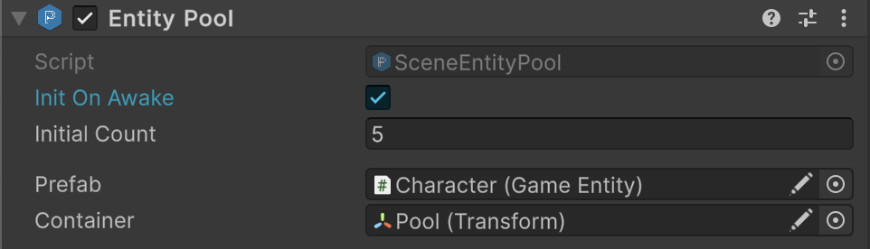

# 🧩 SceneEntityPool

A non-generic version of [SceneEntityPool\<E>](SceneEntityPool%601.md) that operates on
base [SceneEntity](../Entities/SceneEntity.md) types. They are designed to **pre-instantiate entities**, **reuse them
efficiently**, and handle **activation / deactivation** automatically. Useful when you want a simple scene-bound entity
pool without specifying a generic type.

---

## 📑 Table of Contents

- [Examples of Usage](#-examples-of-usage)
    - [Basic Usage](#ex1)
    - [Runtime Creation](#ex2)
- [Inspector Settings](#-inspector-settings)
- [API Reference](#-api-reference)
    - [Type](#-type)
    - [Methods](#-methods)
        - [Rent()](#rent)
        - [Return(IEntity)](#returnientity)
        - [Init(int)](#initint)
        - [Dispose()](#dispose)
        - [OnCreate(SceneEntity)](#oncreatesceneentity)
        - [OnDispose(SceneEntity)](#ondisposesceneentity)
        - [OnRent(SceneEntity)](#onrentsceneentity)
        - [OnReturn(SceneEntity)](#onreturnsceneentity)
        - [Awake()](#awake)
        - [Reset()](#reset)
        - [Create(CreateArgs)](#createcreateargs)
        - [Destroy(SceneEntityPool, float)](#destroysceneentitypool-float)
    - [Nested Types](#-nested-types)
        - [CreateArgs](#createargs)

---

## 🗂 Examples of Usage

Below are examples of using the non-generic `SceneEntityPool` for scene entities:

<div id="ex1"></div>

### 1️⃣ Basic Usage

#### 1. Add `Atomic/Entities/EntityPool` component to GameObject and configure it



#### 2. Usage in a project

```csharp
SceneEntity enemyPool = ...;

 // Rent entities
SceneEntity enemy1 = enemyPool.Rent();
SceneEntity enemy2 = enemyPool.Rent();

// Return entities to the pool
enemyPool.Return(enemy1);
enemyPool.Return(enemy2);
```

---

<div id="ex2"></div>

### 2️⃣ Runtime Creation

```csharp
var poolArgs = new SceneEntityPool.CreateArgs
{
    name = "EnemyPool",
    prefab = enemyPrefab,
    container = parentTransform,
    initOnAwake = true,
    initialCount = 10
};

// Create a new pool
var enemyPool = SceneEntityPool.Create(in poolArgs);

// Destroy pool
SceneEntityPool.Destroy(enemyPool);
```

---

## 🛠 Inspector Settings

| Parameters     | Description                                                                      |
|----------------|----------------------------------------------------------------------------------|
| `initOnAwake`  | Determines whether the pool is automatically initialized in `Awake()`.           |
| `initialCount` | Initial number of entities to pre-instantiate.                                   |
| `prefab`       | Prefab used to create pooled entity instances.                                   |
| `container`    | Optional parent transform for pooled entities (defaults to the pool GameObject). |

---

## 🔍 API Reference

### 🏛️ Type <div id="-type"></div>

```csharp
[AddComponentMenu("Atomic/Entities/Entity Pool")]
[DisallowMultipleComponent]
public class SceneEntityPool : SceneEntityPool<SceneEntity>, IEntityPool
```

- **Inheritance:** [SceneEntityPool\<E>](SceneEntityPool%601.md), [IEntityPool](IEntityPool.md)
- **See also:** [SceneEntityPool\<E>](SceneEntityPool%601.md), [SceneEntity](../Entities/SceneEntity.md)

---

### 🏹 Methods

#### `Rent()`

```csharp
public IEntity Rent();
```

- **Description:** Retrieves (activates) an entity from the pool. Creates a new one if the pool is empty.
- **Returns:** The rented entity instance.

#### `Return(IEntity)`

```csharp
public void Return(IEntity entity);
```

- **Description:** Returns a previously rented entity to the pool.
- **Parameter:** `entity` — Must be castable to `SceneEntity`.
- **Note:** Wraps the generic `Return(SceneEntity)` method.

#### `Init(int)`

```csharp
public void Init(int initialCount);
```

- **Description:** Pre-instantiates the specified number of entities into the pool.
- **Parameter:** `initialCount` — Number of entities to create.
- **Note:** Calls the `OnCreate` lifecycle hook for each entity.

#### `Dispose()`

```csharp
public virtual void Dispose();
```

- **Description:** Disposes all pooled and rented entities, destroying their GameObjects and clearing internal
  collections.

#### `OnCreate(SceneEntity)`

```csharp
protected virtual void OnCreate(SceneEntity entity);
```

- **Description:** Called when a new entity instance is created.
- **Default Behavior:** Deactivates the entity GameObject.

#### `OnDispose(SceneEntity)`

```csharp
protected virtual void OnDispose(SceneEntity entity);
```

- **Description:** Called when an entity is permanently destroyed during disposal.
- **Default Behavior:** Empty; override for cleanup.

#### `OnRent(SceneEntity)`

```csharp
protected virtual void OnRent(SceneEntity entity);
```

- **Description:** Called when an entity is rented from the pool.
- **Default Behavior:** Activates the entity GameObject.

#### `OnReturn(SceneEntity)`

```csharp
protected virtual void OnReturn(SceneEntity entity);
```

- **Description:** Called when an entity is returned to the pool.
- **Default Behavior:** Deactivates the entity and sets its parent to `_container`.

#### `Awake()`

```csharp
protected virtual void Awake();
```

- **Description:** Unity callback called when the GameObject is activated.
- **Note:** Automatically initializes the pool if `_initOnAwake` is true.

#### `Reset()`

```csharp
protected virtual void Reset();
```

- **Description:** Unity callback in the Editor to reset the `_container` to the pool's GameObject transform.

#### `Create(CreateArgs)`

```csharp
public static SceneEntityPool Create(in CreateArgs args) => Create<SceneEntityPool>(in args);
```

- **Description:** Creates a new non-generic `SceneEntityPool` instance in the scene.
- **Parameter:** `args` — Initialization parameters encapsulated in `CreateArgs`.
- **Returns:** A newly created `SceneEntityPool` attached to a new GameObject.

#### `Destroy(SceneEntityPool, float)`

```csharp
public static void Destroy(SceneEntityPool pool, float t = 0);
```

- **Description:** Disposes the pool and destroys its GameObject after an optional delay.
- **Parameter:** `pool` — The pool instance to destroy.
- **Parameter:** `t` — Optional delay in seconds before destruction (default 0).

---

### 🧩 Nested Types

#### `CreateArgs`

```csharp
[Serializable]
public struct CreateArgs
```

- **Description:** Arguments for creating a new `SceneEntityPool<E>`.
- **Fields:**
    - `name` — Name of the GameObject hosting the pool.
    - `prefab` — Prefab used to instantiate entities.
    - `container` — Optional parent transform.
    - `initOnAwake` — Whether to auto-initialize in `Awake()`.
    - `initialCount` — Number of entities to pre-instantiate.