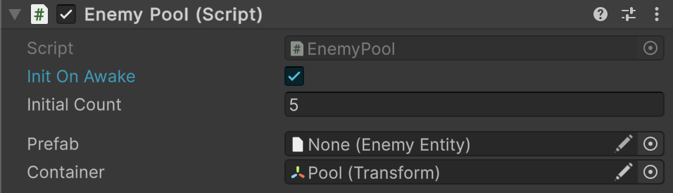

# 🧩 SceneEntityPool\<E>

A Unity **MonoBehaviour-based entity pool** for scene-bound entities of type `E`. Uses a prefab to
instantiate entities and manages their reuse via a stack. Entities are activated / deactivated on rent / return.

---

## 📑 Table of Contents

- [Example of Usage](#-example-of-usage)
- [API Reference](#-api-reference)
  - [Type](#-type)
  - [Inspector Settings](#-inspector-settings)
  - [Methods](#-methods)
    - [Awake()](#awake)
    - [Reset()](#reset)
    - [Init(int)](#initint)
    - [Rent()](#rent)
    - [Return(E)](#returne)
    - [Dispose()](#dispose)
    - [CreateEntity()](#createentity)
    - [OnCreate(E)](#oncreatee)
    - [OnDispose(E)](#ondisposee)
    - [OnRent(E)](#onrente)
    - [OnReturn(E)](#onreturne)
    - [Create<T>(in CreateArgs)](#createtcreateargs)
    - [Destroy(SceneEntityPool<E>, float)](#destroysceneentitypoole-float)
  - [Nested Types](#-nested-types)
    - [CreateArgs](#createargs)


---

## 🗂 Example of Usage

Below is an example of using `SceneEntityPool<E>` for enemy entities:

#### 1. Create `EnemyPool` for enemy entities

```csharp
public class EnemyPool : SceneEntityPool<EnemyEntity>
{
}
```

#### 2. Add `EnemyPool` component to GameObject and configure it




#### 3. Use `EnemyPool` in your project

```csharp
EnemyPool enemyPool = ...

// Rent an enemy from the pool
EnemyEntity enemy1 = enemyPool.Rent();
EnemyEntity enemy2 = enemyPool.Rent();

// Return enemies to the pool when done
enemyPool.Return(enemy1);
enemyPool.Return(enemy2);
```

---

## 🔍 API Reference

### 🏛️ Type <div id="-type"></div>

```csharp
public abstract class SceneEntityPool<E> : MonoBehaviour, IEntityPool<E>
    where E : SceneEntity
```

- **Type Parameter:** `E` — The type of entity managed by this pool. Must inherit
  from [SceneEntity](../Entities/SceneEntity.md).
- **Inheritance:** `MonoBehaviour`, [IEntityPool\<E>](IEntityPool%601.md)
- **See also:** [SceneEntityPool](SceneEntityPool.md), [SceneEntity](../Entities/SceneEntity.md)

---

## 🛠 Inspector Settings

| Parameters     | Description                                                                      |
|----------------|----------------------------------------------------------------------------------|
| `initOnAwake`  | Determines whether the pool is automatically initialized in `Awake()`.           |
| `initialCount` | Initial number of entities to pre-instantiate.                                   |
| `prefab`       | Prefab used to create pooled entity instances.                                   |
| `container`    | Optional parent transform for pooled entities (defaults to the pool GameObject). |

---

## 🏹 Methods

#### `Awake()`

```csharp
protected virtual void Awake();
```

- **Description:** Called by Unity when the GameObject is activated.
- **Note:** Initializes the pool automatically if `_initOnAwake` is true and assigns `_container` if null.

#### `Reset()`

```csharp
protected virtual void Reset();
```

- **Description:** Resets the container to the pool's GameObject transform.
- **Note:** Called by Unity in the Editor.

#### `Init(int)`

```csharp
public void Init(int initialCount);
```

- **Description:** Pre-instantiates the specified number of entities into the pool.
- **Parameter:** `initialCount` — Number of entities to create.

#### `Rent()`

```csharp
public E Rent();
```

- **Description:** Retrieves (activates) an entity from the pool. Creates a new one if the pool is empty.
- **Returns:** The rented entity instance.

#### `Return(E)`

```csharp
public void Return(E entity);
```

- **Description:** Returns (deactivates) an entity to the pool.
- **Parameter:** `entity` — Must have been previously rented.
- **Note:** Logs a warning if the entity was not tracked.

#### `Dispose()`

```csharp
public virtual void Dispose();
```

- **Description:** Disposes all pooled and rented entities, destroying their GameObjects and clearing internal
  collections.

#### `CreateEntity()`

```csharp
private E CreateEntity();
```

- **Description:** Instantiates a new entity from the prefab and calls `OnCreate`.
- **Returns:** The created entity instance.

#### `OnCreate(E)`

```csharp
protected virtual void OnCreate(E entity);
```

- **Description:** Called when a new entity instance is created.
- **Default Behavior:** Deactivates the entity GameObject.

#### `OnDispose(E)`

```csharp
protected virtual void OnDispose(E entity);
```

- **Description:** Called when an entity is permanently destroyed during disposal.
- **Default Behavior:** Empty. Override for cleanup.

#### `OnRent(E)`

```csharp
protected virtual void OnRent(E entity);
```

- **Description:** Called when an entity is rented from the pool.
- **Default Behavior:** Activates the entity GameObject.

#### `OnReturn(E)`

```csharp
protected virtual void OnReturn(E entity);
```

- **Description:** Called when an entity is returned to the pool.
- **Default Behavior:** Deactivates the entity and sets its parent to `_container`.

#### `Create<T>(CreateArgs)`

```csharp
public static T Create<T>(in CreateArgs args) where T : SceneEntityPool<E>;
```

- **Description:** Creates a new instance of a scene entity pool in the scene.
- **Parameter:** `args` — Initialization parameters encapsulated in `CreateArgs`.
- **Returns:** A new instance of the pool attached to a new GameObject.

#### `Destroy(SceneEntityPool<E>, float)`

```csharp
public static void Destroy(SceneEntityPool<E> pool, float t = 0);
```

- **Description:** Disposes the pool and destroys its GameObject after an optional delay.
- **Parameter:** `pool` — The pool instance to destroy.
- **Parameter:** `t` — Optional delay in seconds before destruction (default 0).

---

### 🧩 Nested Types

#### `CreateArgs`

```csharp
[Serializable]
public struct CreateArgs
```

- **Description:** Arguments for creating a new `SceneEntityPool<E>`.
- **Fields:**
    - `name` — Name of the GameObject hosting the pool.
    - `prefab` — Prefab used to instantiate entities.
    - `container` — Optional parent transform.
    - `initOnAwake` — Whether to auto-initialize in `Awake()`.
    - `initialCount` — Number of entities to pre-instantiate.