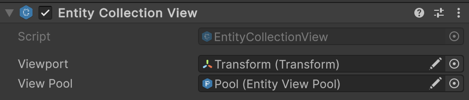

# 🧩 EntityCollectionView

A concrete, non-generic version of [EntityCollectionView\<E, V>](EntityCollectionView%601.md) that manages collections
of [EntityView](EntityView.md) instances in a Unity scene. Provides functionality to show, hide, add, remove, and clear
entity views using a pool of reusable instances. Use when you do not need a custom entity type and want a ready-to-use
collection of generic [EntityViews](EntityView.md).

---

## 📑 Table of Contents

- [Example of Usage](#-example-of-usage)
  - [Collection Setup](#1️⃣-collection-setup)
  - [Collection Usage](#2️⃣-collection-usage)
- [Inspector Settings](#-inspector-settings)
- [API Reference](#-api-reference)
  - [Type](#-type)
  - [Events](#-events)
    - [OnAdded](#onadded)
    - [OnRemoved](#onremoved)
  - [Properties](#-properties)
    - [Count](#count)
    - [IsVisible](#isvisible)
  - [Methods](#-methods)
    - [Show(IReadOnlyEntityCollection\<IEntity>)](#showireadonlyentitycollectionientity)
    - [Hide()](#hide)
    - [Get(IEntity)](#getientity)
    - [TryGet(IEntity, out EntityView)](#trygetientity-out-entityview)
    - [Contains(IEntity)](#containsientity)
    - [Add(IEntity)](#addientity)
    - [Remove(IEntity)](#removeientity)
    - [Clear()](#clear)
    - [GetEnumerator()](#getenumerator)
    - [GetName(IEntity)](#getnameientity)


---

## 🗂 Example of Usage

Below is an example of using non-generic entity view collection:

<div id="ex1"></div>

### 1️⃣ Collection Setup

Attach `Atomic/Entities/Entity Coollection View` to an GameObject



- Assign a `Transform` to `Viewport` field.
- Assign the [EntityViewPool](EntityViewPool.md) to `ViewPool` field.

---

<div id="ex2"></div>

### 2️⃣ Collection Usage

```csharp
// Assume we have an instance of EntityCollectionView
EntityCollectionView collectionView = ...;

// Assume we have an instance of IReadOnlyEntityCollection
IReadOnlyEntityCollection collection = ...;

// Assume we have a single entity
IEntity someEntity = ...;

// ===== Basic Usage =====

// Bind this entity collection to the view collection 
collectionView.Show(collection);

// Unbind the current entity collection
collectionView.Hide();

// ===== Manual View Management =====

// Add a single entity view manually
collectionView.Add(someEntity);

// Remove a specific entity view manually
collectionView.Remove(someEntity);

// Clear all active entity views manually
collectionView.Clear();

// ===== Querying and Accessing =====

// Check if a view exists for a specific entity
bool exists = collectionView.Contains(someEntity);

// Try to get the view safely
if (collectionView.TryGet(someEntity, out EntityView view))
{
    Debug.Log($"Found view for {someEntity}: {view.name}");
}

// Or get it directly (throws if not found)
EntityView directView = collectionView.Get(someEntity);

// ===== Iterating Through All Views =====

// Iterate over all entity-view pairs
foreach (KeyValuePair<IEntity, EntityView> pair in collectionView)
{
    IEntity entity = pair.Key;
    EntityView unitView = pair.Value;
    Debug.Log($"Entity: {entity}, View: {unitView.name}");
}
```

---

## 🛠 Inspector Settings

| Parameter  | Description                                                                              |
|------------|------------------------------------------------------------------------------------------|
| `viewport` | The Transform under which all entity views will be parented in the hierarchy.            |
| `viewPool` | The [EntityViewPool](EntityViewPool.md) responsible for instantiating and reusing views. |

---

## 🔍 API Reference

### 🏛️ Type <div id="-type"></div>

```csharp  
[AddComponentMenu("Atomic/Entities/Entity Collection View")]
[DisallowMultipleComponent]
public class EntityCollectionView : EntityCollectionView<IEntity, EntityView>
```

- **Inheritance:** [EntityCollectionView<E, V>](EntityCollectionView%601.md)
- **See also:** [EntityViewPool](EntityViewPool.md), [EntityViewPool<E, V>](EntityViewPool%601.md)

---

### ⚡ Events

#### `OnAdded`

```csharp
public event Action<IEntity, EntityView> OnAdded;  
```

- **Description:** This event is triggered **every time** a new view is created and displayed for an entity. This
  happens:
    - When calling `Show(source)` for all existing entities in the source.
    - When manually calling `Add(entity)` for a new entity.

- **Parameters:**
    - `IEntity` — The entity for which the view was created.
    - `EntityView` — The created view instance now tracked by the collection.
- **Note:** The event **does not fire** if the entity is already displayed in the collection (duplicates are ignored).

#### `OnRemoved`

```csharp  
public event Action<IEntity, EntityView> OnRemoved;  
```

- **Description:** This event is triggered **every time** a view is removed or returned to the pool. This happens:
    - When calling `Hide()` (removes all active views).
    - When calling `Remove(entity)` for a specific entity.
    - When calling `Clear()` (removes all entities).

- **Parameters:**
    - `IEntity` — The entity whose view was removed.
    - `EntityView` — The view that was hidden and returned to the pool.

- **Note:** The event is called **before** the view is actually returned to the pool, giving you a chance to temporarily
  use it (e.g., play an animation).

---

### 🔑 Properties

#### `Count`

```csharp  
public int Count { get; }  
```

- **Description:** The number of active entity views currently tracked by this collection.

#### `IsVisible`

```csharp  
public bool IsVisible { get; }  
```

- **Description:** Indicates whether this collection is currently bound to a source entity collection.

---

### 🏹 Methods

#### `Show(IReadOnlyEntityCollection<IEntity>)`

```csharp  
public void Show(IReadOnlyEntityCollection<IEntity> source);  
```

- **Description:** Binds the collection view to a source of entities and creates views for all current entities.
- **Parameter:** `source` — The collection of entities to visualize.
- **Throws:** `ArgumentNullException` if `source` is null.

#### `Hide()`

```csharp  
public void Hide();  
```

- **Description:** Unbinds the collection from the source and removes all active views.

#### `Get(IEntity)`

```csharp  
public EntityView Get(IEntity entity);  
```

- **Description:** Returns the view associated with a specific entity.
- **Parameter:** `entity` — The entity whose view is requested.
- **Returns:** The active view instance.
- **Throws:** `KeyNotFoundException` if the entity is not in the collection.

#### `TryGet(IEntity, out EntityView)`

```csharp  
public bool TryGet(IEntity entity, out EntityView view);  
```

- **Description:** Tries to retrieve the view for a given entity.
- **Returns:** `true` if a view exists, `false` otherwise.

#### `Contains(IEntity)`

```csharp  
public bool Contains(IEntity entity);  
```

- **Description:** Checks whether a view exists for the specified entity.

#### `Add(IEntity)`

```csharp  
public void Add(IEntity entity);  
```

- **Description:** Creates and shows a view for the specified entity if it does not already exist.
- **Parameter:** `entity` — The entity to visualize.

#### `Remove(IEntity)`

```csharp  
public void Remove(IEntity entity);  
```

- **Description:** Hides and returns the view associated with the specified entity to the pool.
- **Parameter:** `entity` — The entity to remove.

#### `Clear()`

```csharp  
public void Clear();  
```

- **Description:** Removes all active views and returns them to the pool.

#### `GetEnumerator()`

```csharp  
public IEnumerator<KeyValuePair<IEntity, EntityView>> GetEnumerator();  
```

- **Description:** Returns an enumerator that iterates through all active entity-view pairs in the collection.
  This allows you to use `foreach` to iterate over each entity and its associated view.
- **Returns:** `IEnumerator<KeyValuePair<IEntity, EntityView>>` — An enumerator for the entity-view pairs.

#### `GetName(IEntity)`

```csharp  
protected virtual string GetName(IEntity entity);  
```

- **Description:** Determines the name of the prefab to use for the given entity.
- **Parameter:** `entity` — The entity to evaluate.
- **Returns:** The name used to rent a view from the pool.
- **Default Behavior:** Returns `entity.Name`.
- **Override:** Can be overridden to provide custom logic for prefab selection, grouping, or localization.

<!--


# 🧩 EntityCollectionView

`EntityCollectionView` is a Unity `MonoBehaviour` that manages a collection of `EntityView` instances in the scene. It supports dynamically showing, hiding, adding, and removing entity views, with efficient reuse via a view pool.

This system comes in two forms:

* **Non-generic** version (`EntityCollectionView`) for working with `IEntity`.
* **Generic** version (`EntityCollectionView<E, V>`) for type-specific entities and views.

---

## Key Features

### Dynamic View Management
- Automatically creates views for newly added entities.
- Removes views when entities are removed or despawned.
- Supports clearing all active views at once.

### Efficient Pooling
- Uses a reusable pool of `EntityView` instances.
- Reduces runtime allocations and improves performance.
- Automatically returns views to the pool when removed.

### Type Safety
- Generic version allows compile-time type checking for entity and view types.
- Non-generic version provides convenience for general-purpose usage.

### Flexibility
- Custom entity naming logic via `GetEntityName`.
- Bind to any `IReadOnlyEntityCollection<E>` source.
- Supports Unity scene hierarchy organization through a viewport transform.

---

## EntityCollectionView
**A shorthand for `EntityCollectionView<IEntity, EntityView>`.**

```csharp
[DisallowMultipleComponent]
public class EntityCollectionView : EntityCollectionView<IEntity, EntityView>
{
}

## EntityCollectionView<E, V>
**Generic version for managing entity-specific views.**

```csharp
public abstract class EntityCollectionView<E, V> : MonoBehaviour, IEnumerable<KeyValuePair<E, V>>
    where E : IEntity
    where V : EntityView<E>
{
}
```

---

## Methods

### Show
```csharp
void Show(IReadOnlyEntityCollection<E> source);
```
- **Purpose**: Binds the collection to a source and displays all entity views.
- **Parameter**: `source` — The collection of entities to visualize.
- **Throws**: `ArgumentNullException` if `source` is null.

### Hide
```csharp
void Hide();
```
- **Purpose**: Hides all entity views and detaches from the source.

### Add
```csharp
void Add(E entity);
```
- **Purpose**: Creates and displays a view for the specified entity.
- **Behavior**: If a view already exists, it will not create a duplicate.

### RemoveView
```csharp
void Remove(E entity);
```
- **Purpose**: Hides and returns the view to the pool.

### Clear
```csharp
void Clear();
```
- **Purpose**: Removes all views from the collection and returns them to the pool.

### Get
```csharp
V Get(E entity);
```
- **Purpose**: Retrieves the view associated with a specific entity.
- **Throws**: `KeyNotFoundException` if the entity has no active view.

### GetEnumerator
```csharp
IEnumerator<KeyValuePair<E, V>> GetEnumerator();
```
- **Purpose**: Iterates through all entity-view pairs in the collection.

### GetName
```csharp
protected virtual string GetEntityName(E entity);
```
- **Purpose**: Determines the name used to retrieve the view prefab for a given entity.
- **Default Behavior**: Returns `entity.Name`.
- **Override**: Supports custom naming logic for categories or localization.

---

## Example Usage

### Example #1: Binding Entity Collection (Show / Hide)

```csharp
// Find the collection view in the scene
var collectionView = FindObjectOfType<EntityCollectionView>();

// Bind the collection view to a source of entities
collectionView.Show(entityCollection);

// The collection view automatically creates views for all entities in the collection
// and will keep them synchronized as entities are added or removed

// When done, hide all views
collectionView.Hide();
```

**Description:**
- Demonstrates binding a collection to `EntityCollectionView`.
- Views are automatically created and destroyed based on the bound entity collection.
- Useful for automatic synchronization of entity views without manual intervention.

### Example #2: Manual View Management
```csharp
// Access the collection view manually
var collectionView = FindObjectOfType<EntityCollectionView>();

// Show a view for a specific entity
collectionView.Add(someEntity);

// Retrieve the view for custom logic
EntityView view = collectionView.Get(someEntity);

// Remove the view when needed
collectionView.Remove(someEntity);
```

**Description:**
- Shows manual control over individual views.
- Useful when you want to add or remove entity views outside the automatic collection binding.
- Provides flexibility for one-off operations on specific entities.


-->