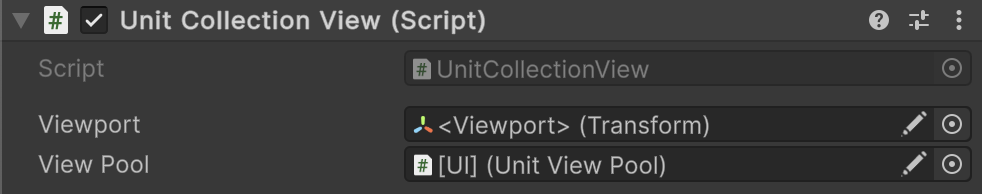

# 🧩 EntityCollectionView<E, V>

A base class for managing collections of entity views in a Unity scene. Provides functionality to show, hide, add,
remove, and clear entity views, backed by a pool of reusable instances. Use for visualizing dynamic collections of
entities (like UI lists, enemy groups, or pooled game objects) efficiently.

---

## 📑 Table of Contents

- [Example of Usage](#-example-of-usage)
    - [Collection Setup](#ex1)
    - [Collection Usage](#ex2)
    - [Extending the Collection](#ex3)
- [Inspector Settings](#-inspector-settings)
- [API Reference](#-api-reference)
    - [Type](#-type)
- [Events](#-events)
    - [OnAdded](#onadded)
    - [OnRemoved](#onremoved)
- [Properties](#-properties)
    - [Count](#count)
    - [IsVisible](#isvisible)
- [Methods](#-methods)
    - [Show(IReadOnlyEntityCollection<E>)](#showireadonlyentitycollectione)
    - [Hide()](#hide)
    - [Get(E)](#gete)
    - [TryGet(E, out V)](#trygete-out-v)
    - [Contains(E)](#containse)
    - [Add(E)](#adde)
    - [Remove(E)](#removee)
    - [Clear()](#clear)
    - [GetEnumerator()](#getenumerator)
    - [GetName(E)](#getnamee)

---

## 🗂 Example of Usage

Below is an example of using generic entity view collection:

<div id="ex1"></div>

### 1️⃣ Collection Setup

#### 1. Assume we have a concrete entity type

```csharp
public class IUnitEntity : IEntity
{
}
```

#### 2. Assume we have a concrete entity view type

```csharp
public class UnitView : EntityView<IUnitEntity>
{
}
```

#### 3. Assume we have a concrete entity view pool

```csharp
public sealed class UnitViewPool : EntityViewPool<IUnitEntity, UnitView>
{
}
```

#### 4. Create a specific entity view collection for `UnitView`

```csharp
public sealed class UnitCollectionView : EntityCollectionView<IUnitEntity, UnitView>
{
}
```

#### 5. Attach this collection to an GameObject



- Assign a `Transform` to `Viewport` field.
- Assign the `UnityViewPool` to `ViewPool` field.

---

<div id="ex2"></div>

### 2️⃣ Collection Usage

```csharp
// Assume we have an instance of UnitCollectionView
UnitCollectionView collectionView = ...;

// Assume we have an instance of IReadOnlyEntityCollection<IUnitEntity>
IReadOnlyEntityCollection<IUnitEntity> collection = ...;

// Assume we have a single entity
IUnitEntity someEntity = ...;

// ===== Basic Usage =====

// Bind this entity collection to the view collection 
collectionView.Show(collection);

// Unbind the current entity collection
collectionView.Hide();

// ===== Manual View Management =====

// Add a single entity view manually
collectionView.Add(someEntity);

// Remove a specific entity view manually
collectionView.Remove(someEntity);

// Clear all active entity views manually
collectionView.Clear();

// ===== Querying and Accessing =====

// Check if a view exists for a specific entity
bool exists = collectionView.Contains(someEntity);

// Try to get the view safely
if (collectionView.TryGet(someEntity, out UnitView view))
{
    Debug.Log($"Found view for {someEntity}: {view.name}");
}

// Or get it directly (throws if not found)
UnitView directView = collectionView.Get(someEntity);

// ===== Iterating Through All Views =====

// Iterate over all entity-view pairs
foreach (KeyValuePair<IUnitEntity, UnitView> pair in collectionView)
{
    IUnitEntity entity = pair.Key;
    UnitView unitView = pair.Value;
    Debug.Log($"Entity: {entity}, View: {unitView.name}");
}
```

<div id="ex3"></div>

### 3️⃣ Extending the Collection

You can override [GetName(E)](#getnamee) to customize prefab selection

```csharp
public sealed class CustomUnitCollectionView : UnitCollectionView
{
    protected override string GetName(IUnitEntity entity)
    {
        string viewId = entity.GetValue<string>("ViewId");
        return viewId;
    }
}
```

---

## 🛠 Inspector Settings

| Parameter  | Description                                                                                        |
|------------|----------------------------------------------------------------------------------------------------|
| `viewport` | The `Transform` under which all entity views will be parented in the hierarchy.                    |
| `viewPool` | The [EntityViewPool<E, V>](EntityViewPool%601.md) responsible for instantiating and reusing views. |

---

## 🔍 API Reference

### 🏛️ Type <div id="-type"></div>

```csharp
public abstract class EntityCollectionView<E, V> : MonoBehaviour, IEnumerable<KeyValuePair<E, V>>
    where E : class, IEntity
    where V : EntityView<E>
```

- **Type Parameters:**
    - `E` — The type of entity managed by this collection. Must implement [IEntity](../Entities/IEntity.md).
    - `V` — The type of entity view associated with the entities: [EntityView\<E>](EntityView%601.md).
- **Inheritance:** `MonoBehaviour`
- **See also:** [EntityViewPool<E, V>](EntityViewPool%601.md)

---

### ⚡ Events

#### `OnAdded`

```csharp  
public event Action<E, V> OnAdded;  
```

- **Description:** This event is triggered **every time** a new view is created and displayed for an entity. This
  happens:
    - When calling `Show(source)` for all existing entities in the source.
    - When manually calling `Add(entity)` for a new entity.

- **Parameters:**
    - `E entity` — The entity for which the view was created.
    - `V view` — The created view instance now tracked by the collection.
- **Note:** The event **does not fire** if the entity is already displayed in the collection (duplicates are ignored).

#### `OnRemoved`

```csharp
public event Action<E, V> OnRemoved;  
```

- **Description:** This event is triggered **every time** a view is removed or returned to the pool. This happens:
    - When calling `Hide()` (removes all active views).
    - When calling `Remove(entity)` for a specific entity.
    - When calling `Clear()` (removes all entities).

- **Parameters:**
    - `E entity` — The entity whose view was removed.
    - `V view` — The view that was hidden and returned to the pool.

- **Note:** The event is called **before** the view is actually returned to the pool, giving you a chance to temporarily
  use it (e.g., play an animation).

### 🔑 Properties

#### `Count`

```csharp
public int Count { get; }
```

- **Description:** The number of active entity views currently tracked by this collection.

#### `IsVisible`

```csharp
public bool IsVisible { get; }
```

- **Description:** Indicates whether this collection is currently bound to a source entity collection.

---

### 🏹 Methods

#### `Show(IReadOnlyEntityCollection<E>)`

```csharp
public void Show(IReadOnlyEntityCollection<E> source);
```

- **Description:** Binds the collection view to a source of entities and creates views for all current entities.
- **Parameter:** `source` — The collection of entities to visualize.
- **Throws:** `ArgumentNullException` if `source` is null.

#### `Hide()`

```csharp
public void Hide();
```

- **Description:** Unbinds the collection from the source and removes all active views.

#### `Get(E)`

```csharp
public V Get(E entity);
```

- **Description:** Returns the view associated with a specific entity.
- **Parameter:** `entity` — The entity whose view is requested.
- **Returns:** The active view instance.
- **Throws:** `KeyNotFoundException` if the entity is not in the collection.

#### `TryGet(E, out V)`

```csharp
public bool TryGet(E entity, out V view);
```

- **Description:** Tries to retrieve the view for a given entity.
- **Returns:** `true` if a view exists, `false` otherwise.

#### `Contains(E)`

```csharp
public bool Contains(E entity);
```

- **Description:** Checks whether a view exists for the specified entity.

#### `Add(E)`

```csharp
public void Add(E entity);
```

- **Description:** Creates and shows a view for the specified entity if it does not already exist.
- **Parameter:** `entity` — The entity to visualize.

#### `Remove(E)`

```csharp
public void Remove(E entity);
```

- **Description:** Hides and returns the view associated with the specified entity to the pool.
- **Parameter:** `entity` — The entity to remove.

#### `Clear()`

```csharp
public void Clear();
```

- **Description:** Removes all active views and returns them to the pool.

#### `GetEnumerator()`

```csharp
public IEnumerator<KeyValuePair<E, V>> GetEnumerator();
```

- **Description:** Returns an enumerator that iterates through all active entity-view pairs in the collection.
  This allows you to use foreach to iterate over each entity and its associated view.
- **Returns:** IEnumerator<KeyValuePair<E, V>> — An enumerator for the entity-view pairs.

#### `GetName(E)`

```csharp
protected virtual string GetName(E entity);
```

- **Description:** Determines the name of the prefab to use for the given entity.
- **Parameter:** `entity` — The entity to evaluate.
- **Returns:** The name used to rent a view from the pool.
- **Default Behavior:** Returns `entity.Name`.
- **Override:** Can be overridden to provide custom logic for prefab selection, grouping, or localization.