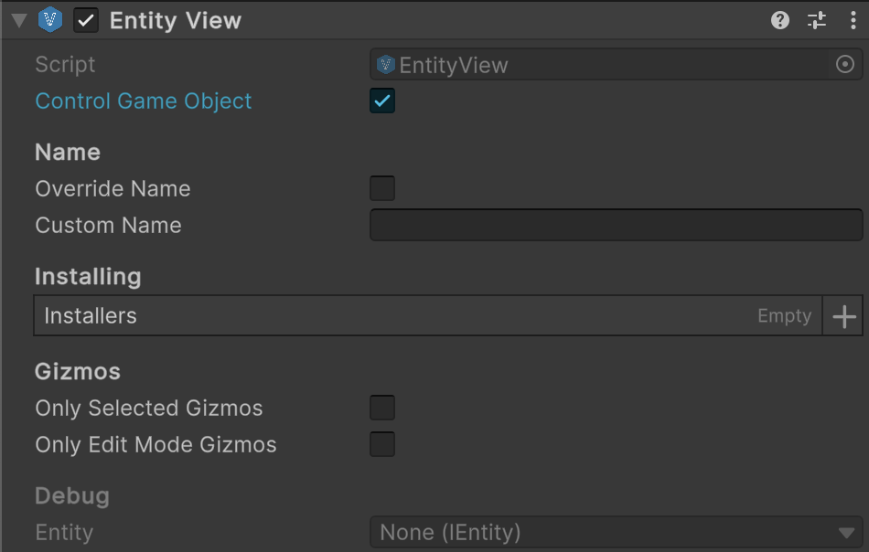
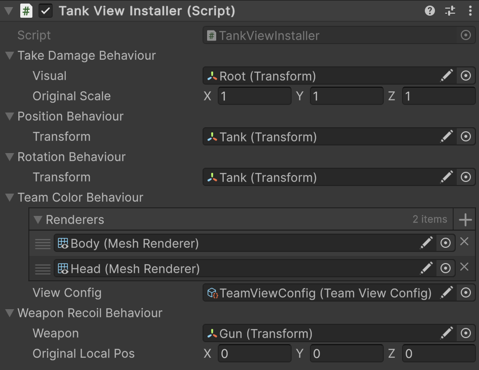

# 🧩 EntityView

A visual representation of an entity in the Unity scene. It provides a complete system for showing / hiding entities,
installing, editor gizmos, custom naming, and safe creation / destruction. Use as a foundation for UI or game objects
that visually represent entity data. A **non-generic wrapper** around [EntityView\<E>](EntityView%601.md) fixed
to [IEntity](../Entities/IEntity.md).

---

## 📑 Table of Contents

- [Examples of Usage](#-examples-of-usage)
    - [View Setup](#ex1)
    - [Entity Rendering](#ex2)
    - [Creation & Destruction](#ex3)
    - [Gizmos Support](#ex4)
- [Inspector Settings](#-inspector-settings)
    - [Parameters](#-parameters)
    - [Context Menu](#-context-menu)
    - [Gizmos](#-gizmos)
- [API Reference](#-api-reference)
    - [Type](#-type)
    - [Properties](#-properties)
        - [Name](#name)
        - [Entity](#entity)
        - [IsVisible](#isvisible)
    - [Methods](#-methods)
        - [Show(IEntity)](#showientity)
        - [Hide()](#hide)
        - [OnShow(IEntity)](#onshowientity)
        - [OnHide(IEntity)](#onhideientity)
        - [Create(CreateArgs)](#createcreateargs)
        - [Destroy(EntityView, float)](#destroyentityview-float)
    - [Nested Types](#-nested-types)
        - [CreateArgs](#createargs)

---

## 🗂 Examples of Usage

<div id="ex1"></div>

### 1️⃣ View Setup

Below is an example of setting up `EntityView<` that represents a tank entity.

#### 1. Attach `Atomic/Entities/Entity View` to a GameObject



#### 2. Create an entity installer for the view

```csharp
public sealed class TankViewInstaller : SceneEntityInstaller
{
    [SerializeField] private TakeDamageViewBehaviour _takeDamageBehaviour;
    [SerializeField] private PositionViewBehaviour _positionBehaviour;
    [SerializeField] private RotationViewBehaviour _rotationBehaviour;
    [SerializeField] private TeamColorViewBehaviour _teamColorBehaviour;
    [SerializeField] private WeaponRecoilViewBehaviour _weaponRecoilBehaviour;
    
    public override void Install(IEntity entity)
    {
        entity.AddBehaviour(_takeDamageBehaviour);
        entity.AddBehaviour(_positionBehaviour);
        entity.AddBehaviour(_rotationBehaviour);
        entity.AddBehaviour(_teamColorBehaviour);
        entity.AddBehaviour(_weaponRecoilBehaviour);
    }

    public override void Uninstall(IEntity entity)
    {
        entity.DelBehaviour(_takeDamageBehaviour);
        entity.DelBehaviour(_positionBehaviour);
        entity.DelBehaviour(_rotationBehaviour);
        entity.DelBehaviour(_teamColorBehaviour);
        entity.DelBehaviour(_weaponRecoilBehaviour);
    }
}
```

#### 3. Attach `TankViewInstaller` to the GameObject that contains the `EntityView` component



#### 4. Drag and drop `TankViewInstaller` to the `installers` field of `EntityView`


#### 5. Now your `EntityView` contains all behaviours that will be attached to a rendering entity

---

<div id="ex2"></div>

### 2️⃣ Entity Rendering

Below is an example of entity visualization through the entity view:

```csharp
// Get an instance of GameEntityView
EntityView view = ...;

// Get an instance of the entity
IEntity entity = ...;

// Start rendering the entity:
// The GameObject dynamically attaches all tags, values, and behaviours to the entity
view.Show(entity);

// Stop rendering the entity:
// The GameObject hides, and all view tags, values, and behaviours are detached from the entity
view.Hide(entity);
```

- **Notes:**
    - `Show(entity)` — activates rendering and links the view with the entity.
    - `Hide(entity)` — disables rendering and detaches the view from the entity.

---

<div id="ex3"></div>

### 3️⃣ Creation & Destruction

Below is an example of creating and destructing entity view using static methods

```csharp
// Create a new instance of GameEntityView dynamically
CreateArgs args = new EntityView.CreateArgs
{
    name = "PlayerView",
    controlGameObject = true,
    installers = new List<SceneEntityInstaller> { jumpInstaller, speedInstaller },
};

EntityView playerView = EntityView.Create(args);

// Destroy GameEntityView dynamically
EntityView.Destroy(playerView, 2f); // destroys after 2 seconds
```

- **Notes:**
    - `Create(args)` — dynamically instantiates a new view with the specified name, controlled GameObject, and aspects.
    - `Destroy(view, delay)` — schedules the view for destruction after the given delay in seconds.

---

<div id="ex4"></div>

### 4️⃣ Gizmos Support

Also, you can create gizmos behaviours and attach to the installer of the entity view

#### 1. Create a custom gizmo for position and scale

```csharp
public sealed class TransformGizmos : IEntityGizmos
{
    public void DrawGizmos(IEntity entity)
    {
        Vector3 center = entity.GetValue<Vector3>("Position");
        float scale = entity.GetValue<float>("Scale");
        Handles.DrawWireDisc(center, Vector3.up, scale);
    }
}
```

#### 2. Attach the gizmo to a `SceneEntityInstaller`

```csharp

public sealed class CharacterViewInstaller : SceneEntityInstaller
{
    private readonly TransformGizmos _transformGizmos = new();
    
    public override void Install(IEntity entity)
    {
        // Other bindings...
        
        entity.AddBehaviour(_transformGizmos);
    }

    public override void Uninstall(IEntity entity)
    {
        // Other bindings...
        
        entity.DelBehaviour(_transformGizmos);
    }
}
```

---

## 🛠 Inspector Settings

### 🎛️ Parameters

| Parameter           | Description                                                                                                                                                       |
|---------------------|-------------------------------------------------------------------------------------------------------------------------------------------------------------------|
| `controlGameObject` | If `true`, `GameObject.SetActive(true/false)` will be automatically called when invoking `Show()` or `Hide()`.                                                    |
| `overrideName`      | If `true`, the view will use `customName` instead of the `GameObject.name`.                                                                                       |
| `customName`        | Custom name used for the view when `overrideName == true`.                                                                                                        |
| `installers`        | A list of **installers** that inject values and behaviors into the attached entity.<br>Each installer calls `Install()` when shown and `Uninstall()` when hidden. |

---

### ⚙️ Context Menu

| Option                           | Description                                                                                               |
|----------------------------------|-----------------------------------------------------------------------------------------------------------|
| `AssignCustomNameFromGameObject` | Assigns the GameObject's current name to `customName`. Accessible via context menu in the Unity Inspector |

---

### 🎨 Gizmos

| Setting              | Description                                       |
|----------------------|---------------------------------------------------|
| `onlySelectedGizmos` | Draw gizmos only when the GameObject is selected. |
| `onlyEditModeGizmos` | Disable gizmo drawing during Play mode.           |

---

## 🔍 API Reference

### 🏛️ Type <div id="-type"></div>

```csharp
[AddComponentMenu("Atomic/Entities/Entity View")]
[DisallowMultipleComponent] 
public class EntityView : EntityView<IEntity>
```

- **Description:**
- **Inheritance:** [EntityView\<E>](EntityView%601.md), `MonoBehaviour`
- **Usage:** Useful when the exact entity type is unknown or irrelevant (e.g., working with heterogeneous entities).

---

### 🔑 Properties

#### `Name`

```csharp
public virtual string Name { get; }
```

- **Description:** Returns the display name of the view:
    - `customName`, if `overrideName == true`,
    - otherwise, `GameObject.name`.

#### `Entity`

```csharp
public IEntity Entity { get; }
```

- **Description:** The entity currently bound to this view.
- **Note:** Only available after calling `Show()`.

#### `IsVisible`

```csharp
public bool IsVisible { get; }
```

- **Description:** Indicates whether the view is currently visible (`Entity != null`).

---

### 🏹 Methods

#### `Show(IEntity)`

```csharp
public void Show(IEntity entity);
```

- **Description:** Displays the view and binds it to the specified entity.
- **Parameter:** `entity` — The entity to associate with this view.
- **Throws:** `ArgumentNullException`, if `entity` is `null`.
- **Details:**
    - Activates the `GameObject` if `controlGameObject == true`.
    - Calls `OnShow(entity)` for custom logic.
    - Executes `Install()` on each `SceneEntityInstaller` in the list.

#### `Hide()`

```csharp
public void Hide();
```

- **Description:** Hides the view and removes the entity binding.
- **Details:**
    - Executes `Uninstall()` for all installers.
    - Calls `OnHide(entity)`.
    - Deactivates the `GameObject` if `controlGameObject == true`.
    - Clears the `Entity` reference.

#### `OnShow(IEntity)`

```csharp
protected virtual void OnShow(IEntity entity);
```

- **Description:** Invoked when the view is shown. Override to add custom behavior  
  (e.g., updating UI or initializing components).

#### `OnHide(IEntity)`

```csharp
protected virtual void OnHide(IEntity entity);
```

- **Description:** Invoked when the view is hidden. Override to add custom cleanup logic  
  (e.g., stopping animations or unsubscribing from events).

#### `Create(CreateArgs)`

```csharp
public static EntityView Create(in CreateArgs args = default);
````

- **Description:** Creates a new `EntityView` `GameObject` and sets up its installers.
- **Parameter:** `args` — Arguments for configuring the new view (see [`CreateArgs`](EntityViewE.md#createargs)).
- **Returns:** A new `EntityView` instance.
- **Details:**
    - Calls the generic factory method `Create<EntityView>(args)`.
    - Automatically applies provided settings (`name`, `installers`, `controlGameObject`, gizmo options).

#### `Destroy(EntityView, float)`

```csharp
public static void Destroy(EntityView<E> view, float time = 0);
```

- **Description:** Destroys the specified view and its `GameObject` after an optional delay.
- **Parameters:**
    - `view` — The `EntityView` instance to destroy.
    - `time` — Optional delay (in seconds) before destruction. Defaults to `0`.
- **Details:**
    - Calls `Hide()` before destroying.
    - Uses Unity's `Object.Destroy`.

---

### 🧩 Nested Types

#### `CreateArgs`

```csharp
[Serializable]
public struct CreateArgs
```

- **Description:** Arguments used to configure and create a new `EntityView<E>` GameObject instance.
- **Fields:**
    - `name` — The name of the newly created `GameObject` for the `EntityView`.
    - `controlGameObject` — If `true`, the created view will automatically call `GameObject.SetActive()` in `Show/Hide`.
    - `installers` — A list of **installers** that configure the view upon creation.