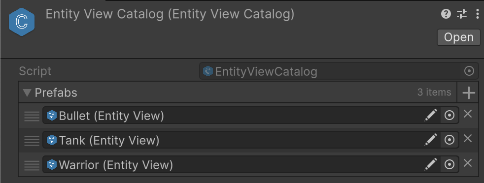

# 🧩 EntityViewCatalog

A **non-generic catalog** of [EntityView](EntityView.md) prefabs. This is a concrete version of
[EntityViewCatalog\<E, V>](EntityViewCatalog%601.md) with [IEntity](../Entities/IEntity.md) fixed
to `EntityView`. Useful when strong typing for a specific entity type is not required. Ideal for general-purpose prefab
management.

---

## 📑 Table of Contents

- [Example of Usage](#-example-of-usage)
- [Inspector Settings](#-inspector-settings)
- [API Reference](#-api-reference)
    - [Type](#-type)
    - [Properties](#-properties)
        - [Count](#count)
    - [Methods](#-methods)
        - [GetPrefab(int)](#getprefabint)
        - [GetPrefab(string)](#getprefabstring)
        - [GetName(EntityView)](#getnameentityview)

---

## 🗂 Example of Usage

#### 1. Creating Catalog Asset

Select in Unity menu: `Assets → Create → Atomic → Entities → New EntityViewCatalog`. Then add prefabs that contain
`EntityView` component.



#### 2. Loading and Accessing Prefabs

```csharp
// Load catalog from Resources
EntityViewCatalog catalog = Resources.Load<EntityViewCatalog>("EntityViewCatalog");

// Get prefab by index
KeyValuePair<string, EntityView> kv = catalog.GetPrefab(0);

// Get prefab by name
EntityView playerPrefab = catalog.GetPrefab("Player");
```

---

## 🛠 Inspector Settings

| Parameter | Description                                                                                   |
|-----------|-----------------------------------------------------------------------------------------------|
| `prefabs` | List of `EntityView` prefabs stored in the catalog. Serialized and editable in the inspector. |

---

## 🔍 API Reference

### 🏛️ Type <div id="-type"></div>

```csharp
[CreateAssetMenu(
    fileName = "EntityViewCatalog",
    menuName = "Atomic/Entities/EntityViewCatalog"
)]
public class EntityViewCatalog : EntityViewCatalog<IEntity, EntityView>
```

- **Inheritance:** [EntityViewCatalog<E, V>](EntityViewCatalog%601.md), `ScriptableObject`
- **Usage:**

---

### 🔑 Properties

#### `Count`

```csharp
public int Count { get; }
```

- **Description:** Returns the number of prefabs stored in the catalog.

---

### 🏹 Methods

#### `GetPrefab(int)`

```csharp
public KeyValuePair<string, EntityView> GetPrefab(int index);
```

- **Description:** Retrieves a prefab at the specified index along with its display name.
- **Parameter:** `index` — The index of the prefab to retrieve.
- **Returns:** A `KeyValuePair<string, EntityView>` where:
    - Key = prefab’s name (from `GetName(EntityView)`),
    - Value = the prefab instance.
- **Throws:** `ArgumentOutOfRangeException` if the index is out of range.

#### `GetPrefab(string)`

```csharp
public EntityView GetPrefab(string name);
```

- **Description:** Retrieves a prefab by its name.
- **Parameter:** `name` — The name of the prefab to search for.
- **Returns:** The prefab instance of type `EntityView`.
- **Throws:** `Exception` if no prefab with the given name exists.

#### `GetName(EntityView)`

```csharp
protected virtual string GetName(EntityView prefab);
```

- **Description:** Extracts the display name of the given prefab.
- **Parameter:** `prefab` — The prefab whose name to retrieve.
- **Returns:** The prefab name.
- **Default Implementation:** Returns `EntityView.Name`.
- **Override:** Customize this method to implement alternative naming logic, e.g., using tags, metadata, or
  localization.

<!--

# 🗂 EntityViewCatalog

The `EntityViewCatalog` provides a centralized collection of `EntityView` prefabs that can be accessed by name or index. It comes in two forms:

* **Non-generic** version (`EntityViewCatalog`) for working with `IEntity` and `EntityView`.
* **Generic** version (`EntityViewCatalog<E, V>`) for specific entity and view types.

---

## Key Features

### Centralized Prefab Storage
- Stores all `EntityView` prefabs in a single `ScriptableObject`.
- Supports access by name or index.
- Ensures consistent prefab management across scenes and systems.

### Type Safety
- Generic version allows compile-time type checking.
- Non-generic version provides convenience when strong typing is not needed.

### Easy Retrieval
- Provides `GetPrefab(int index)` for index-based access.
- Provides `GetPrefab(string name)` for name-based access.
- Supports custom naming strategies via `GetName`.

---

## EntityViewCatalog

**A shorthand class for `EntityViewCatalog<IEntity, EntityView>`.**

```csharp
[CreateAssetMenu(
    fileName = "EntityViewCatalog",
    menuName = "Atomic/Entities/New EntityViewCatalog"
)]
public class EntityViewCatalog : EntityViewCatalog<IEntity, EntityView>
{
}
```

## EntityViewCatalog<E, V>

**A generic catalog for storing entity views of a specific type.**
```csharp
public abstract class EntityViewCatalog<E, V> : ScriptableObject
    where E : IEntity
    where V : EntityView<E>
{
}
```
---

## Inspector Settings

This section describes the configurable fields of the `EntityViewCatalog` as they appear in the Unity Inspector. These settings allow you to manage and organize your entity view prefabs.

| Field Name | Type             | Description                                            | Notes                                                                 |
|------------|------------------|--------------------------------------------------------|-----------------------------------------------------------------------|
| `prefabs`  | List<EntityView> | The list of entity view prefabs stored in the catalog. | Add, remove, or reorder prefabs to control which views are available. |

### Usage Notes
- The `prefabs` list is serialized and editable in the inspector.
- Each prefab in the list should be a valid `EntityView` instance.
- Prefabs can be accessed at runtime using `GetPrefab(int index)` or `GetPrefab(string name)`.

## Methods

### GetPrefab (by index)
```csharp
KeyValuePair<string, V> GetPrefab(int index);
```
- **Purpose**: Retrieves a prefab along with its name by index.
- **Parameter**: `index` — The zero-based index of the prefab.
- **Returns**: A `KeyValuePair` where the key is the prefab's name and the value is the prefab.
- **Exceptions**: Throws `ArgumentOutOfRangeException` if the index is invalid.

### GetPrefab (by name)
```csharp
V GetPrefab(string name);
```
- **Purpose**: Retrieves a prefab by its name.
- **Parameter**: `name` — The name of the prefab to find.
- **Returns**: The matching prefab instance of type `V`.
- **Exceptions**: Throws `Exception` if no prefab with the given name exists.

### GetName
```csharp
protected internal virtual string GetName(V prefab);
```
- **Purpose**: Returns the display name of a prefab.
- **Parameter**: `prefab` — The prefab to extract the name from.
- **Returns**: The name used for identification, defaults to `EntityView.Name`.
- **Notes**: Override to implement custom naming strategies (e.g., tags, metadata, or localization).


## Example Usage
```csharp
var catalog = Resources.Load<EntityViewCatalog>("EntityViewCatalog");

// Get prefab by index
EntityView prefabEntry = catalog.GetPrefab(0);


// Get prefab by name
EntityView soldierView = catalog.GetPrefab("SoldierView");
```
-->