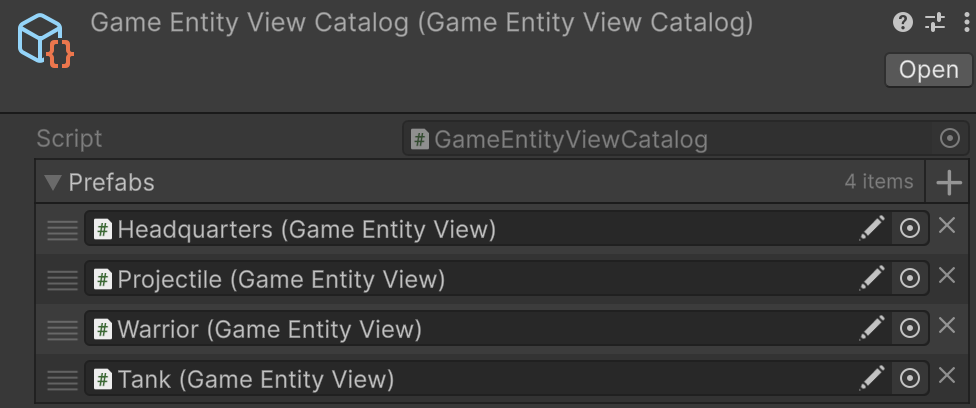

# 🧩 EntityViewCatalog<E, V>

A `ScriptableObject` that serves as a centralized catalog of [EntityView\<E>](EntityView%601.md) prefabs. Provides
storage and retrieval of prefabs by index or by name. Use for managing and reusing collections of prefabs (e.g., UI
elements, game units).

---

## 📑 Table of Contents

- [Example of Usage](#-example-of-usage)
- [Inspector Settings](#-inspector-settings)
- [API Reference](#-api-reference)
    - [Type](#-type)
    - [Properties](#-properties)
        - [Count](#count)
    - [Methods](#-methods)
        - [GetPrefab(int)](#getprefabint)
        - [GetPrefab(string)](#getprefabstring)
        - [GetName(V)](#getnamev)

---

## 🗂 Example of Usage

Below is an example of using the catalog for entity view prefabs

#### 1. Assume we have a concrete entity type

```csharp
public class UnitEntity : Entity
{
}
```

#### 2. Assume we have a concrete entity view type

```csharp
public class UnitView : EntityView<UnitEntity>
{
}
```

#### 3. Define a catalog class for the unit views

```csharp
[CreateAssetMenu(
    fileName = "UnitViewCatalog", 
    menuName = "Example/UnitViewCatalog"
)]
public class UnitViewCatalog : EntityViewCatalog<UnitEntity, UnitView> 
{
}
````

#### 4. Create the catalog asset in the Project Hierarchy




#### 5. Usage in a project

```csharp
// Load the catalog from Resources, for example
UnitViewCatalog catalog = Resources.Load<UnitViewCatalog>("UnitViewCatalog");

// Get a prefab by index
KeyValuePair<string, UnitView> viewPrefabKV = catalog.GetPrefab(0);

// Get by name
UnitView viewPrefab = catalog.GetPrefab("Player");
```

---

## 🛠 Inspector Settings

| Parameter | Description                                                                                      |
|-----------|--------------------------------------------------------------------------------------------------|
| `prefabs` | List of `EntityView` prefabs available in the catalog. Serialized and editable in the inspector. |

---

## 🔍 API Reference

### 🏛️ Type <div id="-type"></div>

```csharp
public abstract class EntityViewCatalog<E, V> : ScriptableObject
    where E : class, IEntity
    where V : EntityView<E>
```

- **Type Parameters:**
    - `E` — The type of entity associated with the views. Must implement `IEntity`.
    - `V` — The type of entity view (`EntityView<E>`) stored in the catalog.
- **Inheritance:** `ScriptableObject`

---

### 🔑 Properties

#### `Count`

```csharp
public int Count { get; }
```

- **Description:** Gets the total number of prefabs stored in the catalog.

---

### 🏹 Methods

#### `GetPrefab(int)`

```csharp
public KeyValuePair<string, V> GetPrefab(int index);
````

- **Description:** Retrieves a prefab at the specified index along with its name.
- **Parameter:** `index` — Index of the prefab.
- **Returns:** A `KeyValuePair<string, V>` where:
    - Key = prefab’s name (from `GetName(V)`),
    - Value = the prefab instance.
- **Throws:** `ArgumentOutOfRangeException` if the index is out of range.

#### `GetPrefab(string)`

```csharp
public V GetPrefab(string name);
````

- **Description:** Retrieves a prefab by its name.
- **Parameter:** `name` — The name of the prefab to search for.
- **Returns:** A prefab of type `V`.
- **Throws:** `Exception` if no prefab with the given name exists.

#### `GetName(V)`

```csharp
protected virtual string GetName(V prefab);
```

- **Description:** Extracts the name of a given prefab.
- **Parameter:** `prefab` — The prefab to get the name of.
- **Returns:** The prefab name.
- **Default Implementation:** Returns `EntityView<E>.Name`.
- **Override:** Customize to use tags, metadata, or localization for prefab naming.