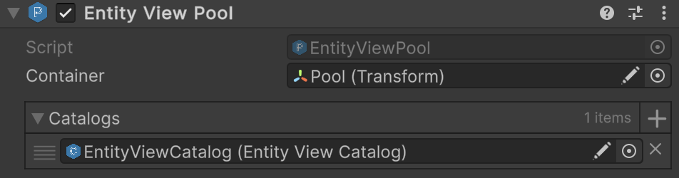

# 🧩 EntityViewPool

A Unity-based pool manager for reusing [EntityView](EntityView.md) instances based on their names. This reduces memory
allocations and improves performance by avoiding frequent instantiations. It is a concrete version of
[EntityViewPool<E, V>](EntityViewPool%601.md) with [IEntity](../Entities/IEntity.md) and [EntityView](EntityView.md).
Use for managing general-purpose entity views when you do not need strong typing for a specific entity type.

---

## 📑 Table of Contents

- [Example of Usage](#-example-of-usage)
    - [Pool Setup](#ex1)
    - [Pool Usage](#ex2)
- [Inspector Settings](#-inspector-settings)
- [API Reference](#-api-reference)
    - [Type](#type)
    - [Methods](#methods)
        - [Rent(string)](#rentstring)
        - [Return(string, EntityView)](#returnstring-entityview)
        - [Clear()](#clear)
        - [RegisterPrefab(string, EntityView)](#registerprefabstring-entityview)
        - [UnregisterPrefab(string)](#unregisterprefabstring)
        - [RegisterPrefabs(EntityViewCatalog)](#registerprefabsentityviewcatalog)
        - [UnregisterPrefabs(EntityViewCatalog)](#unregisterprefabsentityviewcatalog)
        - [Awake()](#awake)

---

## 🗂 Example of Usage

Below is an example of using non-generic entity view pool:

<div id="ex1"></div>

### 1️⃣ Pool Setup

Attach `Atomic/Entities/Entity View Pool` to an GameObject



- Assign a `Transform` to `container` to parent pooled views.
- Add one or more [EntityViewCatalog](EntityViewCatalog.md) assets to `catalogs` to preload prefabs.

---

<div id="ex2"></div>

### 2️⃣ Pool Usage

```csharp
// Assume we have an instance of the pool
EntityViewPool pool = ...;

// Rent a view by name
EntityView view = pool.Rent("Player");

// Return the view to the pool
pool.Return("Player", view);

// Destroy all pooled views
pool.Clear();

// Register prefabs manually
EntityView orcPrefab, magePrefab = ...;
pool.RegisterPrefab("Orc", orcPrefab);
pool.RegisterPrefab("Mage", magePrefab);

// Unregister prefabs manually
pool.UnregisterPrefab("Orc");
pool.UnregisterPrefab("Mage");
```

---

## 🛠 Inspector Settings

| Parameter   | Description                                                                         |
|-------------|-------------------------------------------------------------------------------------|
| `container` | The parent transform under which all pooled views will be stored.                   |
| `catalogs`  | A list of `EntityViewCatalog` assets to preload view prefabs from during `Awake()`. |

---

## 🔍 API Reference

### 🏛️ Type <div id="-type"></div>

```csharp
[AddComponentMenu("Atomic/Entities/Entity View Pool")]
[DisallowMultipleComponent]
public class EntityViewPool : EntityViewPool<IEntity, EntityView>
```

- **Inheritance:** [EntityViewPool<E, V>](EntityViewPool%601.md), `MonoBehaviour`

---

### 🏹 Methods

#### `Rent(string)`

```csharp
public EntityView Rent(string name);
```

- **Description:** Retrieves a view instance by name from the pool.
- **Parameter:** `name` — The name of the view to retrieve.
- **Returns:** A pooled or newly instantiated `EntityView`.
- **Throws:** `KeyNotFoundException` if no prefab with the specified name was registered.

#### `Return(string, EntityView)`

```csharp
public void Return(string name, EntityView view);
```

- **Description:** Returns a view to its pool for reuse.
- **Parameters:**
    - `name` — The name of the view.
    - `view` — The view instance to return.

#### `Clear()`

```csharp
public void Clear();
```

- **Description:** Destroys all pooled instances and clears all pool stacks.

#### `RegisterPrefab(string, EntityView)`

```csharp
public void RegisterPrefab(string entityName, EntityView prefab);
```

- **Description:** Registers a single prefab for future pooling.
- **Parameters:**
    - `entityName` — Key used to identify the prefab.
    - `prefab` — The prefab to register.

#### `UnregisterPrefab(string)`

```csharp
public void UnregisterPrefab(string entityName);
```

- **Description:** Removes a prefab registration from the pool.
- **Parameter:** `entityName` — The name key of the prefab to remove.

#### `RegisterPrefabs(EntityViewCatalog)`

```csharp
public void RegisterPrefabs(EntityViewCatalog catalog);
```

- **Description:** Registers all prefabs contained in the specified catalog.
- **Parameter:** `catalog` — The catalog containing prefabs to register.

#### `UnregisterPrefabs(EntityViewCatalog)`

```csharp
public void UnregisterPrefabs(EntityViewCatalog catalog);
```

- **Description:** Removes all prefabs from the specified catalog from the pool.
- **Parameter:** `catalog` — The catalog containing prefabs to unregister.

#### `Awake()`

```csharp
protected virtual void Awake();
```

- **Description:** Unity lifecycle callback invoked when the component is initialized. Loads prefabs from the assigned
  catalogs.

<!--

# 🧩 EntityViewPool
A **Unity-based pool manager** for reusing `EntityView` instances by name. Reduces memory allocations and improves performance by avoiding frequent instantiations.

## Key Features

### Efficient Object Pooling
- Reuses `EntityView` instances to minimize memory allocations.
- Reduces performance overhead caused by frequent instantiation and destruction.

### Flexible Prefab Management
- Supports individual prefab registration via `RegisterPrefab`/`UnregisterPrefab`.
- Supports bulk registration from `EntityViewCatalog`s.
- Prefabs are keyed by name for easy retrieval.

### Automatic Scene Integration
- Can assign a parent container for pooled objects.
- Automatically re-parents returned views to the pool container.
- Optional activation/deactivation of `GameObject`s when rented or returned.

### Editor-Friendly
- Inspector-friendly arrays for catalogs and container assignment.
- Compatible with Odin Inspector for enhanced read-only and editor-mode display.

### Runtime Safety
- Throws informative exceptions when a requested prefab is not registered.
- Handles empty pools gracefully by instantiating new views if needed.
