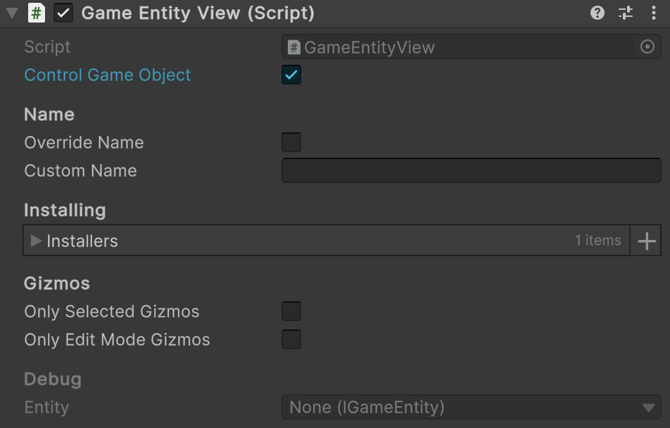

# 🧩 EntityView\<E>

A visual representation of an entity in the Unity scene. It provides a complete system for showing / hiding entities,
installing, editor gizmos, custom naming, and safe creation / destruction. Use as a foundation for UI or game objects
that visually represent entity data.

---

## 📑 Table of Contents

- [Examples of Usage](#-examples-of-usage)
    - [View Setup](#ex1)
    - [Entity Rendering](#ex2)
    - [Creation & Destruction](#ex3)
    - [Gizmos Support](#ex4)
- [Inspector Settings](#-inspector-settings)
    - [Parameters](#-parameters)
    - [Context Menu](#-context-menu)
    - [Gizmos](#-gizmos)
- [API Reference](#-api-reference)
    - [Type](#-type)
    - [Properties](#-properties)
        - [Name](#name)
        - [Entity](#entity)
        - [IsVisible](#isvisible)
    - [Methods](#-methods)
        - [Show(E)](#showe-entity)
        - [Hide()](#hide)
        - [OnShow(E)](#onshowe-entity)
        - [OnHide(E)](#onhidee-entity)
        - [Create<T>(CreateArgs)](#createtcreateargs)
        - [Destroy(EntityView<E>, float)](#destroyentityviewe-float)
    - [Nested Types](#-nested-types)
        - [CreateArgs](#createargs)

---

## 🗂 Examples of Usage

<div id="ex1"></div>

### 1️⃣ View Setup

Below is an example of setting up `EntityView<E>` that represents a tank entity.

#### 1. Assume we have entity type `IGameEntity` derived from [IEntity](../Entities/IEntity.md)

```csharp
public interface IGameEntity : IEntity
{
}
```

#### 2. Create custom view type derived from `EntityView<E>`

```csharp
public class GameEntityView : EntityView<IGameEntity>
{
}
```

#### 3. Attach `GameEntityView` to a GameObject



#### 4. Create an entity installer for `GameEntityView`

```csharp
public sealed class TankViewInstaller : SceneEntityInstaller<IGameEntity>
{
    [SerializeField] private TakeDamageViewBehaviour _takeDamageBehaviour;
    [SerializeField] private PositionViewBehaviour _positionBehaviour;
    [SerializeField] private RotationViewBehaviour _rotationBehaviour;
    [SerializeField] private TeamColorViewBehaviour _teamColorBehaviour;
    [SerializeField] private WeaponRecoilViewBehaviour _weaponRecoilBehaviour;
    
    public override void Install(IGameEntity entity)
    {
        entity.AddBehaviour(_takeDamageBehaviour);
        entity.AddBehaviour(_positionBehaviour);
        entity.AddBehaviour(_rotationBehaviour);
        entity.AddBehaviour(_teamColorBehaviour);
        entity.AddBehaviour(_weaponRecoilBehaviour);
    }

    public override void Uninstall(IGameEntity entity)
    {
        entity.DelBehaviour(_takeDamageBehaviour);
        entity.DelBehaviour(_positionBehaviour);
        entity.DelBehaviour(_rotationBehaviour);
        entity.DelBehaviour(_teamColorBehaviour);
        entity.DelBehaviour(_weaponRecoilBehaviour);
    }
}
```

#### 5. Attach `TankViewInstaller` to the GameObject that contains the `GameEntityView` component


#### 6. Drag and drop `TankViewInstaller` to the `installers` field of `GameEntityView`


#### 7. Now your `GameEntityView` contains all behaviours that will be attached to a rendering entity

---

<div id="ex2"></div>

### 2️⃣ Entity Rendering

Below is an example of entity visualization through the entity view:

```csharp
// Get an instance of GameEntityView
GameEntityView view = ...;

// Get an instance of the entity
IGameEntity entity = ...;

// Start rendering the entity:
// The GameObject dynamically attaches all tags, values, and behaviours to the entity
view.Show(entity);

// Stop rendering the entity:
// The GameObject hides, and all view tags, values, and behaviours are detached from the entity
view.Hide(entity);
```

- **Notes:**
    - `Show(entity)` — activates rendering and links the view with the entity.
    - `Hide(entity)` — disables rendering and detaches the view from the entity.

---

<div id="ex3"></div>

### 3️⃣ Creation & Destruction

Below is an example of creating and destructing entity view using static methods

```csharp
// Create a new instance of GameEntityView dynamically
CreateArgs args = new GameEntityView.CreateArgs
{
    name = "PlayerView",
    controlGameObject = true,
    installers = new List<SceneEntityInstaller> { jumpInstaller, speedInstaller },
};

GameEntityView playerView = GameEntityView.Create(args);

// Destroy GameEntityView dynamically
GameEntityView.Destroy(playerView, 2f); // destroys after 2 seconds
```

- **Notes:**
    - `Create(args)` — dynamically instantiates a new view with the specified name, controlled GameObject, and aspects.
    - `Destroy(view, delay)` — schedules the view for destruction after the given delay in seconds.

---

<div id="ex4"></div>

### 4️⃣ Gizmos Support

Also, you can create gizmos behaviours and attach to the installer of the entity view 

#### 1. Create a custom gizmo for position and scale

```csharp
public sealed class TransformGizmos : IEntityGizmos<IGameEntity>
{
    public void DrawGizmos(IGameEntity entity)
    {
        Vector3 center = entity.GetValue<Vector3>("Position");
        float scale = entity.GetValue<float>("Scale");
        Handles.DrawWireDisc(center, Vector3.up, scale);
    }
}
```

#### 2. Attach the gizmo to a `SceneEntityInstaller`

```csharp

public sealed class CharacterViewInstaller : SceneEntityInstaller<IGameEntity>
{
    private readonly TransformGizmos _transformGizmos = new();
    
    public override void Install(IGameEntity entity)
    {
        // Other bindings...
        
        entity.AddBehaviour(_transformGizmos);
    }

    public override void Uninstall(IGameEntity entity)
    {
        // Other bindings...
        
        entity.DelBehaviour(_transformGizmos);
    }
}
```

---

## 🛠 Inspector Settings

### 🎛️ Parameters

| Parameter           | Description                                                                                                                                                       |
|---------------------|-------------------------------------------------------------------------------------------------------------------------------------------------------------------|
| `controlGameObject` | If `true`, `GameObject.SetActive(true/false)` will be automatically called when invoking `Show()` or `Hide()`.                                                    |
| `overrideName`      | If `true`, the view will use `customName` instead of the `GameObject.name`.                                                                                       |
| `customName`        | Custom name used for the view when `overrideName == true`.                                                                                                        |
| `installers`        | A list of **installers** that inject values and behaviors into the attached entity.<br>Each installer calls `Install()` when shown and `Uninstall()` when hidden. |

---

### ⚙️ Context Menu

| Option                           | Description                                                                                               |
|----------------------------------|-----------------------------------------------------------------------------------------------------------|
| `AssignCustomNameFromGameObject` | Assigns the GameObject's current name to `customName`. Accessible via context menu in the Unity Inspector |

---

### 🎨 Gizmos

| Setting              | Description                                       |
|----------------------|---------------------------------------------------|
| `onlySelectedGizmos` | Draw gizmos only when the GameObject is selected. |
| `onlyEditModeGizmos` | Disable gizmo drawing during Play mode.           |

---

## 🔍 API Reference

### 🏛️ Type <div id="-type"></div>

```csharp
public abstract class EntityView<E> : MonoBehaviour where E : class, IEntity
```

- **Type Parameter:** `E` — The type of entity associated with this view. Must
  implement [IEntity](../Entities/IEntity.md).
- **Inheritance:** `MonoBehaviour`

---

### 🔑 Properties

#### `Name`

```csharp
public virtual string Name { get; }
```

- **Description:** Returns the display name of the view:
    - `customName`, if `overrideName == true`,
    - otherwise, `GameObject.name`.

#### `Entity`

```csharp
public E Entity { get; }
```

- **Description:** The entity currently bound to this view.
- **Note:** Only available after calling `Show()`.

#### `IsVisible`

```csharp
public bool IsVisible { get; }
```

- **Description:** Indicates whether the view is currently visible (`Entity != null`).

---

### 🏹 Methods

#### `Show(E entity)`

```csharp
public void Show(E entity);
```

- **Description:** Displays the view and binds it to the specified entity.
- **Parameter:** `entity` — The entity to associate with this view.
- **Throws:** `ArgumentNullException`, if `entity` is `null`.
- **Details:**
    - Activates the `GameObject` if `controlGameObject == true`.
    - Calls `OnShow(entity)` for custom logic.
    - Executes `Install()` on each `SceneEntityInstaller` in the list.

#### `Hide()`

```csharp
public void Hide();
```

- **Description:** Hides the view and removes the entity binding.
- **Details:**
    - Executes `Uninstall()` for all installers.
    - Calls `OnHide(entity)`.
    - Deactivates the `GameObject` if `controlGameObject == true`.
    - Clears the `Entity` reference.

#### `OnShow(E entity)`

```csharp
protected virtual void OnShow(E entity);
```

- **Description:** Invoked when the view is shown. Override to add custom behavior  
  (e.g., updating UI or initializing components).

#### `OnHide(E entity)`

```csharp
protected virtual void OnHide(E entity);
```

- **Description:** Invoked when the view is hidden. Override to add custom cleanup logic  
  (e.g., stopping animations or unsubscribing from events).

#### `Create<T>(CreateArgs)`

```csharp
public static T Create<T>(in CreateArgs args = default) where T : EntityView<E>
```

- **Description:** Creates a new `EntityView` GameObject, applies configuration, and returns the instance.
- **Parameter:** `args` — Arguments for creating and configuring the new view.
- **Returns:** A new `EntityView` instance of type `T`.
- **Details:**
    - Creates a new inactive `GameObject` with the given `name`.
    - Attaches a component of type `T` (derived from `EntityView<E>`).
    - Applies provided `installers`, `controlGameObject`, and gizmo settings.
    - Activates the object before returning.

#### `Destroy(EntityView<E>, float)`

```csharp
public static void Destroy(EntityView<E> view, float time = 0);
```

- **Description:** Destroys the specified view and its `GameObject` after an optional delay.
- **Parameters:**
    - `view` — The `EntityView` instance to destroy.
    - `time` — Optional delay (in seconds) before destruction. Defaults to `0`.
- **Details:**
    - Calls `Hide()` before destroying.
    - Uses Unity's `Object.Destroy`.

---

### 🧩 Nested Types

#### `CreateArgs`

```csharp
[Serializable]
public struct CreateArgs
```

- **Description:** Arguments used to configure and create a new `EntityView<E>` GameObject instance.
- **Fields:**
    - `name` — The name of the newly created `GameObject` for the `EntityView`.
    - `controlGameObject` — If `true`, the created view will automatically call `GameObject.SetActive()` in `Show/Hide`.
    - `installers` — A list of **installers** that configure the view upon creation.