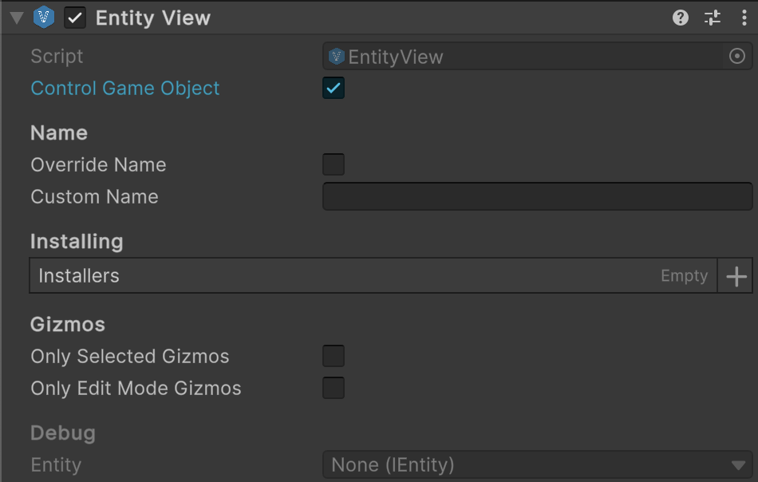
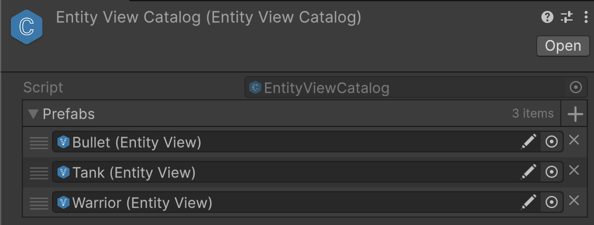
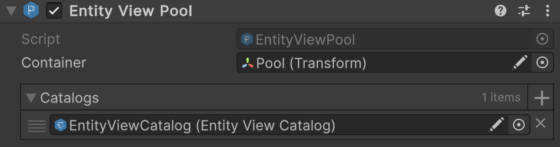
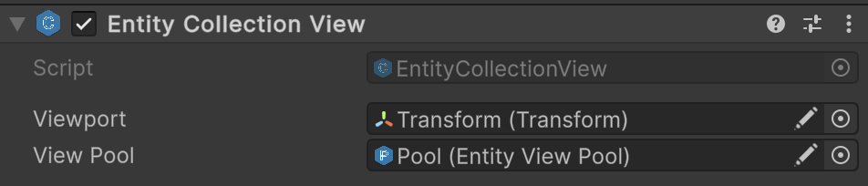

# 🧩 Entity View System

**Entity View System** provides tools for visualizing and managing [entity](../Entities/Manual.md) instances in Unity
scenes. It includes **views**, **catalogs**, **pools**, and **collections** to create flexible, reusable, and efficient
UI representations of entities. Components can be **generic** or **non-generic**, depending on the use case.

---

## 📑 Table of Contents 

- [Examples of Usage](#-examples-of-usage)
  - [EntityView](#ex1)
  - [EntityViewCatalog](#ex2)
  - [EntityViewPool](#ex3)
  - [EntityCollectionView](#ex4)
  - [EntityWorldView](#ex5)
- [API Reference](#-api-reference)
- [Notes](#-notes)
- [Best Practices](#-best-practices)

---

## 🗂 Examples of Usage

<div id="ex1"></div>

### 1️⃣ EntityView

Below is an example of setting up `EntityView` that represents a tank entity.

#### 1. Attach `Atomic/Entities/Entity View` to a GameObject



#### 2. Create an entity installer for the view

```csharp
public sealed class TankViewInstaller : MonoEntityInstaller
{
    [SerializeField] private TakeDamageViewBehaviour _takeDamageBehaviour;
    [SerializeField] private PositionViewBehaviour _positionBehaviour;
    [SerializeField] private RotationViewBehaviour _rotationBehaviour;
    [SerializeField] private TeamColorViewBehaviour _teamColorBehaviour;
    [SerializeField] private WeaponRecoilViewBehaviour _weaponRecoilBehaviour;
    
    public override void Install(IEntity entity)
    {
        entity.AddBehaviour(_takeDamageBehaviour);
        entity.AddBehaviour(_positionBehaviour);
        entity.AddBehaviour(_rotationBehaviour);
        entity.AddBehaviour(_teamColorBehaviour);
        entity.AddBehaviour(_weaponRecoilBehaviour);
    }

    public override void Uninstall(IEntity entity)
    {
        entity.DelBehaviour(_takeDamageBehaviour);
        entity.DelBehaviour(_positionBehaviour);
        entity.DelBehaviour(_rotationBehaviour);
        entity.DelBehaviour(_teamColorBehaviour);
        entity.DelBehaviour(_weaponRecoilBehaviour);
    }
}
```

#### 3. Attach `TankViewInstaller` to the GameObject that contains the `EntityView` component


#### 4. Drag and drop `TankViewInstaller` to the `installers` field of `EntityView`


#### 5. Use this `EntityView` in the project

```csharp
// Get an instance of GameEntityView
EntityView view = ...;

// Get an instance of the entity
IEntity entity = ...;

// Start rendering the entity:
// The GameObject dynamically attaches all tags, values, and behaviours to the entity
view.Show(entity);

// Stop rendering the entity:
// The GameObject hides, and all view tags, values, and behaviours are detached from the entity
view.Hide(entity);
```

---

<div id="ex2"></div>

### 2️⃣ EntityViewCatalog

#### 1. Create Catalog Asset

Select in Unity menu: `Assets → Create → Atomic → Entities → New EntityViewCatalog`. Then add prefabs that contain
`EntityView` component.



#### 2. Use this `EntityViewCatalog` in the project

```csharp
// Load catalog from Resources
EntityViewCatalog catalog = Resources.Load<EntityViewCatalog>("EntityViewCatalog");

// Get prefab by index
KeyValuePair<string, EntityView> kv = catalog.GetPrefab(0);

// Get prefab by name
EntityView playerPrefab = catalog.GetPrefab("Player");
```

---

<div id="ex3"></div>

### 3️⃣ EntityViewPool

#### 1. Attach `Atomic/Entities/Entity View Pool` to a GameObject



- Assign a `Transform` to `container` to parent pooled views.
- Add one or more [EntityViewCatalog](EntityViewCatalog.md) assets to `catalogs` to preload prefabs.

#### 2. Usage in a project

```csharp
// Assume we have an instance of the pool
EntityViewPool pool = ...;

// Rent a view by name
EntityView view = pool.Rent("Player");

// Return the view to the pool
pool.Return("Player", view);

// Destroy all pooled views
pool.Clear();

// Register prefabs manually
EntityView orcPrefab, magePrefab = ...;
pool.RegisterPrefab("Orc", orcPrefab);
pool.RegisterPrefab("Mage", magePrefab);

// Unregister prefabs manually
pool.UnregisterPrefab("Orc");
pool.UnregisterPrefab("Mage");
```


---

<div id="ex4"></div>

### 4️⃣ EntityCollectionView

#### 1. Attach `Atomic/Entities/Entity Collection View` to a GameObject




- Assign a `Transform` to `viewport` field.
- Assign the [EntityViewPool](EntityViewPool.md) to `viewPool` field.


#### 2. Usage in a project

```csharp
// Assume we have an instance of EntityCollectionView
EntityCollectionView collectionView = ...;

// Assume we have a single entity
IEntity someEntity = ...;

// Add a single entity view manually
EntityView createdView = collectionView.Add(someEntity);

// Remove a specific entity view manually
collectionView.Remove(someEntity);

// Clear all active entity views manually
collectionView.Clear();

// ===== Querying and Accessing =====

// Check if a view exists for a specific entity
bool exists = collectionView.Contains(someEntity);

// Try to get the view safely
if (collectionView.TryGet(someEntity, out EntityView view))
{
    Debug.Log($"Found view for {someEntity}: {view.name}");
}

// Or get it directly (throws if not found)
EntityView directView = collectionView.Get(someEntity);

// ===== Iterating Through All Views =====

// Iterate over all entity-view pairs
foreach (KeyValuePair<IEntity, EntityView> pair in collectionView)
{
    IEntity entity = pair.Key;
    EntityView unitView = pair.Value;
    Debug.Log($"Entity: {entity}, View: {unitView.name}");
}
```

---

<div id="ex5"></div>

### 5️⃣ EntityWorldView

Use [EntityWorldView](EntityWorldView.md) when a view should automatically mirror an entity collection.

#### 1. Attach `Atomic/Entities/Entity Collection View` to a GameObject

- Assign a `Transform` to `viewport`.
- Assign the [EntityViewPool](EntityViewPool.md) to `viewPool`.

#### 2. Usage in a project

```csharp
EntityWorldView worldView = ...;
IReadOnlyEntityCollection<IEntity> entityCollection = ...;

// Create views for existing entities and subscribe to additions/removals:
worldView.Activate(entityCollection);

// Stop synchronization and return all views to the pool:
worldView.Deactivate();
```

---

## 🔍 API Reference

Below is a list of available Entity UI modules:

- **EntityViews**
    - [EntityView](EntityView.md) <!-- + -->
    - [EntityView&lt;E&gt;](EntityView%601.md) <!-- + -->
- **Catalogs**
    - [EntityViewCatalog](EntityViewCatalog.md) <!-- + -->
    - [EntityViewCatalog&lt;E&gt;](EntityViewCatalog%601.md) <!-- + -->
- **Pools**
    - [EntityViewPool](EntityViewPool.md) <!-- + -->
    - [EntityViewPool&lt;E&gt;](EntityViewPool%601.md) <!-- + -->
- **Collections**
    - [EntityCollectionView](EntityCollectionView.md) <!-- + -->
    - [EntityCollectionView&lt;E&gt;](EntityCollectionView%601.md) <!-- + -->
- **World Views**
    - [EntityWorldView](EntityWorldView.md) <!-- + -->
    - [EntityWorldView&lt;K, E, V&gt;](EntityWorldView%601.md) <!-- + -->
    - [EntityWorldViewSingleton](EntityWorldViewSingleton.md) <!-- + -->
    - [EntityWorldViewSingleton&lt;K, E, V&gt;](EntityWorldViewSingleton%601.md) <!-- + -->

---

## 📝 Notes

- **Views** represent the visual element for an entity and can be generic ([EntityView\<E>](EntityView%601.md))
  or non-generic ([EntityView](EntityView.md)).
- **Catalogs** provide a registry for prefabs to select the correct view for an entity.
- **Pools** manage instantiation and recycling of views for performance.
- **Collections** manually manage active entity views with `Add`, `Remove`, and `Clear`.
- **World Views** bind to entity collections and keep views synchronized with collection additions/removals.
- **Generic versions** provide type-safety and avoid casting when working with specific entity types.

---

## 📌 Best Practices

- [Building Entity System with Model & View Separation](../../BestPractices/EntitySystem.md)  <!-- + -->
