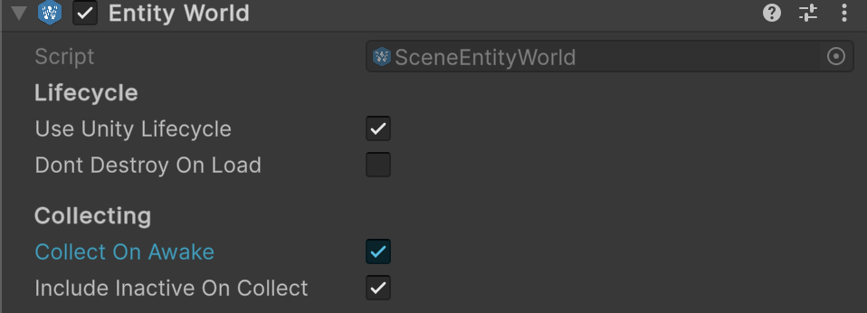

# 🧩 SceneEntityWorld

A **non-generic** alias for [SceneEntityWorld\<E>](SceneEntityWorld%601.md). Represents a Unity scene-bound entity world
operating on the base [SceneEntity](../Entities/SceneEntity.md) type. Use this class when you do not need to specialize
the world with a custom entity type. Ideal for simple scenarios where only [SceneEntity](../Entities/SceneEntity.md) is
involved.

---

## 📑 Table of Contents

<ul>
  <li><a href="#-example-of-usage">Example of Usage</a></li>
  <li>
    <a href="#-inspector-settings">Inspector Settings</a></li>
  <li>
    <a href="#-api-reference">API Reference</a>
    <ul>
      <li><a href="#-type">Type</a></li>
      <li>
        <details>
          <summary><a href="#-events">Events</a></summary>
          <ul>
            <li><a href="#onstatechanged">OnStateChanged</a></li>
            <li><a href="#onadded">OnAdded</a></li>
            <li><a href="#onremoved">OnRemoved</a></li>
            <li><a href="#onenabled">OnEnabled</a></li>
            <li><a href="#ondisabled">OnDisabled</a></li>
            <li><a href="#onticked">OnTicked</a></li>
            <li><a href="#onfixedticked">OnFixedTicked</a></li>
            <li><a href="#onlateticked">OnLateTicked</a></li>
          </ul>
        </details>
      </li>
      <li>
        <details>
          <summary><a href="#-properties">Properties</a></summary>
          <ul>
            <li><a href="#name">Name</a></li>
            <li><a href="#enabled">Enabled</a></li>
            <li><a href="#isreadonly">IsReadOnly</a></li>
            <li><a href="#count">Count</a></li>
          </ul>
        </details>
      </li>
      <li>
        <details>
          <summary><a href="#-methods">Methods</a></summary>
          <ul>
            <li><a href="#addsceneentity">Add(SceneEntity)</a></li>
            <li><a href="#removesceneentity">Remove(SceneEntity)</a></li>
            <li><a href="#clear">Clear()</a></li>
            <li><a href="#containssceneentity">Contains(SceneEntity)</a></li>
            <li><a href="#copytoicollectionsceneentity">CopyTo(ICollection&lt;SceneEntity&gt;)</a></li>
            <li><a href="#enable">Enable()</a></li>
            <li><a href="#disable">Disable()</a></li>
            <li><a href="#tickfloat">Tick(float)</a></li>
            <li><a href="#fixedtickfloat">FixedTick(float)</a></li>
            <li><a href="#latetickfloat">LateTick(float)</a></li>
            <li><a href="#dispose">Dispose()</a></li>
            <li><a href="#createstring-bool-bool">Create(string, bool, bool)</a></li>
            <li><a href="#destroysceneentityworld-float">Destroy(SceneEntityWorld, float)</a></li>
        </ul>
        </details>
      </li>
    </ul>
  </li>
</ul>

---

## 🗂 Example of Usage

Below is an example of creating and using `SceneEntityWorld`

#### 1. Add and configure `Atomic/Entities/EntityWorld` component



#### 2. Use `SceneEntityWorld` in runtime

```csharp  
SceneEntityWorld world = ...

// Subscribe to events
world.OnAdded += e => Debug.Log($"Added entity: {e.name}");
world.OnRemoved += e => Debug.Log($"Removed entity: {e.name}");
world.OnEnabled += () => Debug.Log("World enabled");

// Enable the world
world.Enable();

// Tick updates
world.Tick(Time.deltaTime);
world.FixedTick(Time.fixedDeltaTime);
world.LateTick(Time.deltaTime);
```

Also, you can create and destroy an instance of `SceneEntityWorld` dynamically

```csharp
// Create a SceneEntityWorld
SceneEntityWorld world = SceneEntityWorld.Create("SceneEntityWorld", scanEntities: true);

// Destroy the world when done
SceneEntityWorld.Destroy(world);
```

---

## 🛠 Inspector Settings

| Parameter                   | Description                                                                                                        |
|-----------------------------|--------------------------------------------------------------------------------------------------------------------|
| `useUnityLifecycle`         | Enable automatic syncing with Unity MonoBehaviour lifecycle (`Start`, `OnEnable`, `OnDisable`). Default is `true`. |
| `dontDestroyOnLoad`         | Prevent this world from being destroyed when the scene changes. Default is `false`.                                |
| `registerOnAwake`           | If enabled, the world automatically adds all entities in the scene during `Awake()`. Default is `true`.            |
| `includeInactiveOnRegister` | If enabled, the world will also scan and register inactive entities in the scene. Default is `true`.               |

---

## 🔍 API Reference

### 🏛️ Type <div id="-type"></div>

```csharp
[DefaultExecutionOrder(-1000)]
[DisallowMultipleComponent]
[AddComponentMenu("Atomic/Entities/Entity World")]
public class SceneEntityWorld : SceneEntityWorld<SceneEntity>  
```

- **Inheritance:** [SceneEntityWorld\<E>](SceneEntityWorld%601.md)
- **See also:** [SceneEntity](../Entities/SceneEntity.md)

---

### ⚡ Events

#### `OnStateChanged`

```csharp
public event Action OnStateChanged;  
```

- **Description:** Raised when entities are added or removed.

#### `OnAdded`

```csharp  
public event Action<SceneEntity> OnAdded;  
```

- **Description:** Raised when an entity is added.
- **Parameter:** `entity` — The entity that was added.

#### `OnRemoved`

```csharp  
public event Action<SceneEntity> OnRemoved;  
```

- **Description:** Raised when an entity is removed.
- **Parameter:** `entity` — The entity that was removed.

#### `OnEnabled`

```csharp  
public event Action OnEnabled;  
```

- **Description:** Raised when the world is enabled.

#### `OnDisabled`

```csharp  
public event Action OnDisabled;  
```

- **Description:** Raised when the world is disabled.

#### `OnTicked`

```csharp  
public event Action<float> OnTicked;  
```

- **Description:** Raised every `Tick`.
- **Parameter:** `deltaTime` — Time in seconds since the last frame.

#### `OnFixedTicked`

```csharp  
public event Action<float> OnFixedTicked;  
```

- **Description:** Raised every `FixedTick`.
- **Parameter:** `deltaTime` — Fixed time step used by the physics engine.

#### `OnLateTicked`

```csharp  
public event Action<float> OnLateTicked;  
```

- **Description:** Raised every `LateTick`.
- **Parameter:** `deltaTime` — Time in seconds since the last frame.

---

### 🔑 Properties

#### `Name`

```csharp  
public string Name { get; set; }  
```

- **Description:** Gets or sets the name of the world.
- **Note:** Automatically tied to the `GameObject` name.

#### `Enabled`

```csharp  
public bool Enabled { get; }  
```

- **Description:** Indicates whether the world is currently enabled.

#### `IsReadOnly`

```csharp  
public bool IsReadOnly { get; }  
```

- **Description:** Indicates whether the entity collection is read-only.

#### `Count`

```csharp  
public int Count { get; }  
```

- **Description:** Returns the number of entities in the world.

---

### 🏹 Methods

#### `Add(SceneEntity)`

```csharp  
public bool Add(SceneEntity entity);  
```

- **Description:** Adds an entity to the world.
- **Returns:** `true` if added, `false` if it already exists.

#### `Remove(SceneEntity)`

```csharp  
public bool Remove(SceneEntity entity);  
```

- **Description:** Removes an entity from the world.
- **Returns:** `true` if removed.

#### `Clear()`

```csharp  
public void Clear();  
```

- **Description:** Removes all entities from the world.

#### `Contains(SceneEntity)`

```csharp  
public bool Contains(SceneEntity entity);  
```

- **Description:** Checks whether the entity exists in the world.

#### `CopyTo(ICollection<SceneEntity>)`

```csharp  
public void CopyTo(ICollection<SceneEntity> results);  
```

- **Description:** Copies all entities into a provided collection.

#### `Enable()`

```csharp  
public void Enable();  
```

- **Description:** Enables the world and all contained entities.

#### `Disable()`

```csharp 
public void Disable();  
```

- **Description:** Disables the world and all contained entities.

#### `Tick(float)`

```csharp  
public void Tick(float deltaTime);  
```

- **Description:** Performs the regular update for all enabled entities.

#### `FixedTick(float)`

```csharp  
public void FixedTick(float deltaTime);  
```

- **Description:** Performs the fixed update (usually for physics) for all enabled entities.

#### `LateTick(float)`

```csharp  
public void LateTick(float deltaTime);  
```

- **Description:** Performs the late update for all enabled entities.

#### `Dispose()`

```csharp  
public void Dispose();  
```

- **Description:** Disposes the world and all entities, unsubscribing events.

#### `Create(string, bool, bool)`

```csharp  
public static SceneEntityWorld Create(string name = null, bool scanEntities = true, bool useUnityLifecycle = true);  
```

- **Description:** Creates a new inactive GameObject with a `SceneEntityWorld` component.
- **Parameters:**
    - `name` — Optional GameObject/world name.
    - `scanEntities` — Whether to automatically scan scene entities on Awake.
    - `useUnityLifecycle` — Whether to integrate with Unity lifecycle callbacks.
- **Returns:** The initialized `SceneEntityWorld` instance.

#### `Destroy(SceneEntityWorld, float)`

```csharp  
public static void Destroy(SceneEntityWorld world, float t = 0);  
```

- **Description:** Destroys the world and its GameObject after an optional delay.