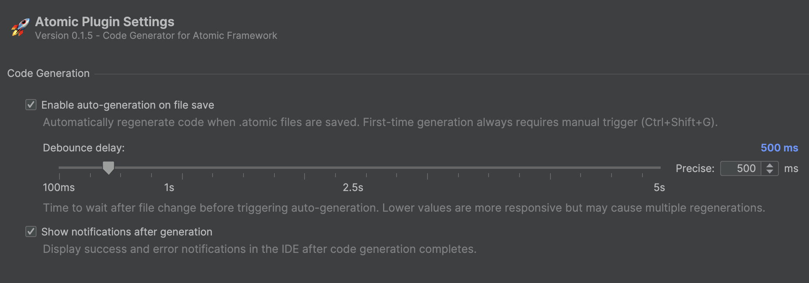

# 📖 Entity API Generation

The Atomic Framework supports automatic generation of extension methods for entities, which helps eliminate hard-coded
values and “magic constants”, while ensuring type safety when working with data. Before you start creating gameplay
mechanics, you need to configure a special file that will store all the value names and tags for a specific type of
entity.

---

## 📑 Table of Contents

- [The Problem](#the-problem)
- [Entity API Generation](#entity-api-generation)
- [Generation via Unity Editor](#generation-via-unity-editor)
- [Generation via Rider Plugin](#generation-via-rider-plugin)

---

## The Problem

By default, the framework provides support for working with **integer IDs** and **string keys** within the framework.

#### ❌ Using Integer ID

```csharp
// Define tag keys
const int PlayerTag = 1;
const int NPCTag = 2;

// Define value keys
const int Health = 1;
const int Speed = 2;

Entity entity = new Entity();

entity.AddTag(PlayerTag);
entity.AddTag(NPCTag);
entity.AddValue(Health, 100);

int health = entity.GetValue<int>(Health);
```

#### ❌ Using String Names

```csharp
Entity entity = new Entity();

entity.AddTag("Player");
entity.AddTag("NPC");
entity.AddValue("Health", 100);

int health = entity.GetValue<int>("Health");
```

This approach leads to **hardcoded strings** and **magic constants** tightly coupled with your codebase. It makes
**maintenance**, **refactoring**, and **type validation** difficult. The **Entity API Generation** solves this problem
through **code generation**, providing **type-safe** accessors and eliminating hardcoded constants.

---

## Entity API Generation

As a solution to the problem of magic constants and hardcoding, a special class called `EntityAPI` is generated. This
class provides extension methods and identifiers for accessing an entity’s tags and values.

Here’s how the generated class would look for an entity type that has the following definition:

- **Tags**
    - `Moveable`
- **Values**
    - `Position`: IVariable\<Vector3>
    - `MoveDirection`: IVariable\<Vector3>
    - `MoveSpeed`: IValue\<float>

The generated class looks like this:

```csharp
/**
 * Code generation. Don't modify!
 **/
public static class EntityAPI
{
    ///Tags
    public static readonly int Moveable;
    
    ///Values
    public static readonly int Position;       // IVariable<Vector3>
    public static readonly int MoveDirection;  // IVariable<Vector3>
    public static readonly int MoveSpeed;      // IValue<float>

    static EntityAPI()
    {
        // Tags
        Moveable = NameToId(nameof(Moveable));

        // Values
        Position = NameToId(nameof(Position));
        MoveDirection = NameToId(nameof(MoveDirection));
        MoveSpeed = NameToId(nameof(MoveSpeed));
    }
    
    ///Tag Extensions
    
    #region Moveable

    [MethodImpl(MethodImplOptions.AggressiveInlining)]
    public static bool HasMoveableTag(this IEntity entity) => entity.HasTag(Moveable);

    [MethodImpl(MethodImplOptions.AggressiveInlining)]
    public static bool AddMoveableTag(this IEntity entity) => entity.AddTag(Moveable);

    [MethodImpl(MethodImplOptions.AggressiveInlining)]
    public static bool DelMoveableTag(this IEntity entity) => entity.DelTag(Moveable);

    #endregion

    ///Value Extensions

    #region Position

    [MethodImpl(MethodImplOptions.AggressiveInlining)]
    public static IVariable<Vector3> GetPosition(this IEntity entity) => entity.GetValue<IVariable<Vector3>>(Position);

    [MethodImpl(MethodImplOptions.AggressiveInlining)]
    public static bool HasPosition(this IEntity entity) => entity.HasValue(Position);

    [MethodImpl(MethodImplOptions.AggressiveInlining)]
    public static void SetPosition(this IEntity entity, IVariable<Vector3> value) => entity.SetValue(Position, value);

    [MethodImpl(MethodImplOptions.AggressiveInlining)]
    public static bool DelPosition(this IEntity entity) => entity.DelValue(Position);

    #endregion

    #region MoveDirection

    [MethodImpl(MethodImplOptions.AggressiveInlining)]
    public static IVariable<Vector3> GetMoveDirection(this IEntity entity) => entity.GetValue<IVariable<Vector3>>(MoveDirection);

    [MethodImpl(MethodImplOptions.AggressiveInlining)]
    public static bool HasMoveDirection(this IEntity entity) => entity.HasValue(MoveDirection);

    [MethodImpl(MethodImplOptions.AggressiveInlining)]
    public static void SetMoveDirection(this IEntity entity, IVariable<Vector3> value) => entity.SetValue(MoveDirection, value);

    [MethodImpl(MethodImplOptions.AggressiveInlining)]
    public static bool DelMoveDirection(this IEntity entity) => entity.DelValue(MoveDirection);

    #endregion

    #region MoveSpeed

    [MethodImpl(MethodImplOptions.AggressiveInlining)]
    public static IValue<float> GetMoveSpeed(this IEntity entity) => entity.GetValue<IValue<float>>(MoveSpeed);

    [MethodImpl(MethodImplOptions.AggressiveInlining)]
    public static bool HasMoveSpeed(this IEntity entity) => entity.HasValue(MoveSpeed);

    [MethodImpl(MethodImplOptions.AggressiveInlining)]
    public static void SetMoveSpeed(this IEntity entity, IValue<float> value) => entity.SetValue(MoveSpeed, value);

    [MethodImpl(MethodImplOptions.AggressiveInlining)]
    public static bool DelMoveSpeed(this IEntity entity) => entity.DelValue(MoveSpeed);

    #endregion
}
```

Thus, we no longer need to write hardcoded values or magic constants — we can simply use the generated extension methods
instead. Below are examples of using extension methods:

#### ✅ Setting up an entity

```csharp
// Create a new entity named "Character"
IEntity entity = new Entity("Character");

// Add tags
entity.AddMoveableTag();

// Add values
entity.AddPosition(new Variable<Vector3>());       // Extension method
entity.AddMoveSpeed(new Variable<float>(3.5f));    // Extension method
entity.AddMoveDirection(new Variable<Vector3>());  // Extension method

// Add behaviours
entity.AddBehaviour(new MoveBehaviour());
```

#### ✅ Movement mechanic

```csharp
public sealed class MoveBehaviour : IEntityInit, IEntityTick
{   
    private IVariable<Vector3> _position;   
    private IVariable<Vector3> _moveDirection;    
    private IVariable<float> _moveSpeed;    

    // Initialize entity
    public void Init(IEntity entity) 
    { 
        _position = entity.GetPosition();           // Extension method
        _moveSpeed = entity.GetMoveSpeed();         // Extension method
        _moveDirection = entity.GetMoveDirection(); // Extension method
    }    

    // Update entity each frame
    public void Tick(IEntity entity, float deltaTime)    
    {        
        if (!entity.HasMoveableTag())
            return;
        
        Vector3 direction = _moveDirection.Value;
        if (direction != Vector3.zero)
            _position.Value += _moveSpeed.Value * deltaTime * direction; 
    }
}
```

Advantages of using extension-method generation:

- **No hardcoding or magic constants**: The code becomes easier to maintain and less prone to errors.
- **Type safety**: Strong typing allows developers to clearly understand which types of values they are working with.
- **Readability and maintainability**: Method calls are shorter and more intuitive, making the project easier to
  support.
- **Faster development**: IDE autocompletion and suggestions speed up and streamline the workflow.
- **Unified working environment**: Everything happens directly inside Rider, without the need to switch to Unity, saving
  time and reducing context switching.

You can generate the API file either through the Unity Editor, which has this functionality built in by default, or by
using a dedicated plugin developed for Rider IDE.


---

## Generation via Unity Editor

By default, there is a way to generate the API through the Unity Editor. This is the basic method, which provides
special menu options inside Unity that allow you to generate your extension methods directly.

First, we need to create a special YAML file where we will store all our keys for tags and values.

To do this, go to Unity, select `Assets → Create → Atomic → Entities → EntityAPI` to create a new YAML file.


After creating the file and placing it in the specified path, you’ll get the following template containing the
configuration settings for your code generation.

Example configuration file:

```yaml
directory: Assets/Scripts/
className: EntityAPI
namespace: SampleGame
entityType: IEntity
aggressiveInlining: true
unsafe: false

imports:
  - Atomic.Entities
  - Atomic.Elements
  - SampleGame
  - UnityEngine

tags:
  - Player
  - NPC

values:
  - Health: int
  - Speed: float
```

### Code Generation Options

Below are the options and settings that the user can configure for code generation.
These settings include not only configurations for tags and values, but also parameters for how the file is generated —
such as the class name, the output path, and various generation options.

| Option                 | Description                                               | Default   |
|------------------------|-----------------------------------------------------------|-----------|
| **directory**          | Output path for the generated file                        | –         |
| **className**          | Name of the generated class/file                          | –         |
| **namespace**          | Namespace for the generated class                         | –         |
| **entityType**         | Entity interface or derived type                          | `IEntity` |
| **aggressiveInlining** | Adds `[MethodImpl(MethodImplOptions.AggressiveInlining)]` | `false`   |
| **unsafe**             | Uses `GetValueUnsafe` for faster but unsafe access        | `false`   |
| **imports**            | Additional namespaces                                     | –         |
| **tags**               | List of tag names                                         | –         |
| **values**             | List of key-value pairs (`Name: Type`)                    | –         |

For example, you can enable optimizations like `aggressiveInlining` or `unsafe` if needed.
Additionally, there are import settings (namespaces) required to ensure that your generated API file compiles correctly.

After configuring your code generation settings, you can open the menu and select
`Tools → Atomic → Entities → Compile Entity API`
to automatically generate your extension class.


As a result, you’ll get an `EntityAPI` file that contains all the extension methods and identifiers, which you can then
use
just as described in the [Entity API Generation](#entity-api-generation) section.

```csharp
/**
 * Code generation. Don't modify!
 **/
public static class EntityAPI {...}
```

> [!IMPORTANT] An important point is that if your project is large and contains many keys and values, you can split them
> into multiple YAML files, with each one storing its own set of keys, values, and identifiers based on its area of
> responsibility. For example, you might have one file for `MovementAPI`, another for `JumpAPI`, and a third for
`CombatAPI` etc.


By default, if you modify your YAML file, Unity automatically regenerates your API file at roughly one-second intervals
while the editor tab is open. This means you don’t need to manually trigger regeneration each time.

If you want to disable automatic code generation or adjust the regeneration interval in Unity, you can do so by
navigating to `Tools → Atomic → Entities → Select EntityAPI Settings`.

  

Next, after clicking the option, you’ll see a ScriptableObject in the Inspector containing two settings:


- `Auto Refresh` — if disabled, automatic code generation will be turned off.
- `Auto Refresh Period` — controls the time interval between regenerations.

If you’ve disabled automatic code generation and modify your `.yaml` configuration file, you can manually update
`EntityAPI` by selecting `Tools → Atomic → Entities → Refresh Entity API`


This way, you have full control over how and when code generation occurs within your workflow.

---

## Generation via Rider Plugin

There’s another, more convenient and advanced way to generate the Entity API file by using a plugin specifically
developed for Rider. This method is generally recommended, as it provides a smoother workflow and better integration
directly within the IDE.

### Installation

You can install the plugin either from **JetBrains Marketplace** or **GitHub**.

#### Method 1. JetBrains Marketplace

- **Option 1:** In **Rider IDE**, go to `Preferences → Plugins → Marketplace` and search for **Atomic**

  

- **Option 2:** Install the plugin directly using
  a [link to the plugin’s page](https://plugins.jetbrains.com/plugin/28321-atomic) to market

#### Method 2. GitHub Repository

1. Visit the [official repository](https://github.com/Prylor/atomic-rider-plugin) of the plugin
2. Download the latest `ReSharperPlugin.AtomicPlugin.zip` version from the **Releases** page
3. In **Rider**, open `Preferences → Plugins → Settings`
4. Choose **Install Plugin from Disk**, then select the downloaded `.zip` archive

   

After installation restart Rider IDE after installation to activate the plugin.

### Plugin Usage

First, we need to create a special `.atomic` file where we will store all our keys for tags and values.

1. Right-click on the desired scripts directory in Rider.
2. Select New → **Atomic File** from the context menu.

   

Once clicked, a configuration window will open. Fill it out and click **Create**.


This creates an `.atomic` configuration file for **Entity API generation**:

```yaml
namespace: SampleGame
className: EntityAPI
directory: Assets/Scripts/
aggressiveInlining: true
unsafe: false
entityType: IEntity

imports:

tags:
# Add your tags here
# - Player
# - Enemy

values:
# Add your values here
# - health: float
# - position: Vector3
```

#### Step 3. Configure your entity API by editing parameters as needed.

| Option                 | Description                                                                                 | Default   |
|------------------------|---------------------------------------------------------------------------------------------|-----------|
| **directory**          | Output path for the generated file                                                          | –         |
| **className**          | Name of the generated class and file                                                        | –         |
| **namespace**          | Namespace of the generated class                                                            | –         |
| **entityType**         | Entity type (can be `IEntity` or a custom type inheriting from it)                          | `IEntity` |
| **aggressiveInlining** | Adds `[MethodImpl(MethodImplOptions.AggressiveInlining)]` to extension methods (true/false) | `false`   |
| **unsafe**             | Uses `GetValueUnsafe` instead of `GetValue` (faster but uses unsafe cast)                   | `false`   |
| **imports**            | List of namespaces (`using`) required for code generation                                   | –         |
| **tags**               | List of tags to generate                                                                    | –         |
| **values**             | List of values to generate, in the format `Name: Type`                                      | –         |

#### Step 4. Generate extension methods

Press `Ctrl + Shift + G` while in the `.atomic` file

- Required for **first-time generation**
- Can be used anytime to **force regeneration**

The plugin automatically updates existing C# files when saving `.atomic` changes

- Only works for **existing files**
- Can be enabled / disabled in plugin settings

> [!IMPORTANT]
> To generate the file, you need to add at least one property in the `values` section or a tag in the `tags` section.
> **Without adding a property, the code generator will not produce any output!**

> [!TIP]
> You can create multiple .atomic files to make your project easier to maintain and extend.

### Plugin Settings

Access plugin settings via: `File → Settings → Tools → Atomic Plugin`



- **Auto-generate:** Enable/disable automatic regeneration
- **Debounce delay:** Set delay before auto-generation (ms)
- **Show notifications:** Toggle generation notifications

---

<p align="center">
<a href="EntityCreation.md">Move Next</a> •
<a href="https://github.com/StarKRE22/Atomic/issues">Report Issue</a> •
<a href="https://github.com/StarKRE22/Atomic/discussions">Join Discussion</a>
</p>
