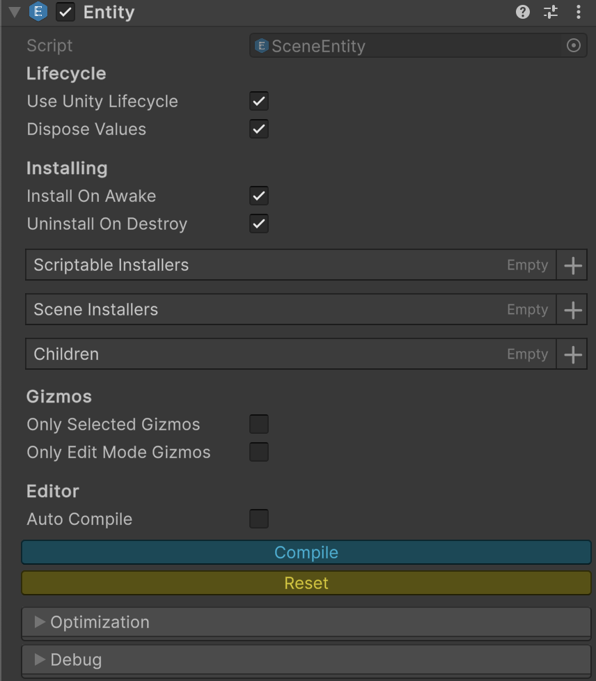
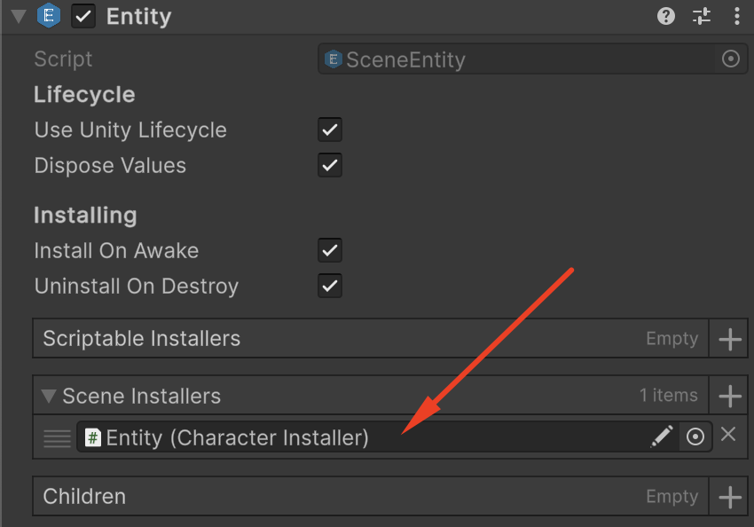

# 📖 Creating the Entity in Unity

In this section, we’ll walk through the complete process of creating a character entity in Unity using Rider IDE and the
Atomic plugin. Step by step, we’ll set up an entity, generate its data through the Atomic configuration file, and
implement a simple movement mechanic.

By the end of this section, you’ll have a working character that moves in the specified direction
demonstrating how Atomic’s code generation and entity-based architecture streamline gameplay logic creation.

---

## 📑 Table of Contents

- [Creating a Character](#creating-a-character)
- [Adding Keyboard Input](#adding-keyboard-input)

---

## Creating a Character

#### Step 1. Creating a game object

In the Scene Hierarchy, right-click and choose `3D Object → Capsule` to create a new game object.


#### Step 2. Adding the Entity Component

In the Inspector window of the created object, go to `Atomic → Entities → Entity` to add the Entity component.



Make sure the following checkboxes are enabled:

- `useUnityLifecycle` — the entity updates along with the **MonoBehaviour** lifecycle.
- `installOnAwake` — the entity is constructed during the **Awake** phase.

#### Step 3. Generate Data

Add the following properties to the configuration file `EntityAPI.atomic`:

- `Transform` : Transform
- `MoveDirection`: IVariable\<Vector3>
- `MoveSpeed`: IValue<float>

```yaml
namespace: SampleGame
className: EntityAPI
directory: Assets/Scripts/
aggressiveInlining: true
unsafe: false
entityType: IEntity

imports:
  - Atomic.Entities
  - Atomic.Elements

tags:

# Add properties
values:
  Transform: Transform
  MoveSpeed: IValue<float>
  MoveDirection: IVariable<Vector3>
```

#### Step 4. Creating the Movement Mechanic

Let’s write a behaviour that will move our entity in the direction of its movement:

<!--  -->

```csharp
// Controller that moves entity by its direction
public sealed class MoveBehaviour : IEntityInit, IEntityFixedTick
{
    private Transform _transform;
    private IValue<float> _moveSpeed;
    private IVariable<Vector3> _moveDirection;

    // Called when Start() is invoked
    public void Init(IEntity entity)
    {
        _transform = entity.GetTransform();
        _moveSpeed = entity.GetMoveSpeed();
        _moveDirection = entity.GetMoveDirection();
    }

    // Called when FixedUpdate() is invoked
    public void FixedTick(IEntity entity, float deltaTime)
    {
        Vector3 direction = _moveDirection.Value;
        if (direction != Vector3.zero) 
            _transform.position += _moveSpeed.Value * deltaTime * direction;
    }
}
```

> [!IMPORTANT]
> It’s important to note that in the Atomic approach, the developer **always works with data abstractions represented
> as reference-type wrappers.**
>
> This design greatly simplifies project maintenance, testing, and multiplayer development, as it removes the tight
> coupling to data storage methods that is typical for component-based ECS architectures.
>
> A simple example:
> Under the `IValue<T>` interface, you can substitute either a `Variable<T>` or a `Const<T>` implementation.

#### Step 5. Creating the Installer

To add the data and movement logic to the entity, let’s create a script that will inject the corresponding atomic
elements and behaviour into it.

 ```csharp
// Populates entity with tags, values and behaviours
public sealed class CharacterInstaller : SceneEntityInstaller
{
    [SerializeField] private Transform _transform;
    [SerializeField] private Const<float> _moveSpeed = 5.0f;
    [SerializeField] private Variable<Vector3> _moveDirection = Vector3.forward;

    public override void Install(IEntity entity)
    {
        // Add properties to a character
        entity.AddTransform(_transform);
        entity.AddMoveSpeed(_moveSpeed);
        entity.AddMoveDirection(_moveDirection);
        
        // Add behaviours to a character
        entity.AddBehaviour<MoveBehaviour>();
    }
}
```

#### Step 6. Configuring the Game Object

Next, add the `CharacterInstaller` component to your entity through the Inspector and configure its settings.


#### Step 7. Connecting the Installer to the Entity

To link the `CharacterInstaller` to the `Entity` component, drag and drop it into the `Scene Installers` field.



#### Step 8. Running the Character

In the Unity Editor, press Play to verify that the character starts moving forward.

## Adding Keyboard Input

Next, we’ll look at how to implement movement control using the WASD or arrow keys and show how to modify entity
structure through code.

#### Step 1. Create an Input Controller

```csharp
public class InputBehaviour : IEntityInit, IEntityTick
{
    private const string HORIZONTAL = "Horizontal";
    private const string VERTICAL = "Vertical";
    
    private ISetter<Vector3> _moveDirection;
    
    public void Init(IEntity entity)
    {
        _moveDirection = entity.GetMoveDirection();
    }

    public void Tick(IEntity entity, float deltaTime)
    {
        float dx = Input.GetAxis(HORIZONTAL);
        float dz = Input.GetAxis(VERTICAL);
        _moveDirection.Value = new Vector3(dx, 0, dz);
    }
}
```

> [!IMPORTANT]
> Here, it’s important to note that to change the entity’s data, we simply modify the value through its reference.
> No `SetMoveDirection` to the `IEntity` is required.

#### Step 2. Add the InputBehaviour

Next, let’s register the `InputBehaviour` inside the `CharacterInstaller`:

```csharp
public sealed class CharacterInstaller : SceneEntityInstaller
{
    [SerializeField] private Transform _transform;
    [SerializeField] private Const<float> _moveSpeed = 5.0f;
    [SerializeField] private Variable<Vector3> _moveDirection = Vector3.zero;

    public override void Install(IEntity entity)
    {
        // Add properties to a character
        entity.AddTransform(_transform);
        entity.AddMoveSpeed(_moveSpeed);
        entity.AddMoveDirection(_moveDirection);
        
        // Add behaviours to a character
        entity.AddBehaviour<MoveBehaviour>();
        entity.AddBehaviour<InputBehaviour>(); // (+)
    }
}
```

#### Step 3. Running the Character

In the Unity Editor, press Play to verify that the character moves when pressing the WASD or arrow keys.

---

<p align="center">
<a href="ArchitectualConsistency.md">Move Next</a> •
<a href="https://github.com/StarKRE22/Atomic/issues">Report Issue</a> •
<a href="https://github.com/StarKRE22/Atomic/discussions">Join Discussion</a>
</p>
