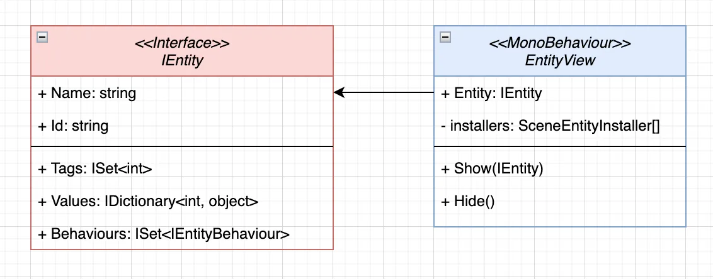
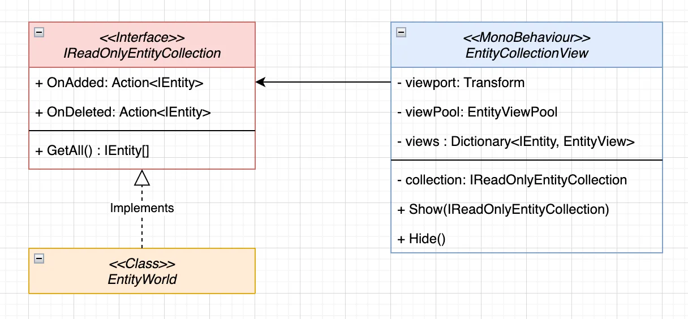

# 📖 Minimizing Unity

When it comes to team development, it’s important to ensure that developers don’t interfere with each other’s work.
Minimizing the code’s dependency on MonoBehaviour solves the problem of separating responsibilities. With this approach,
engineers can focus on developing and testing systems purely in code, while designers can use the engine for creating
and visualizing gameplay.

As a result, the game project can be divided into two architectural layers: **simulation** and **visualization**.

---

## 📑 Table of Contents

- [Simulation in C#](#simulation-in-c)
    - [Entry Point](#entry-point)
    - [Entity World](#entity-world)
    - [Entity Pool](#entity-pool)
    - [Entity Spawning](#entity-spawning)
- [Visualization in Unity](#visualization-in-unity)
    - [Entity Visualization](#entity-visualization)
    - [World Visualization](#world-visualization)

---

## Simulation in C#

To define an entity domain in C#, you simply need to inherit from the base
class [Entity](../Entities/Entities/Entity.md) and populate it with the
required data and logic.

To deploy entities, an entry point is needed — the starting place from which the entire infrastructure begins its work.

### Entry Point

The entry point acts as a bridge between the game engine and the simulation. It handles Unity’s core lifecycle events,
creates an instance of `GameContext`, and centralizes the management of its lifecycle.

It looks like this:

```csharp
public sealed class EntryPoint : MonoBehaviour
{
    private GameContext _gameContext;

    [SerializeField]
    private GameContextInstaller _gameInstaller;

    private void Awake()
    {
        _gameContext = new GameContext();
        _gameInstaller.Install(_gameContext);
    }

    private void Start()
    {
        _gameContext.Init();
        _gameContext.Enable();
    }

    private void Update() 
    {
        _gameContext.Tick(Time.deltaTime);
    } 

    private void FixedUpdate() 
    {
       _gameContext.FixedTick(Time.fixedDeltaTime);
    }

    private void LateUpdate()
    {
        _gameContext.LateTick(Time.deltaTime);
    }

    private void OnDestroy()
    {
        _gameContext.Disable();
        _gameContext.Dispose();
    }
}
```

### Entity World

To store all game objects in a single place, you need a central registry.
In Atomic, this is provided by the [EntityWorld](../Entities/Worlds/Manual.md) class — a high-performance collection
that allows adding, removing, and retrieving entities by their IDs.

But most importantly, the world eliminates the need to manually manage the lifecycle of entities — initialization,
updates, and disposal are handled automatically.

Here’s how you can integrate the entity world inside your game context installer:

```csharp
[Serializable]
public sealed class GameContextInstaller : IEntityInstaller<IGameContext>
{
    public void Install(IGameContext context)
    {
        // Connecting the Entity World
        var entityWorld = new EntityWorld<IGameEntity>();
        context.AddEntityWorld(entityWorld);
    }
}
```

To make the world update and be managed automatically along with the game system, you can link it
using [extension methods](../Entities/Lifecycle/Extensions.md):

```csharp
[Serializable]
public sealed class GameContextInstaller : IEntityInstaller<IGameContext>
{
    public void Install(IGameContext context)
    {
        // Connecting the Entity World
        {...}

        // Synchronizing the EntityWorld lifecycle with GameContext  
        context.WhenInit(entityWorld.InitEntities);
        context.WhenEnable(entityWorld.Enable);
        context.WhenTick(entityWorld.Tick);
        context.WhenFixedTick(entityWorld.FixedTick);
        context.WhenLateTick(entityWorld.LateTick);
        context.WhenDisable(entityWorld.Disable);
        context.WhenDispose(entityWorld.DisposeEntities);
        context.WhenDispose(entityWorld.Dispose);
    }
}
```

### Entity Pool

Now that we’ve covered the world, a curious reader might ask: “How do entities get into the `EntityWorld`?”

To provide entities to the gameplay process, a special [MultiEntityPool](../Entities/Pooling/MultiEntityPool.md) is
used — it supplies game objects by key. Its initialization is performed through a separate directory that contains a
dictionary of factories for these entities.

```csharp
[Serializable]
public sealed class GameContextInstaller : IEntityInstaller<IGameContext>
{
    // Catalog containing all entities
    [SerializeField]
    private GameEntityCatalog _entityCatalog;

    public void Install(IGameContext context)
    {
        // Connecting the Entity World  
        {...}

        // Synchronizing the EntityWorld lifecycle with GameContext  
        {...}

        // Adding the multi-pool  
        var pool = new MultiEntityPool<string, IGameEntity>(_entityCatalog);
        context.AddEntityPool(pool);
    }
}
```

### Entity Spawning

Placing game objects in the scene is handled through the interaction between the world and the pool. The pool provides
ready-made objects on request, while the world manages their active state. After use, the entity is returned to the
pool.

Below is an example of entity spawning and despawning:

```csharp
public static class GameEntitiesUseCase
{
    public static IGameEntity Spawn(
        IGameContext gameContext,
        string name,
        Vector3 position,
        Quaternion rotation,
        TeamType team
    )
    {
        // Rent a game object from the pool
        MultiEntityPool<string, IGameEntity> pool = gameContext.GetEntityPool();
        IGameEntity entity = pool.Rent(name);

        // Update its position and team
        entity.GetPosition().Value = position;
        entity.GetRotation().Value = rotation;
        entity.GetTeam().Value = team;

        // Add the game object to the world
        EntityWorld<IGameEntity> world = gameContext.GetEntityWorld();
        world.Add(entity); // Automatic activation of the game object
        return entity;
    }

    public static bool Despawn(IGameContext gameContext, IGameEntity entity)
    {
        // Remove the game object from the world
        EntityWorld<IGameEntity> world = gameContext.GetEntityWorld();
        if (!world.Remove(entity)) // Automatic deactivation of the game object
            return false;

        // Return the game object to the pool
        MultiEntityPool<string, IGameEntity> pool = gameContext.GetEntityPool();  
        gameContext.GetEntityPool().Return(entity);
        return true;
    }
}
```

Thus, the framework provides ready-to-use tools for building simulations and efficiently managing the lifecycle of
entities.

---

## Visualization in Unity

For visualizing game entities, there are also built-in (“out of the box”) tools. Atomic allows you to display both
individual entities and the entire world.

### Entity Visualization

To represent an entity in the scene, there is a class called [EntityView](../Entities/UI/EntityView.md). When enabled,
it binds to an Entity and adds visual data and logic to it.



To add components, the same installers used for game mechanics are applied. Let’s look at an example of a character
representation:

```csharp
public sealed class CharacterViewInstaller : SceneEntityInstaller<GameEntity>
{
    [SerializeField] private TakeDamageViewBehaviour _takeDamageBehaviour;
    [SerializeField] private PositionViewBehaviour _positionBehaviour;
    [SerializeField] private RotationViewBehaviour _rotationBehaviour;
    [SerializeField] private TeamColorViewBehaviour _teamColorBehaviour;
    [SerializeField] private WeaponRecoilViewBehaviour _weaponRecoilBehaviour;

    public override void Install(GameEntity entity)
    {
        entity.AddBehaviour(_takeDamageBehaviour);
        entity.AddBehaviour(_positionBehaviour);
        entity.AddBehaviour(_rotationBehaviour);
        entity.AddBehaviour(_teamColorBehaviour);
        entity.AddBehaviour(_weaponRecoilBehaviour);
    }

    public override void Uninstall(GameEntity entity)
    {
        entity.DelBehaviour(_takeDamageBehaviour);
        entity.DelBehaviour(_positionBehaviour);
        entity.DelBehaviour(_rotationBehaviour);
        entity.DelBehaviour(_teamColorBehaviour);
        entity.DelBehaviour(_weaponRecoilBehaviour);
    }
}
```

Unlike the `EntityView` model, the installer overrides the `Uninstall` method, which disables all visual mechanics when
the entity is detached from its view.

Now let’s take a look at how visual mechanics are implemented. As an example, we’ll examine the mechanic that displays
an entity’s position on a `Transform`:

```csharp
[Serializable]
public sealed class PositionViewBehaviour : 
    IEntityInit<GameEntity>, 
    IEntityDispose
{
    [SerializeField] 
    private Transform _transform;
    
    private IReactiveValue<Vector3> _position;

    public PositionViewBehaviour(Transform transform)
    {
        _transform = transform;
    }

    public void Init(GameEntity entity)
    {
        _position = entity.GetPosition();
        _position.Observe(this.OnPositionChanged);
    }

    public void Dispose(IEntity entity)
    {
        _position.Unsubscribe(this.OnPositionChanged);
    }

    private void OnPositionChanged(Vector3 position)
    {
        _transform.position = position;
    }
}
```

In this example, you can see that a visualization mechanic has the same structure as a simulation mechanic. The only
difference is that visualization data can be passed through fields marked with the `[SerializeField]` attribute.

> [!TIP]
> A good practice is to avoid using shared data if it’s only needed within a single visual behaviour.

Thus, `EntityView` acts as a “temporary aspect” for the entity, which becomes a common container for both data and
logic —
for the model and the visualization alike.

This approach allows you to implement both core mechanics and visuals in a consistent way. It simplifies working with
the UI and ensures centralized storage of all data and mechanics in one place.

### World Visualization

To display all entities in the scene, the [EntityCollectionView](../Entities/UI/EntityCollectionView.md) class is used.
It monitors the state of the world and creates corresponding `EntityView` instances for any entities that are added.




From the diagram, you can see that `EntityCollectionView` takes a collection of entities as input and manages their
visual
representation. It has a `Hide` method that disables the current collection. When entities are added to or removed from
the collection or the `EntityWorld`, `EntityCollectionView` automatically spawns or despawns the corresponding
`EntityView`
objects in the Unity scene.

For renting entity views, a generic pool called [EntityViewPool](../Entities/UI/EntityViewPool.md) is used. For each
entity type, it stores a stack of corresponding visualizations.

As a result, the framework enables building an optimized infrastructure for representing entities using the same
architecture as the simulation layer written in C#.

---

<p align="center">
<a href="Summary.md">Move Next</a> •
<a href="https://github.com/StarKRE22/Atomic/issues">Report Issue</a> •
<a href="https://github.com/StarKRE22/Atomic/discussions">Join Discussion</a>
</p>