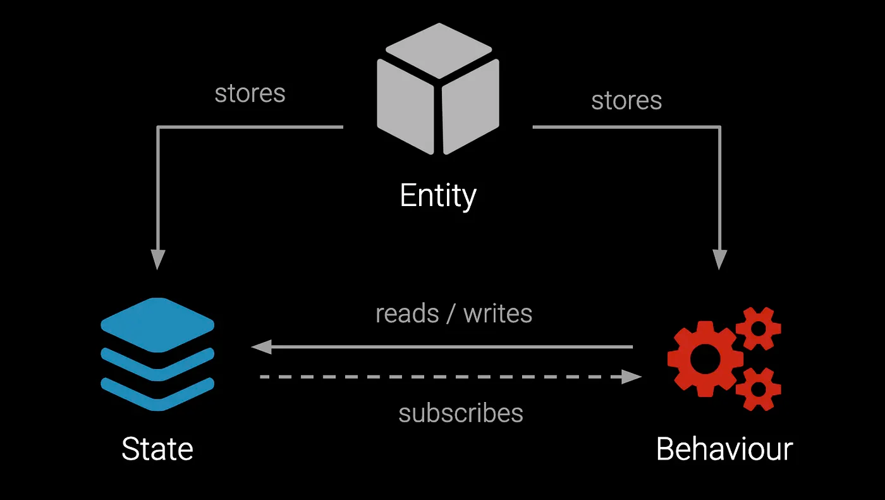
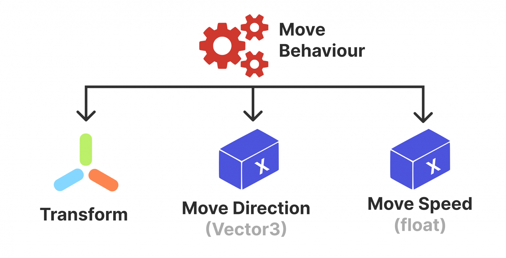
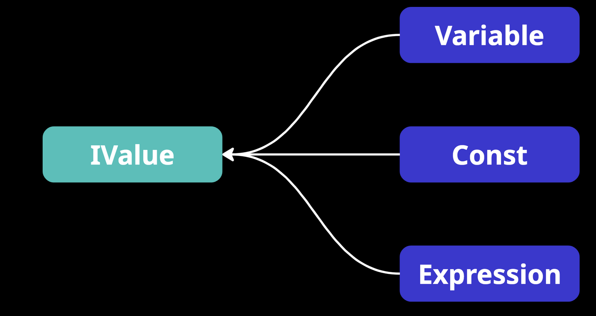

# 📖 What is Atomic Approach

The **atomic approach** is a hybrid methodology that enables the creation of game systems using **atomic elements** and
**behaviours** that perform operations on those elements.

---

## 📑 Table of Contents

- [The Problem](#the-problem)
- [ESB Pattern](#esb-pattern)
- [Example of Mechanic](#example-of-mechanic)
- [Reusing Mechanics](#reusing-mechanics)
- [Testing Mechanics](#testing-mechanics)
- [Adapting to New Requirements](#adapting-to-new-requirements)

---

## The Problem

In the early stages of development, a project is usually just a prototype of the core game mechanics. As the prototype
grows more complex, a traditional OOP architecture often requires restructuring relationships and rewriting existing
solutions, which can lead to messy workarounds and make future maintenance harder.

The atomic approach offers a radical solution to this problem. You define the necessary data and can immediately start
writing business logic — without the need to design relationships between objects.

---

## ESB Pattern

At the core of the atomic approach lies the **Entity-State-Behaviour (ESB)** pattern — a custom design pattern
consisting of an **Entity**, a **State**, and a **Behaviour**.



In Atomic, everything revolves around the **Entity**, which serves as a dynamic container. This container holds data in
the
form of atomic elements and logic in the form of controllers. Data and logic are strictly separated from one another.

The **State** of an entity consists of a set of **shared data**, organized as atomic elements. Each element is a
reference type
and represents a universal object — such as a constant, variable, event, action, or function. These atomic elements,
like “nuts” and “bolts,” are directly added to the entity’s container.

The **Behaviour** of an entity is an ordered set of controllers. These controllers handle the entity’s lifecycle events
and perform operations on its data. Each controller implements one or more **lifecycle
interfaces**, such as initialization, update, or destruction.

It’s important to note that the behaviour itself does not store any state — it merely defines the logic for how to work
with it. This design allows behaviours to be reused across different entities without code duplication.

During program execution, an entity can change its set of data and logic, allowing it to **dynamically modify its
behaviour** at runtime.

---

## Example of Mechanic

To illustrate, let’s implement a simple character movement mechanic.
Below are the steps a developer should follow when thinking with the atomic approach.

#### Step 1. Define the data

For character movement we need data in the form of position, speed, and movement direction.

- `Position` — a variable that stores the object’s current position.
- `MoveDirection` — a variable that defines the movement direction.
- `MoveSpeed` — a variable that sets the magnitude of the speed.

After defining the specific data types, we can generate them using a dedicated plugin developed for Rider IDE.
We’ll discuss how to configure code generation in detail in the [Entity API Generation](Codegeneration.md) page.

#### Step 2. Define the logic

For moving the character we need a behaviour that, on each frame, takes the `Position` and adds to it the product of
`MoveDirection` and `MoveSpeed`.



Let’s write a behaviour that will move our entity in its movement direction:

```csharp
public sealed class MoveBehaviour : IEntityInit, IEntityTick
{   
    // Data represented as atomic elements
    private IVariable<Vector3> _position;   
    private IVariable<Vector3> _moveDirection;    
    private IVariable<float> _moveSpeed;    

    // Entity initialization
    public void Init(IEntity entity) 
    { 
        _position = entity.GetPosition(); 
        _moveSpeed = entity.GetMoveSpeed();
        _moveDirection = entity.GetMoveDirection();
    }    

    // Entity update on each frame
    public void Tick(IEntity entity, float deltaTime)    
    {        
        Vector3 direction = _moveDirection.Value;
        if (direction != Vector3.zero)
            _position.Value += _moveSpeed.Value * deltaTime * direction; 
    }
}
```

#### Step 3. Creating the entity

Now let’s create an entity and add the data — `Position`, `MoveSpeed`, `MoveDirection` — along with the `MoveBehaviour`
logic:

```csharp
// Create the character entity
IEntity entity = new Entity("Character");

// Add data
entity.AddPosition(new Variable<Vector3>()); // Generated method
entity.AddMoveDirection(new Variable<Vector3>()); // Generated method
entity.AddMoveSpeed(new Const<float>(3.5f)); // Generated method
 
// Add logic
entity.AddBehaviour(new MoveBehaviour());
```

> It’s important to note that in the Atomic approach, the developer always works with **data abstractions** represented
> as
> reference-type wrappers. This design simplifies project maintenance, testing, and multiplayer development by removing
> the rigid dependency on
> data storage methods typical of traditional ECS-based architectures.

A simple example: the `IValue<T>` interface can be implemented by either `Variable<T>` or `Const<T>`.



#### Step 4. Managing the lifecycle

For the movement mechanic to work, we need to manage the entity’s lifecycle by triggering its **initialization**,
**activation**, and **update** events:

```csharp
// Initialize the entity — calls IEntityInit
entity.Init();

// Enable the entity for per-frame updates — calls IEntityEnable
entity.Enable(); 

// Update the game object at 60 FPS while the game is running
while (isGameRunning)
{   
    entity.Tick(0.016f); // Calls IEntityTick    
    await Task.Delay(16); // Wait for the next frame
}

// Disable the entity from updates — calls IEntityDisable
entity.Disable();

// Release entity resources — calls IEntityDispose
entity.Dispose();
```

From this example, it’s clear that the atomic approach significantly accelerates development. There’s no longer any need
to write separate components to organize data. Instead, we use atomic elements and universal mechanics, which allow us
to assemble both simple and complex game objects like pieces of a construction set.

---

## Reusing Mechanics

The ESB pattern makes it easy to reuse game mechanics without rewriting code.

In the example above, we implemented a movement mechanic for a character. Now, if we want to create a **bullet** with
the
same movement behavior, it’s enough to simply create a new entity instance, define the data `Position`, `MoveSpeed`, and
`MoveDirection`, and attach the **same movement mechanic**.

```csharp
// Create a bullet entity
IEntity entity = new Entity("Bullet");

// Movement mechanic (Reused)
entity.AddValue("Position", new BaseVariable<Vector3>());
entity.AddValue("MoveSpeed", new BaseVariable<float>(3.5f));
entity.AddValue("MoveDirection", new BaseVariable<Vector3>());
entity.AddBehaviour(new MoveBehaviour());

// Collision mechanic (New)
entity.AddValue("Damage", 10);
entity.AddBehaviour(new CollisionBehaviour());
```

Thus, developing with the ESB pattern eliminates code duplication.


---

## Testing Mechanics

Another advantage of the atomic approach is the ability to test game mechanics without running Play Mode in Unity. Since
the mechanics are written in pure C#, they can be easily tested using standard frameworks like **NUnit**, directly in
**Edit Mode**.

```csharp
public sealed class MoveBehaviourTests
{
    private Entity entity;

    [SetUp]
    public void SetUp()
    {
        entity = new Entity();

        // Add data
        entity.AddPosition(new Variable<Vector3>(Vector3.zero));
        entity.AddMoveSpeed(new Const<float>(2f));
        entity.AddMoveDirection(new Variable<Vector3>());
        
        // Add behaviours
        entity.AddBehaviour(new MoveBehaviour());

        // Activate the entity
        entity.Init();
        entity.Enable();
    }

    [Test]
    public void Tick_WithZeroDirection_DoesNotMove()
    {
        // Arrange
        entity.GeMoveDirection().Value = Vector3.zero;
        
        // Act
        const float deltaTime = 1;
        entity.Tick(deltaTime);

        // Assert
        Assert.AreEqual(Vector3.zero, entity.GetPosition().Value);
    }

    [Test]
    public void Tick_WithNonZeroDirection_MovesCorrectly()
    {
        // Arrange
        entity.GetMoveDirection().Value = Vector3.forward;
        
        // Act
        const float deltaTime = 0.5f;
        entity.Tick(deltaTime);

        // Assert
        Assert.AreEqual(new Vector3(0, 0, 1), entity.GetPosition().Value);
    }
}
```

Thus, the developer no longer needs to constantly switch between the IDE and Unity. They can implement mechanics
directly in Rider, write isolated tests, and run them using the Test Runner.

## Adapting to New Requirements

Game mechanics often change throughout development. The ESB pattern provides flexibility, allowing entities to adapt to
new requirements without rewriting existing code.

For example, if a game designer decides to implement **kinematic movement** — preventing the character from passing
through
physical objects — you can simply create a separate behaviour called `KinematicMoveBehaviour`, instead of modifying the
existing one:

```csharp
public sealed class KinematicMoveBehaviour : IEntityInit, IEntityTick
{   
    private Rigidbody _rigidbody;
    private IVariable<float> _moveSpeed;
    private IVariable<Vector3> _moveDirection;

    public void Init(IEntity entity)
    {
        _rigidbody = entity.Rigidbody();
        _moveSpeed = entity.GetMoveSpeed();
        _moveDirection = entity.GetMoveDirection();
    }

    public void FixedTick(IEntity entity, float deltaTime)
    {
        Vector3 direction = _moveDirection.Value;
        if (direction == Vector3.zero)
            return;

        float moveStep = _moveSpeed.Value * deltaTime;
        if (_rigidbody.SweepTest(direction, out _, moveStep))
            return;

        Vector3 newPosition = _rigidbody.position + direction * moveStep;
        _rigidbody.MovePosition(newPosition); 
    }
}
```

Now let’s modify the entity to use the new kinematic movement mechanic:

```csharp
// Create a new entity named "Character"
IEntity entity = new Entity("Character");

// Add data
entity.AddRigidbody(rigidbody); // (+)
entity.AddMoveSpeed(new Variable<float>(3.5f));
entity.AddMoveDirection(new Variable<Vector3>());

// Add behaviours
entity.AddBehaviour(new KinematicMoveBehaviour()); // (+)

// Remove previous components
// entity.AddValue("Position", new Variable<Vector3>());
// entity.AddBehaviour(new MoveBehaviour());
```

Thus, we simply replace the `Position` data with `Rigidbody`, and the `MoveBehaviour` with `KinematicMoveBehaviour`,
implementing the new requirements without rewriting the existing business logic.

---

<p align="center">
<a href="Codegeneration.md">Move Next</a> •
<a href="https://github.com/StarKRE22/Atomic/issues">Report Issue</a> •
<a href="https://github.com/StarKRE22/Atomic/discussions">Join Discussion</a>
</p>
