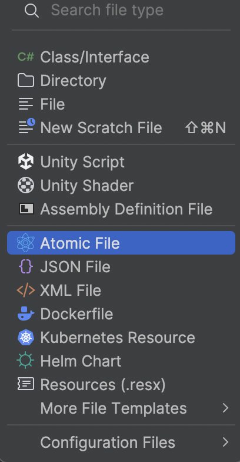
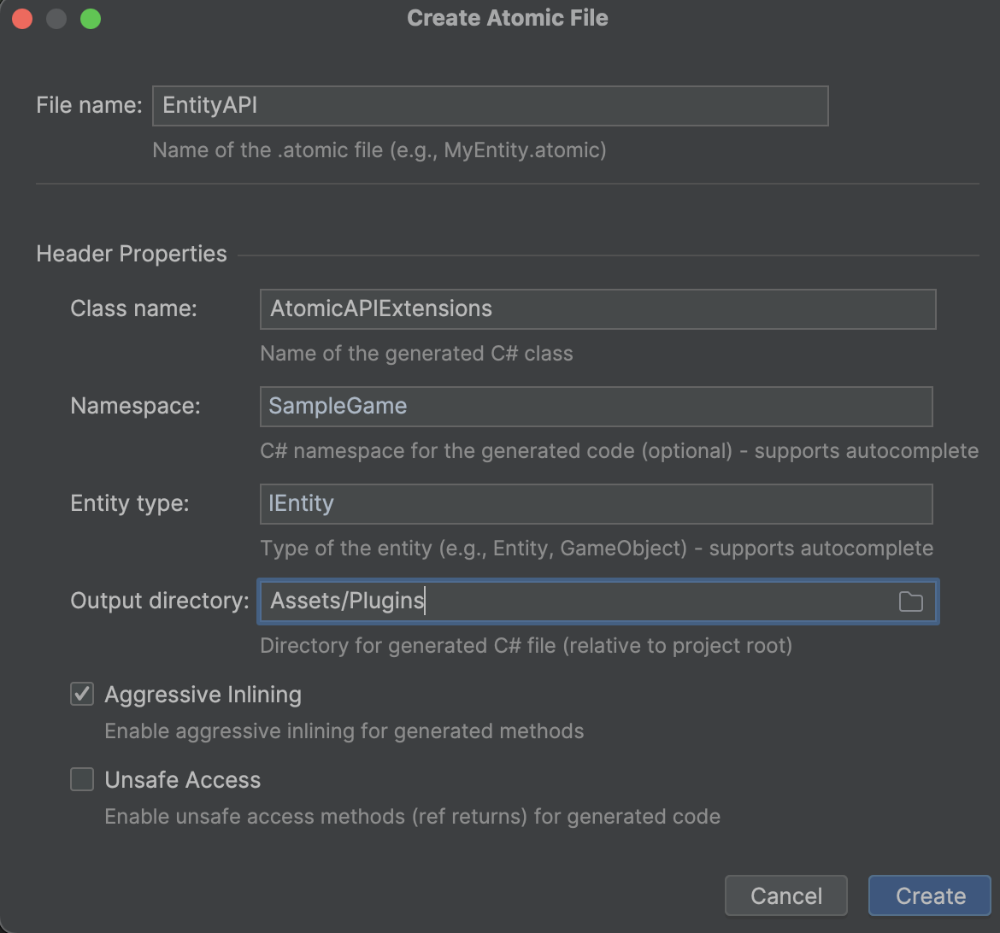

[](https://github.com/starkre22/Atomic/releases)
[](https://github.com/StarKRE22/Atomic/blob/main/LICENSE.md)


<!--  -->
<!--   -->

# ⚛️ What is Atomic?

**Atomic** is an architectural framework for game development in **Unity** and **C#**,
built around the idea of constructing game systems from **atomic elements** — modular units represented as constants,
variables, events, actions, and functions.

This approach eliminates the need for continuous architectural redesign and code refactoring during project iteration.
Instead, it allows developers to focus entirely on creating gameplay mechanics, logic and behaviour — not on maintaining
complex object-oriented structures.

---

# 📑 Table of Contents

- [Requirements](#-requirements)
- [Installation](#-installation)
- [Unity Quick Start](#-unity-quick-start)
  - [Code Generation Setup](#i-code-generation-setup)
  - [Creating a Character](#ii-creating-a-character)
  - [Adding Keyboard Input](#iii-adding-keyboard-input)
- [Tutorials](#-tutorials)
- [API Reference](#-api-reference)
- [Sample Projects](#-sample-projects)
    - [Beginner Sample](#ex1)
    - [Top-Down Shooter Sample](#ex2)
    - [RTS Sample](#ex3)
- [Best Practices](#-best-practices)
- [Performance](#-performance)
- [Useful Links](#-useful-links)
- [License](#-license)
- [Contact](#-contact)

---

## 📝 Requirements

The Atomic Framework requires **Unity 6+** or **.NET 7+**.  
Make sure your development environment meets these requirements before using the framework.

### Recommended Tools

Although not required, the following tools significantly improve the development experience with Atomic:

#### • [Odin Inspector](https://assetstore.unity.com/packages/tools/utilities/odin-inspector-and-serializer-89041)

For better **debugging**, **configuration**, and **visualization** of your game state in the Unity Editor.  
Atomic works perfectly **without Odin**, but using it makes data inspection and live tweaking much easier.

#### • [Atomic Rider Plugin](https://plugins.jetbrains.com/plugin/28321-atomic)

For enhanced **code generation** and **workflow integration** with **Rider IDE**.
While Unity itself provides basic support, the Atomic Rider Plugin makes development smoother and more powerful.
Available on [JetBrains](https://plugins.jetbrains.com/plugin/28321-atomic)
or [GitHub](https://github.com/Prylor/atomic-rider-plugin).

#### • [Rider IDE](https://www.jetbrains.com/ru-ru/rider/)

It is strongly recommended to use **Rider 2025** instead of **Visual Studio**, since **Visual Studio does not support
the Atomic Plugin**. For code generation directly through **Unity**, refer to the separate article in
the [documentation](https://github.com/StarKRE22/Atomic/blob/experimental/Docs/Entities/EntityAPI/Manual.md#generating-api-via-unity-editor).


---

## 📦 Installation

- _Option #1. Download source code with game examples_
- _Option #2.
  Download [Atomic.unitypackage](https://github.com/StarKRE22/Atomic/releases/download/v.2.0.1/Atomic.v.2.0.unitypackage)
  or [AtomicNonUnity.zip](https://github.com/StarKRE22/Atomic/releases/download/v.2.0.1/AtomicNonUnity.v.2.0.zip)
  from [release notes](https://github.com/StarKRE22/Atomic/releases)_
- _Option #3: Install via Unity Package Manager using the Git
  URL: `https://github.com/StarKRE22/Atomic.git?path=Assets/Plugins/Atomic`_

---

## 🚀 Unity Quick Start

This section provides a hands-on introduction to using the Atomic Framework inside Unity.
You’ll learn how to set up code generation, create your first entity, and implement a simple movement mechanic —
all directly from Rider IDE using the Atomic plugin.

### I. Code Generation Setup

Before you start creating gameplay mechanics, you need to configure the data generation process.
The Atomic Framework supports automatic generation of extension methods for entities, which helps eliminate hard-coded
values and “magic constants”, while ensuring type safety when working with data.

#### Step 1. Setup Atomic Plugin

In **Rider IDE**, go to `Preferences → Plugins → Marketplace` and search for **Atomic** or install directly
via [reference](https://plugins.jetbrains.com/plugin/28321-atomic)


#### Step 2. Create a Configuration File

1. Right-click on the desired scripts directory in Rider.
2. Select New → **Atomic File** from the context menu.



Once clicked, a configuration window will open. Fill it out and click **Create**.



This creates an `.atomic` configuration file for **Entity API generation**:

```yaml
namespace: SampleGame
className: EntityAPI
directory: Assets/Scripts/
aggressiveInlining: true
unsafe: false
entityType: IEntity

imports:

tags:
# Add your tags here
# - Player
# - Enemy

values:
# Add your values here
# - health: float
# - position: Vector3
```

> [!TIP]
> You can create multiple .atomic files to make your project easier to maintain and extend.

#### Step 3. Configure your entity API by editing parameters as needed.

| Option                 | Description                                                                                 | Default   |
|------------------------|---------------------------------------------------------------------------------------------|-----------|
| **directory**          | Output path for the generated file                                                          | –         |
| **className**          | Name of the generated class and file                                                        | –         |
| **namespace**          | Namespace of the generated class                                                            | –         |
| **entityType**         | Entity type (can be `IEntity` or a custom type inheriting from it)                          | `IEntity` |
| **aggressiveInlining** | Adds `[MethodImpl(MethodImplOptions.AggressiveInlining)]` to extension methods (true/false) | `false`   |
| **unsafe**             | Uses `GetValueUnsafe` instead of `GetValue` (faster but uses unsafe cast)                   | `false`   |
| **imports**            | List of namespaces (`using`) required for code generation                                   | –         |
| **tags**               | List of tags to generate                                                                    | –         |
| **values**             | List of values to generate, in the format `Name: Type`                                      | –         |

#### Step 4. Generate extension methods

Press `Ctrl + Shift + G` while in the `.atomic` file

- Required for **first-time generation**
- Can be used anytime to **force regeneration**

The plugin automatically updates existing C# files when saving `.atomic` changes

- Only works for **existing files**
- Can be enabled / disabled in plugin settings

> [!IMPORTANT]
> To generate the file, you need to add at least one property in the `values` section or a tag in the `tags` section.
> **Without adding a property, the code generator will not produce any output!**

### II. Creating a Character

In this section, we’ll walk through the complete process of creating a character entity in Unity using Rider IDE and the
Atomic plugin. Step by step, we’ll set up an entity, generate its data through the Atomic configuration file, and
implement a simple movement mechanic.

By the end of this section, you’ll have a working character that moves in the specified direction
demonstrating how Atomic’s code generation and entity-based architecture streamline gameplay logic creation.

#### Step 1. Creating a game object

In the Scene Hierarchy, right-click and choose `3D Object → Capsule` to create a new game object.


#### Step 2. Adding the Entity Component

In the Inspector window of the created object, go to `Atomic → Entities → Entity` to add the Entity component.


Make sure the following checkboxes are enabled:

- `useUnityLifecycle` — the entity updates along with the **MonoBehaviour** lifecycle.
- `installOnAwake` — the entity is constructed during the **Awake** phase.

#### Step 3. Generate Data

Add the following properties to the configuration file `EntityAPI.atomic`:

- `Transform` : Transform
- `MoveDirection`: IVariable\<Vector3>
- `MoveSpeed`: IValue<float>

```yaml
namespace: SampleGame
className: EntityAPI
directory: Assets/Scripts/
aggressiveInlining: true
unsafe: false
entityType: IEntity

imports:
  - Atomic.Entities
  - Atomic.Elements

tags:

# Add properties
values:
  Transform: Transform
  MoveSpeed: IValue<float>
  MoveDirection: IVariable<Vector3>
```

#### Step 4. Creating the Movement Mechanic

Let’s write a behaviour that will move our entity in the direction of its movement:

<!--  -->

```csharp
// Controller that moves entity by its direction
public sealed class MoveBehaviour : IEntityInit, IEntityFixedTick
{
    private Transform _transform;
    private IValue<float> _moveSpeed;
    private IVariable<Vector3> _moveDirection;

    // Called when Start() is invoked
    public void Init(IEntity entity)
    {
        _transform = entity.GetTransform();
        _moveSpeed = entity.GetMoveSpeed();
        _moveDirection = entity.GetMoveDirection();
    }

    // Called when FixedUpdate() is invoked
    public void FixedTick(IEntity entity, float deltaTime)
    {
        Vector3 direction = _moveDirection.Value;
        if (direction != Vector3.zero) 
            _transform.position += _moveSpeed.Value * deltaTime * direction;
    }
}
```

> [!IMPORTANT]
> It’s important to note that in the Atomic approach, the developer **always works with data abstractions represented
> as reference-type wrappers.**
>
> This design greatly simplifies project maintenance, testing, and multiplayer development, as it removes the tight
> coupling to data storage methods that is typical for component-based ECS architectures.
>
> A simple example:
> Under the `IValue<T>` interface, you can substitute either a `Variable<T>` or a `Const<T>` implementation.

#### Step 5. Creating the Installer

To add the data and movement logic to the entity, let’s create a script that will inject the corresponding atomic
elements and behaviour into it.

 ```csharp
// Populates entity with tags, values and behaviours
public sealed class CharacterInstaller : SceneEntityInstaller
{
    [SerializeField] private Transform _transform;
    [SerializeField] private Const<float> _moveSpeed = 5.0f;
    [SerializeField] private Variable<Vector3> _moveDirection = Vector3.forward;

    public override void Install(IEntity entity)
    {
        // Add properties to a character
        entity.AddTransform(_transform);
        entity.AddMoveSpeed(_moveSpeed);
        entity.AddMoveDirection(_moveDirection);
        
        // Add behaviours to a character
        entity.AddBehaviour<MoveBehaviour>();
    }
}
```

#### Step 6. Configuring the Game Object

Next, add the `CharacterInstaller` component to your entity through the Inspector and configure its settings.


#### Step 7. Connecting the Installer to the Entity

To link the `CharacterInstaller` to the `Entity` component, drag and drop it into the `Scene Installers` field.


#### Step 8. Running the Character

In the Unity Editor, press Play to verify that the character starts moving forward.

### III. Adding Keyboard Input

Next, we’ll look at how to implement movement control using the WASD or arrow keys and show how to modify entity
structure through code.

#### Step 1. Create an Input Controller

```csharp
public class InputBehaviour : IEntityInit, IEntityTick
{
    private const string HORIZONTAL = "Horizontal";
    private const string VERTICAL = "Vertical";
    
    private ISetter<Vector3> _moveDirection;
    
    public void Init(IEntity entity)
    {
        _moveDirection = entity.GetMoveDirection();
    }

    public void Tick(IEntity entity, float deltaTime)
    {
        float dx = Input.GetAxis(HORIZONTAL);
        float dz = Input.GetAxis(VERTICAL);
        _moveDirection.Value = new Vector3(dx, 0, dz);
    }
}
```

> [!IMPORTANT]
> Here, it’s important to note that to change the entity’s data, we simply modify the value through its reference.
> No `SetMoveDirection` to the `IEntity` is required.

#### Step 2. Add the InputBehaviour

Next, let’s register the `InputBehaviour` inside the `CharacterInstaller`:

```csharp
public sealed class CharacterInstaller : SceneEntityInstaller
{
    [SerializeField] private Transform _transform;
    [SerializeField] private Const<float> _moveSpeed = 5.0f;
    [SerializeField] private Variable<Vector3> _moveDirection = Vector3.zero;

    public override void Install(IEntity entity)
    {
        // Add properties to a character
        entity.AddTransform(_transform);
        entity.AddMoveSpeed(_moveSpeed);
        entity.AddMoveDirection(_moveDirection);
        
        // Add behaviours to a character
        entity.AddBehaviour<MoveBehaviour>();
        entity.AddBehaviour<InputBehaviour>(); // (+)
    }
}
```

#### Step 3. Running the Character

In the Unity Editor, press Play to verify that the character moves when pressing the WASD or arrow keys.

---

## 📖 Tutorials

Get hands-on with the Atomic Framework through practical guides and examples. Each tutorial introduces a specific
concept — from the fundamental Atomic approach to advanced topics such as entity
interaction and simulation without Unity.

1. [What is Atomic Approach](Docs/Tutorials/WhatIsAtomicApproach.md)
2. [Entity API Generation](Docs/Tutorials/Codegeneration.md)
3. [Creating the Entity in Unity](Docs/Tutorials/EntityCreation.md)
4. [Architectural Consistency](Docs/Tutorials/ArchitectualConsistency.md)
5. [Interaction Between Entities](Docs/Tutorials/InteractionsBetweenEntities.md)
6. [Minimizing Unity](Docs/Tutorials/MinimizingUnity.md)
7. [Summary](Docs/Tutorials/Summary.md)

<!-- 

## 📖 Tutorials

To be added...

- **What is Entity**
- **Create an Entity**
    - **CSharp Guide**
    - **Unity Guide**
- **Entity Behaviour Lifecycle** + Gizmos и аттрибут в Edit Mode
- **Using Entity Pools**
- **Using Entity Worlds**
- **Using Entity Filters**
- **Separating Game from Unity** //Factories, Baking, Views
- **Designing Architecture with Entities** //Contexts

- **Using Code generation**
    - **Unity Guide**
    - **Rider Plugin Guide**

---

-->

---

## 🔍 API Reference

Explore the full Atomic API documentation. The framework is divided into two main modules — Elements and Entities, each
responsible for a different level of abstraction.

### [⚛️ Atomic.Elements](Docs/Elements/Manual.md)

Low-level, composable building blocks — the atomic “elements” that power everything in the framework.
Use them to define data, state, logic, and interaction between systems.

- [Values](Docs/Elements/Values/Manual.md)  — immutable constants and parameters
- [Variables](Docs/Elements/Variables/Manual.md) — reactive mutable data containers
- [Actions](Docs/Elements/Actions/Manual.md) — callable commands and procedures
- [Functions](Docs/Elements/Functions/Manual.md) — encapsulated logic returning results
- [Setters](Docs/Elements/Setters/Manual.md) — controlled state mutation interfaces
- [Requests](Docs/Elements/Requests/Manual.md) — deferred actions that can be executed at a later time
- [Events](Docs/Elements/Events/Manual.md) — reactive broadcast-based communication
- [Time](Docs/Elements/Time/Manual.md) — frame-based and delta-time utilities
- [Collections](Docs/Elements/Collections/Manual.md) — reactive collections such as arrays, lists, dictionaries, and
  sets.
- [Utilities](Docs/Elements/Utils/Manual.md) —utility classes and components

### [🧬 Atomic.Entities](Docs/Entities/Manual.md)

The high-level architecture layer that combines atomic elements into functional entities. All game objects,
systems, UI elements, and application contexts can be represented as entities, each containing state and behaviour.

- [Entities](Docs/Entities/Entities/Manual.md) — base unit of game logic
- [Behaviours](Docs/Entities/Behaviours/Manual.md) — reusable logic modules
- [Installers](Docs/Entities/Installers/Manual.md) — dependency injection and setup scripts
- [Aspects](Docs/Entities/Aspects/Manual.md) — applies or discards tags, values, and behaviours on an entity
- [Factories](Docs/Entities/Factories/Manual.md) — entity creation and configuration
- [Baking](Docs/Entities/Baking/Manual.md) — converting Unity GameObjects into entity
- [Pooling](Docs/Entities/Pooling/Manual.md) — entity reuse and performance optimization
- [Collections](Docs/Entities/Collections/Manual.md) — high performance set for entities
- [Worlds](Docs/Entities/Worlds/Manual.md) — high performance entity collection with automatic lifecycle
- [Registry](Docs/Entities/Registry/EntityRegistry.md) — central access and lookup
- [Filters](Docs/Entities/Filters/Manual.md) — runtime querying and filtering
- [Triggers](Docs/Entities/Filters/EntityTriggers.md) — reactive filtering events
- [Lifecycle](Docs/Entities/Lifecycle/Manual.md) — initialization and update stages
- [Views](Docs/Entities/UI/Manual.md) — UI integration and visualization
- [Names](Docs/Entities/Names/Manual.md) — converting string-based names into unique integer identifiers
- [API Generation](Docs/Entities/EntityAPI/Manual.md) — automatic code generation via Atomic plugin and Unity Editor

---

## 🗂 Sample Projects

This section presents **three sample projects**, each demonstrating a different level of complexity and use case of the
framework. All examples are available inside **[Assets/Examples](Assets/Examples)**.

- **[Beginner Sample](Assets/Examples/Beginner)** — a simple 2-player mini-game showcasing the core principles of the
  framework.
- **[Top-Down Shooter Sample](Assets/Examples/Shooter)** — a more advanced, modular game architecture suitable for
  mid-sized projects.
- **[RTS Sample](Assets/Examples/RTS)** — a large-scale simulation demonstrating high-performance entity management with
  thousands of units.

---

<div id="ex1"></div>

### 1️⃣ Beginner Sample

A **simple 2-player mini-game** designed to introduce the fundamental ideas behind the Atomic
framework. [Link to the sample](Assets/Examples/Beginner).


This sample represents the **most basic foundation** of the Atomic framework with Unity. It demonstrates how to build
gameplay using a **universal `SceneEntity`**, showing three minimal entities:

- `GameContext`
- `Character`
- `Coin`

Everything here is intentionally kept **as simple and transparent as possible**, focusing on the **core idea of the
atomic approach** — how logic can emerge from the composition of small, modular elements.

The project uses **code generation in Unity** and serves as a minimal example for **rapid prototyping** within the
Atomic ecosystem.

#### 🕹 Gameplay Overview

- **Players:** Two players share a single arena.
- **Goal:** Collect more coins than your opponent within a **limited time**.
- **Controls:**
    - Player (Blue): Arrow keys
    - Player (Red): `W`, `A`, `S`, `D`

#### 💡 This Sample Demonstrates

1. Creating and configuring **Entity** objects in Unity.
2. Structuring a project using the **Entity–State–Behaviour** pattern.
3. Using **atomic elements** to drive logic and interaction.
4. Applying **code generation** for fast and clean iteration.

---

<div id="ex2"></div>

### 2️⃣ Top-Down Shooter Sample

The **Top-Down Shooter** demonstrates a more sophisticated and scalable game architecture, suitable for **mid-size
projects**. [Link to the sample](Assets/Examples/Shooter).


#### 🕹 Gameplay Overview

- **Players:** Two players in a shared arena.
- **Objective:** Eliminate your opponent more times than they eliminate you, within a **time limit**.
- **Controls:**
    - Player (Blue): Arrow keys to move, `Space` to shoot
    - Player (Red): `W`, `A`, `S`, `D` to move, `Q` to shoot
- **Mechanics:**
    - **Movement:** Kinematic character movement with `Rigidbody.SweepTest` collision handling.
    - **Combat:** Independent weapon entities firing physical projectiles.
    - **Projectile:** Kinematic object with trigger collisions and limited lifetime.
    - **Respawn:** Units reappear at random points after death.
    - **Time Limit:** The match ends when the timer expires.
- **Visualization:**
    - Animated characters with sound and VFX.
    - UI displays kills and time remaining.

#### 🧩 Application Structure

- **Scenes:**
    - `Bootstrap` — initializes and loads the game.
    - `Menu` — the main navigation scene.
    - **Levels:** three stages featuring player and enemy spawning.
- **Save System:** Remembers the last completed level.
- **Loading Tree:** Hierarchical scene-loading sequence for structured bootstrapping.

#### 💡 This Sample Demonstrates

1. Designing a complete, **scalable game architecture**.
2. Implementing an **application context** using the Entity–State–Behaviour pattern.
3. Building procedural **menu systems**.
4. Managing complex loading flows with a **Loading Tree**.
5. Saving and restoring **persistent game data**.
6. Turning entities into fully featured **game objects** with animation, VFX, and audio.
7. Managing **projectile pools** efficiently.
8. Structuring a **modular project file system**.

---

<div id="ex3"></div>

### 3️⃣ RTS Sample


The **RTS Sample** showcases **high-performance entity management** — running thousands of active units in real time
with minimal overhead. [Link to the sample](Assets/Examples/RTS).

#### 🕹 Gameplay Overview

- **Armies:** Two large armies automatically engage in battle — each consisting of infantry, tanks, and buildings.
- **Buildings:** Have health points and serve as static defense or production units.
- **Infantry:** Possesses health, performs melee attacks, and seeks the nearest enemy.
- **Tanks:** Fire projectiles and detect enemies within range.
- **Projectiles:** Travel toward targets with limited lifetime and cause impact damage.
- **CameraControls:**
    - Movement: WASD
    - Zoom: Mouse Scroll

#### 🧩 Scenes

- **5000 Units Scene** — 5,000 visualized GameObjects for real-time simulation.
- **10000 Units Scene** — 10,000 entities simulated **without visualization** for performance benchmarking.
- **Entity Baking Scene** — demonstrates converting Unity scene objects into pure C# entities for simulation.

#### 💡 This Sample Demonstrates

1. Running complete **game logic in pure C#**, using Unity solely for visualization.
2. Employing `EntityWorld`, `EntityFactory`, `EntityPool`, `EntityFilter`, and `EntityTriggers`.
3. Using `EntityView`, `EntityViewPool`, and `EntityCollectionView` for rendering and synchronization.
4. Managing **5,000–10,000 active objects** efficiently on a single thread.
5. Baking Unity objects into a **pure data-driven simulation** architecture.

---

## 📌 Best Practices

This section outlines **recommended approaches and patterns** when working with the library. Following these
practices will help you write **modular, testable, and high-performance code**, whether you’re developing single-player
or multiplayer games.

- **Architecture**
    - [File System Organization](Docs/BestPractices/ProjectFolderOrganization.md) <!-- + -->
    - [Prefer Atomic Interfaces to Concrete Classes](Docs/BestPractices/PreferAbstractInterfaces.md) <!-- + -->
    - [Flyweight Pattern for Constants](Docs/BestPractices/SharedConstants.md) <!-- + -->
    - [Request-Condition-Action-Event (RCAE) Flow](Docs/BestPractices/RequestConditionActionEvent.md) <!-- + -->
    - [Modular EntityInstallers](Docs/BestPractices/ModularEntityInstallers.md) <!-- + -->
    - [Upgrading EntityFactory to the Builder](Docs/BestPractices/UpgradingEntityFactoryToBuilder.md) <!-- + -->
    - [Combine EntityPool with EntityFactory](Docs/BestPractices/UsingEntityPoolWithFactories.md) <!-- + -->
    - [Building Entity System with Model & View Separation](Docs/BestPractices/EntitySystem.md) <!-- + -->
    - [Overriding EntityFactories with EntityBakers](Docs/BestPractices/OverrideEntityFactoriesWithBakers.md) <!-- + -->
- **Optimization**
    - [Iterating over Reactive Collections](Docs/BestPractices/IteratingReactiveCollections.md) <!-- + -->
    - [Iterating over Entity Tags, Values and Behaviours](Docs/BestPractices/IteratingOverEntity.md) <!-- + -->
    - [Iterating over EntityCollections, Worlds and Filters.](Docs/BestPractices/IteratingOverEntityCollections.md) <!-- + -->
- **Features**
    - [InlineActions with Entities](Docs/BestPractices/UsingInlineActions.md) <!-- + -->
    - [InlineFunctions with Entities](Docs/BestPractices/UsingInlineFunctions.md) <!-- + -->
    - [Events with Entities](Docs/BestPractices/UsingEvents.md) <!-- + -->
    - [Requests with Entities](Docs/BestPractices/UsingRequests.md) <!-- + -->
    - [Requests vs Actions](Docs/BestPractices/RequestsVsActions.md) <!-- + -->
    - [Cooldown with Entities](Docs/BestPractices/UsingCooldownInGameMechanics.md) <!-- + -->
    - [Timer vs Cooldown](Docs/BestPractices/ChosingBetweenTimerAndCooldown.md) <!-- + -->
    - [Expressions with Entities](Docs/BestPractices/UsingExpressions.md) <!-- + -->
    - [Setters with Entities](Docs/BestPractices/UsingSetters.md) <!-- + -->
    - [Uninstall Method for EntityInstallers](Docs/BestPractices/UninstallEntityInstaller.md) <!-- + -->
    - [DisposeComposite in EntityInstallers](Docs/BestPractices/UsingSubscriptionsWithDisposeComposite.md) <!-- + -->
    - [PlayMode & EditMode for EntityInstallers](Docs/BestPractices/UsingUtilsForEntityInstallers.md) <!-- + -->
    - [Optional with EntityInstallers](Docs/BestPractices/UsingOptionalWithInstallers.md) <!-- + -->
- **Extensions**
    - [Observe Extension Method](Docs/BestPractices/UsingObserveWithReactiveValues.md) <!-- + -->
    - [Constants with AndExpressions](Docs/BestPractices/UsingConstantsWithAndExpressions.md) <!-- + -->
    - [[SerializeReference] for CompositeActions](Docs/BestPractices/UsingSerializeReferenceForCompositeActions.md) <!-- + -->
    - [[SerializeReference] for LogAction](Docs/BestPractices/UsingSerializeReferenceForPrintActions.md) <!-- + -->

---

## 🔥 Performance

This section focuses on **runtime efficiency** within the framework. It provides detailed benchmarks, comparisons, and
implementation notes that highlight how different systems and data structures perform under real-world conditions.

- Atomic.Entities
    - [Entity](Docs/Entities/Entities/Manual.md#-performance)
    - [EntityCollection](Docs/Entities/Collections/Manual.md#-performance)
- Atomic.Elements
    - [ReactiveArray](Docs/Elements/Performance/ReactiveArrayPerformance.md)
    - [ReactiveList](Docs/Elements/Performance/ReactiveListPerformance.md)
    - [ReactiveLinkedList](Docs/Elements/Performance/ReactiveLinkedListPerformance.md)
    - [ReactiveDictionary](Docs/Elements/Performance/ReactiveDictionaryPerformance.md)
    - [ReactiveHashSet](Docs/Elements/Performance/ReactiveHashSetPerformance.md)

---

## 🔗 Useful Links

- [Стрим: Введение в фреймворк Atomic](https://www.youtube.com/live/AWNOzbGKg3Y?si=yF4Cipyrmx8L7bcm)
- [Хабр: Atomic — свежий взгляд на разработку игр Unity и C#](https://habr.com/ru/articles/959834/)
- [Medium: Atomic — a fresh architecture on game development with Unity and C#](https://medium.com/@gulkin.igor.developer/atomic-a-fresh-architecture-on-game-development-with-unity-and-c-c587fcf9e266)

---

## ⚖️ License

This project is licensed under the [MIT License](./LICENSE.md).

```
MIT License

Copyright (c) 2025 Igor Gulkin

Permission is hereby granted, free of charge, to any person obtaining a copy
of this software and associated documentation files (the "Software"), to deal
in the Software without restriction, including without limitation the rights
to use, copy, modify, merge, publish, distribute, sublicense, and/or sell
copies of the Software, and to permit persons to whom the Software is
furnished to do so, subject to the following conditions:

The above copyright notice and this permission notice shall be included in all
copies or substantial portions of the Software.

THE SOFTWARE IS PROVIDED "AS IS", WITHOUT WARRANTY OF ANY KIND, EXPRESS OR
IMPLIED, INCLUDING BUT NOT LIMITED TO THE WARRANTIES OF MERCHANTABILITY,
FITNESS FOR A PARTICULAR PURPOSE AND NONINFRINGEMENT. IN NO EVENT SHALL THE
AUTHORS OR COPYRIGHT HOLDERS BE LIABLE FOR ANY CLAIM, DAMAGES OR OTHER
LIABILITY, WHETHER IN AN ACTION OF CONTRACT, TORT OR OTHERWISE, ARISING FROM,
OUT OF OR IN CONNECTION WITH THE SOFTWARE OR THE USE OR OTHER DEALINGS IN THE
SOFTWARE.
```

---

## 📧 Contact

**Author:** Igor Gulkin  
**Telegram:** [t.me/starkre22](https://t.me/starkre22)  
**Email:** [gulkin.igor.developer@gmail.com](mailto:gulkin.igor.developer@gmail.com)

---

<p align="center">
<a href="#-table-of-contents">Back to top</a> •
<a href="https://github.com/StarKRE22/Atomic/issues">Report Issue</a> •
<a href="https://github.com/StarKRE22/Atomic/discussions">Join Discussion</a>
</p>